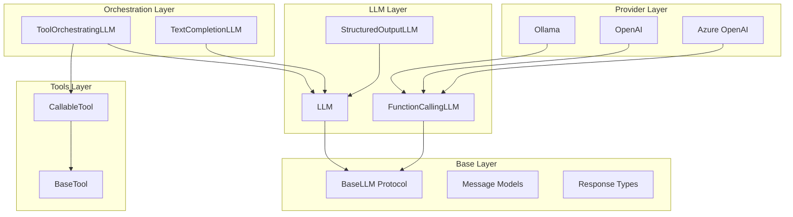

# Welcome to Serapeum

**A modular Python LLM framework for building intelligent applications**

Serapeum provides clean, composable abstractions for working with Large Language Models. Built on a provider-agnostic architecture, it lets you focus on building applications rather than wrestling with API differences.

---

## Features

<div class="grid cards" markdown>

-   :material-puzzle-outline: **Modular Architecture**

    ---

    Provider-agnostic core with pluggable integrations. Switch between Ollama, OpenAI, Azure, or any other provider without changing your application code.

-   :material-tools: **Tool Calling Made Easy**

    ---

    Create tools from Python functions or Pydantic models. Automatic JSON schema generation, validation, and execution.

-   :material-flash: **Async-First Design**

    ---

    Full support for both sync and async operations with streaming. Built for high-performance production applications.

-   :material-code-json: **Structured Outputs**

    ---

    Force LLMs to return structured data using Pydantic models. Type-safe responses with automatic validation.

-   :material-robot: **LLM Orchestration**

    ---

    High-level orchestrators that manage conversation flow, tool execution, and prompt composition automatically.

-   :material-package-variant: **Namespace Packages**

    ---

    Clean package hierarchy using PEP 420 namespace packages. Install only what you need: `serapeum-core`, `serapeum-ollama`, etc.

</div>

---

## Quick Start

Install the core package and a provider:

```bash
# Install serapeum-core and ollama provider
pip install serapeum-core serapeum-ollama
```

Create your first LLM application:

```python
import os
from serapeum.ollama import Ollama
from serapeum.core.llms import Message, MessageRole

# Initialize LLM
llm = Ollama(model="gpt-oss:20b", api_key=os.environ.get("OLLAMA_API_KEY"))

# Simple chat
messages = [
    Message(role=MessageRole.USER, content="What is Python?")
]
response = llm.chat(messages)
print(response.message.content)
```

Use tools with your LLM:

```python
import os
from serapeum.core.tools import CallableTool
from serapeum.ollama import Ollama

# Initialize LLM
llm = Ollama(model="gpt-oss:20b", api_key=os.environ.get("OLLAMA_API_KEY"))

# Create a simple tool
def get_weather(city: str) -> str:
    """Get the current weather for a city."""
    return f"The weather in {city} is sunny and 72°F"

weather_tool = CallableTool.from_function(get_weather)

# Chat with tool calling
response = llm.chat_with_tools(
    tools=[weather_tool],
    user_msg="What's the weather in San Francisco?"
)
print(response.message.additional_kwargs["tool_calls"])
# [ToolCall(function=Function(name='get_weather', arguments={'city': 'San Francisco'}))]
```

Get structured outputs:

```python
import os
from pydantic import BaseModel
from serapeum.core.prompts import PromptTemplate
from serapeum.ollama import Ollama


class CityInfo(BaseModel):
    name: str
    country: str
    population: int
    famous_for: list[str]

# Create a prompt template
prompt = PromptTemplate(
    "Provide information about {city} in JSON format. "
    "Include: name, country, population, and famous_for (list of attractions)."
)

# Force structured output
llm_json = Ollama(model="llama3.1", api_key=os.environ.get("OLLAMA_API_KEY"), json_mode=True)
result = llm_json.parse(
    output_cls=CityInfo,
    prompt=prompt,
    city="Paris"
)
print(result.name)  # "Paris"
print(result.famous_for)  # ["Eiffel Tower", "Louvre Museum", ...]
```

---

## Architecture Overview

Serapeum follows a **layered architecture** from base abstractions to high-level orchestration:



**Key Layers:**

1. **Base Layer**: Core protocols and data models that all providers implement
2. **LLM Layer**: Prompt formatting, structured prediction, and tool-calling specialization
3. **Tools Layer**: Tool interfaces with automatic schema generation
4. **Orchestration Layer**: High-level components that compose prompts, LLMs, and toolsets
5. **Provider Layer**: Concrete implementations (Ollama, OpenAI, Azure, etc.)

---

## Why Serapeum?

### :fontawesome-solid-shield: **Provider Agnostic**
Write your application once, switch providers anytime. The same code works with Ollama, OpenAI, Azure, or any other provider.

### :fontawesome-solid-code: **Type Safe**
Full type annotations with Pydantic integration. Catch errors at development time, not runtime.

### :fontawesome-solid-gauge-high: **Production Ready**
Async-first design with streaming support. Built for high-throughput production applications.

### :fontawesome-solid-cubes: **Composable**
Build complex workflows by composing simple, reusable components. Tools, prompts, and LLMs work together seamlessly.

### :fontawesome-solid-book: **Well Documented**
Comprehensive documentation with examples, architecture diagrams, and API references.

---

## Project Structure

The repository uses a **monorepo structure** with multiple packages:

```
serapeum/
├── libs/
│   ├── core/                    # serapeum-core: provider-agnostic core
│   └── providers/
│       ├── ollama/              # serapeum-ollama: Ollama integration
│       ├── openai/              # serapeum-openai: OpenAI integration
│       └── azure-openai/        # serapeum-azure-openai: Azure OpenAI
├── docs/                        # MkDocs documentation
├── examples/                    # Usage examples and notebooks
└── prompts/                     # Prompt templates
```

**Benefits:**

- **Unified development**: All packages share the same development environment
- **Consistent versioning**: Coordinated releases across packages
- **Shared tooling**: Single configuration for testing, linting, and documentation

---

## Next Steps

<div class="grid cards" markdown>

-   :material-download: **[Installation Guide](developer-guide/installation.md)**

    ---

    Get started with detailed installation instructions for different environments

-   :material-map: **[Codebase Map](overview/core-package.md)**

    ---

    Understand the project structure and key components

-   :material-file-tree: **[Architecture](architecture/diagrams.md)**

    ---

    Dive deep into the architectural patterns and design decisions

-   :material-api: **[API Reference](reference/core/llms/llm-classes-comparison.md)**

    ---

    Explore the complete API documentation with examples

</div>

---

## Community & Support

- **GitHub Repository**: [Serapieum-of-alex/Serapeum](https://github.com/Serapieum-of-alex/Serapeum)
- **Issue Tracker**: [Report bugs or request features](https://github.com/Serapieum-of-alex/Serapeum/issues)
- **Changelog**: [View release history](change-log.md)
- **Contributing**: [Contribution guidelines](developer-guide/contributing.md)
- **License**: [GNU General Public License v3](LICENSE.md)

---
