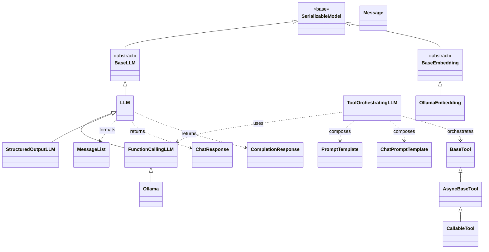

# Codebase Map

This page summarizes the main modules, key classes, and the public API surface of the `serapeum` package.

## Packages and Modules

### Core Framework (`serapeum.core`)

#### Base Abstractions

- **serapeum.core.base.llms**
  - `BaseLLM`: Foundation protocol for all LLM backends with sync/async chat and completion, streaming endpoints, and message conversion helpers
  - Core data models: `Message`, `MessageList`, `ChatResponse`, `CompletionResponse`, `Metadata`, `MessageRole`
  - Multimodal support: `TextChunk`, `Image`, `Audio`
  - Utilities for adapting chat endpoints to completion-style calls

- **serapeum.core.base.embeddings**
  - `BaseEmbedding`: Foundation protocol for embedding models
  - Core embedding types: `NodeType`, `BaseNode`, `LinkedNodes`, `NodeInfo`, `MetadataMode`
  - Utilities for working with document nodes and embeddings

#### LLM Layer

- **serapeum.core.llms**
  - `LLM`: High-level LLM orchestration built on `BaseLLM` with prompt/message formatting and structured prediction to Pydantic models
  - `FunctionCallingLLM`: Tool-calling specialization with chat with tools, tool call extraction/validation, and predict-and-call helpers
  - `StructuredOutputLLM`: Wrapper that forces structured outputs (`BaseModel`) from any LLM while keeping chat/completion interfaces
  - `ChatToCompletionMixin`: Adapter for using chat models in completion mode
  - Sync/async/streaming support across all abstractions

- **serapeum.core.llms.orchestrators**
  - `ToolOrchestratingLLM`: Composes prompts, an LLM, and a toolset to drive structured tool-calling conversations
  - `TextCompletionLLM`: Text-completion style orchestration utilities
  - `StreamingObjectProcessor`: Handles streaming structured outputs
  - Support for sync/async operations with streaming

#### Embeddings Layer

- **serapeum.core.embeddings**
  - `MockEmbedding`: Testing/development embedding implementation
  - Embedding utilities and helpers
  - Integration with node types for document processing

#### Tools System

- **serapeum.core.tools**
  - `BaseTool` / `AsyncBaseTool`: Core tool protocols
  - `CallableTool`: Create tools from Python functions or Pydantic models with automatic schema generation
  - `ToolMetadata`: Tool metadata and JSON schema utilities
  - `ToolOutput` / `ToolCallArguments`: Tool execution types
  - Automatic sync/async bridging and output parsing

#### Prompts

- **serapeum.core.prompts**
  - `PromptTemplate`: String-based prompts with variable/function mappings
  - `ChatPromptTemplate`: Message-based prompts for chat interfaces
  - Prompt-related utilities and type definitions

#### Output Parsing

- **serapeum.core.output_parsers**
  - `PydanticParser`: Parse LLM outputs into Pydantic models
  - Output parser protocols and base classes
  - Error handling and retry mechanisms for robust parsing

#### Chat Support

- **serapeum.core.chat**
  - `AgentChatResponse`: Aggregates model/tool outputs with sync/async streaming
  - Utilities for managing conversation state
  - Tool output parsing and aggregation

#### Configuration & Types

- **serapeum.core.configs**
  - `Configs`: Global configuration object
  - Default values and settings used across the framework

- **serapeum.core.types**
  - `SerializableModel`: Base model with JSON/pickle serialization helpers
  - `Model`: Pydantic model base
  - `StructuredLLMMode`: Enum for structured output modes

- **serapeum.core.utils**
  - Common utilities: sync/async helpers, base utilities
  - Shared functionality across modules

### Provider Integrations

- **serapeum.ollama**
  - Complete Ollama integration package
  - `Ollama`: `FunctionCallingLLM` implementation for Ollama server (chat, completion, tool calling, structured outputs)
  - `OllamaEmbedding`: Local embedding generation using Ollama models
  - Full sync/async/streaming support for both LLM and embeddings
  - See [Ollama Provider Documentation](../reference/providers/ollama/general.md) for detailed documentation

## Key Public Classes

### LLM Abstractions
- `serapeum.core.base.llms.BaseLLM` - Base LLM protocol
- `serapeum.core.llms.LLM` - High-level LLM orchestration
- `serapeum.core.llms.FunctionCallingLLM` - Tool-calling LLM specialization
- `serapeum.core.llms.StructuredOutputLLM` - Structured output wrapper

### Orchestration
- `serapeum.core.llms.orchestrators.ToolOrchestratingLLM` - Tool-calling orchestrator
- `serapeum.core.llms.orchestrators.TextCompletionLLM` - Text completion orchestrator

### Tools
- `serapeum.core.tools.CallableTool` - Function/model-based tools
- `serapeum.core.tools.BaseTool` - Base tool protocol
- `serapeum.core.tools.AsyncBaseTool` - Async tool protocol

### Data Types
- `serapeum.core.base.llms.types.Message` - Individual messages
- `serapeum.core.base.llms.types.MessageList` - Message sequences
- `serapeum.core.base.llms.types.ChatResponse` - Chat responses
- `serapeum.core.base.llms.types.CompletionResponse` - Completion responses
- `serapeum.core.base.llms.types.Metadata` - LLM metadata

### Prompts
- `serapeum.core.prompts.PromptTemplate` - String templates
- `serapeum.core.prompts.ChatPromptTemplate` - Chat templates

### Base Models
- `serapeum.core.types.SerializableModel` - Serialization base
- `serapeum.core.types.Model` - Pydantic model base

### Embeddings
- `serapeum.core.base.embeddings.BaseEmbedding` - Base embedding protocol
- `serapeum.core.embeddings.MockEmbedding` - Mock implementation

### Provider Implementations
- `serapeum.ollama.Ollama` - Ollama LLM implementation
- `serapeum.ollama.OllamaEmbedding` - Ollama embeddings implementation

## Representative Public Methods

### BaseLLM
- `chat(messages, **kwargs) → ChatResponse`
- `complete(prompt, formatted=False, **kwargs) → CompletionResponse`
- `stream_chat(...) → ChatResponseGen`
- `stream_complete(...) → CompletionResponseGen`
- `achat(...) → ChatResponse` (async)
- `acomplete(...) → CompletionResponse` (async)
- `astream_chat(...) → ChatResponseAsyncGen` (async)
- `astream_complete(...) → CompletionResponseAsyncGen` (async)

### LLM
- `predict(prompt: PromptTemplate, **kwargs) → str`
- `stream(prompt, **kwargs) → CompletionResponseGen`
- `apredict(...) → str` (async)
- `astream(...) → CompletionResponseAsyncGen` (async)
- `structured_predict(output_cls: type[BaseModel], prompt, **kwargs) → BaseModel`
- `stream_structured_predict(...) → Generator[BaseModel, None, None]`
- `astructured_predict(...) → BaseModel` (async)
- `astream_structured_predict(...) → AsyncGenerator[BaseModel, None]` (async)

### FunctionCallingLLM
- `chat_with_tools(tools, user_msg=None, chat_history=None, **kwargs) → ChatResponse`
- `predict_and_call(tools, user_msg=None, chat_history=None, **kwargs) → AgentChatResponse`
- `get_tool_calls_from_response(response, error_on_no_tool_call=True) → list[ToolCallArguments]`
- `stream_chat_with_tools(...) → ChatResponseGen`
- `astream_chat_with_tools(...) → ChatResponseAsyncGen` (async)

### CallableTool
- `from_function(func, name=None, description=None, **kwargs) → CallableTool` (class method)
- `from_model(model_cls, fn, name=None, description=None, **kwargs) → CallableTool` (class method)
- `call(input, **kwargs) → ToolOutput`
- `acall(input, **kwargs) → ToolOutput` (async)

### ToolOrchestratingLLM
- `__call__(**prompt_args, llm_kwargs=None) → BaseModel | Any`
- `acall(**prompt_args, llm_kwargs=None) → BaseModel | Any` (async)
- `stream_call(**prompt_args, llm_kwargs=None) → Generator`
- `astream_call(**prompt_args, llm_kwargs=None) → AsyncGenerator` (async)

### BaseEmbedding
- `get_text_embedding(text: str) → list[float]`
- `get_query_embedding(query: str) → list[float]`
- `get_text_embeddings(texts: list[str]) → list[list[float]]`
- `aget_text_embedding(text: str) → list[float]` (async)
- `aget_query_embedding(query: str) → list[float]` (async)
- `aget_text_embeddings(texts: list[str]) → list[list[float]]` (async)

## Data Flow (High Level)

### Basic LLM Flow
```
User input/messages
  → Prompt building (PromptTemplate / ChatPromptTemplate)
  → LLM (LLM or concrete provider like Ollama)
  → ChatResponse / CompletionResponse
```

### Structured Output Flow
```
User input
  → PromptTemplate
  → LLM.structured_predict(output_cls=MyModel, ...)
  → Pydantic BaseModel instance
```

### Tool-Calling Flow
```
User message
  → FunctionCallingLLM.predict_and_call(tools=[...])
  → LLM predicts tool calls
  → Tools executed (BaseTool/CallableTool)
  → ToolOutput aggregated
  → AgentChatResponse
```

### Orchestrated Tool Flow
```
User input
  → ToolOrchestratingLLM(llm=..., tools=[...], prompt=...)
  → Automatic tool selection and execution
  → Structured output (if output_cls specified)
```

### Embedding Flow
```
Documents/queries
  → BaseEmbedding.get_text_embeddings(texts)
  → Vector embeddings (list[list[float]])
  → Use for similarity search, RAG, etc.
```

See the [Architecture](../architecture/) section for diagrams and deeper internals, and the API Reference for exhaustive signatures.

## Class & Dependency Graph

Below is a high-level Mermaid class/dependency diagram showing the main modules and their primary classes, plus key relationships between them.



## Adding New Providers

To add a new provider (e.g., for OpenAI, Anthropic, etc.):

1. Create a new package in `libs/providers/{provider}/`
2. Implement `FunctionCallingLLM` for chat/completion models
3. Implement `BaseEmbedding` for embedding models (if applicable)
4. Follow the provider-based organization pattern (all features in one package)
5. Add comprehensive examples and documentation

See the [Ollama provider](../../libs/providers/ollama/) as a reference implementation.

---

**Notes:**
- The diagram abstracts many modules for clarity; see source files for full method signatures and additional classes
- `Ollama` and `OllamaEmbedding` are concrete implementations; additional providers follow the same pattern
- All async methods use the `a` prefix convention (e.g., `achat`, `astream_chat`)
- Streaming methods return generators (sync) or async generators (async)
