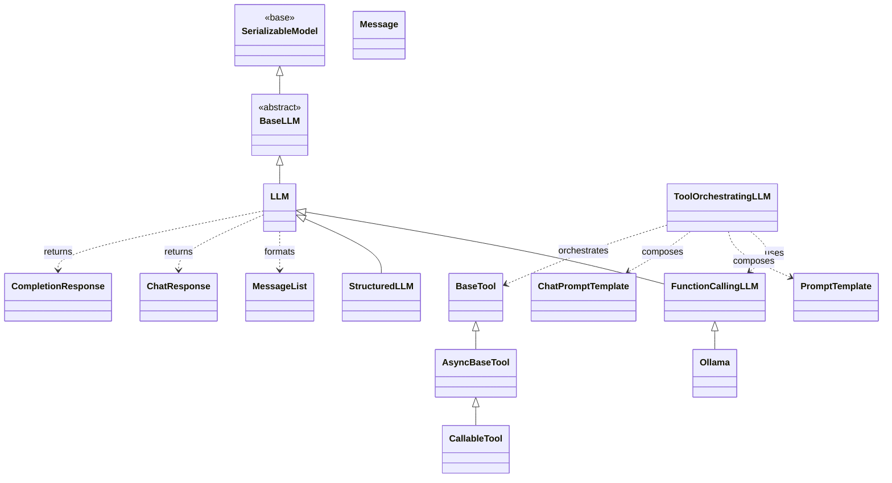

# Codebase Map

This page summarizes the main modules, key classes, and the public API surface of the `serapeum` package.

## Packages and Modules

- serapeum.core.base.llms.base
  - Base interface for all LLM backends (`BaseLLM`): sync/async chat and completion, streaming endpoints, and message conversion helpers.
- serapeum.core.base.llms.types
  - Core data models: `Message`, `MessageList`, `ChatResponse`, `CompletionResponse`, `Metadata`, `MessageRole`, and multimodal chunks (`TextChunk`, `Image`, `Audio`).
- serapeum.core.base.llms.utils
  - Adapters/decorators to adapt chat endpoints to completion-style calls (`chat_to_completion_decorator`, `achat_to_completion_decorator`).
- serapeum.core.llm.base
  - High-level LLM orchestration (`LLM`) built on `BaseLLM`: prompt/message formatting, structured prediction to Pydantic models, and sync/async streaming utilities.
- serapeum.core.llm.function_calling
  - Tool-calling specialization (`FunctionCallingLLM`): chat with tools, tool call extraction/validation, predict-and-call helpers (sync/async, streaming).
- serapeum.core.llm.structured_llm
  - Wrapper LLM (`StructuredLLM`) that forces structured outputs (`BaseModel`) from another `LLM` while keeping chat/completion interfaces.
- serapeum.core.chat.models
  - `AgentChatResponse`: aggregates model/tool outputs and provides sync/async streaming generators and tool output parsing.
- serapeum.core.prompts.base
  - Prompt abstractions: `PromptTemplate` (string prompts) and `ChatPromptTemplate` (message-based prompts) with variable/function mappings.
- serapeum.core.prompts.models
  - Prompt-related data models and types used by templates and LLMs.
- serapeum.core.prompts.utils
  - Utilities for working with prompts and templates.
- serapeum.core.tools.models
  - Tool system: `ToolMetadata`, JSON schema utilities, `BaseTool`, `AsyncBaseTool`, `ToolOutput`, `ToolCallArguments`, and adapters (e.g., `adapt_to_async_tool`).
- serapeum.core.tools.callable_tool
  - `CallableTool`: create tools from Python callables or Pydantic models; handles sync/async bridging and output parsing.
- serapeum.core.tools.utils
  - General-purpose helpers for the tool subsystem.
- serapeum.core.structured_tools.tools_llm
  - `ToolOrchestratingLLM`: composes prompts, an LLM, and a toolset to drive structured tool-calling conversations (sync/async, streaming).
- serapeum.core.structured_tools.text_completion_llm
  - Utilities/classes for orchestrating text-completion style LLMs in the structured tools pipeline.
- serapeum.core.structured_tools.utils
  - Support utilities for the structured tools orchestration layer.
- serapeum.core.output_parsers.models
  - Parsers and base models for converting raw LLM output into typed structures.
- serapeum.core.output_parsers.utils
  - Helper functions for robust output parsing and error handling.
- serapeum.core.configs.configs / serapeum.core.configs.defaults
  - Configuration objects and defaults used across the package.
- serapeum.core.utils.base / serapeum.core.utils.async_utils
  - Common utilities (sync/async helpers, base helpers) shared across modules.
- serapeum.core.models.base
  - `SerializableModel` (JSON/pickle serialization helpers) and `StructuredLLMMode` enum.
- serapeum.llms.ollama.base
  - `Ollama`: concrete `FunctionCallingLLM` implementation for the Ollama server; supports chat/completion, tool calling, and structured prediction (sync/async/streaming).
- serapeum.datasource
  - Convenience helpers for integrating external data sources (if used by your application code).

## Key Public Classes

- serapeum.core.base.llms.base.BaseLLM
- serapeum.core.llm.base.LLM
- serapeum.core.llm.function_calling.FunctionCallingLLM
- serapeum.core.llm.structured_llm.StructuredLLM
- serapeum.core.structured_tools.tools_llm.ToolOrchestratingLLM
- serapeum.core.tools.callable_tool.CallableTool
- serapeum.core.tools.models.BaseTool / AsyncBaseTool
- serapeum.core.base.llms.types.Message / MessageList / ChatResponse / CompletionResponse / Metadata
- serapeum.core.prompts.base.PromptTemplate / ChatPromptTemplate
- serapeum.core.models.base.SerializableModel
- serapeum.llms.ollama.base.Ollama

## Representative Public Methods

- BaseLLM
  - chat(messages, **kwargs) → ChatResponse
  - complete(prompt, formatted=False, **kwargs) → CompletionResponse
  - stream_chat(...), stream_complete(...)
  - achat(...), acomplete(...), astream_chat(...), astream_complete(...)
- LLM
  - predict(prompt: BasePromptTemplate, ...) → CompletionResponse
  - stream(...), apredict(...), astream(...)
  - structured_predict(output_cls, prompt, llm_kwargs=None, **prompt_args)
  - astructured_predict(...), stream_structured_predict(...), astream_structured_predict(...)
- FunctionCallingLLM
  - chat_with_tools(tools, user_msg=None, chat_history=None, ...)
  - predict_and_call(tools, user_msg=None, chat_history=None, ...)
  - get_tool_calls_from_response(response, ...)
  - stream_chat_with_tools(...), astream_chat_with_tools(...)
- CallableTool
  - from_function(func, ...), from_model(output_cls)
  - call(...), acall(...)
- ToolOrchestratingLLM
  - __call__(..., llm_kwargs=None, ...), acall(...)
  - stream_call(...), astream_call(...)
- Ollama
  - chat/achat/stream_chat/astream_chat, complete/acomplete/stream_complete/astream_complete
  - structured_predict/astr.../stream_str.../astream_str...

## Data Flow (High Level)

- User input/messages -> Prompt building (`PromptTemplate` / `ChatPromptTemplate`) -> LLM (`LLM` or concrete impl like `Ollama`)
- Optional structured path: `LLM.structured_predict(...)` -> Pydantic `BaseModel` outputs
- Tool-calling path: `FunctionCallingLLM` predicts tool calls -> `BaseTool`/`CallableTool` executed -> `ToolOutput` aggregated -> `AgentChatResponse`
- Outputs -> `ChatResponse` / `CompletionResponse` (optionally converted/parsed to domain models)

See the Architecture section for diagrams and deeper internals, and the API Reference for exhaustive signatures.

## Class & Dependency Graph

Below is a high-level Mermaid class/dependency diagram showing the main modules and their primary classes, plus key relationships between them.

Notes:
- The diagram abstracts many modules for clarity; see source files for full method signatures and additional classes.
- `Ollama` is one concrete backend; additional backends would subclass `FunctionCallingLLM` or `LLM`.
