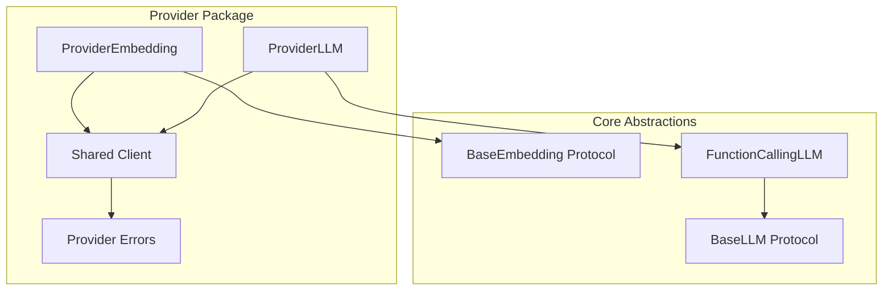

# Provider Integrations

This page provides an overview of all available provider integrations in the Serapeum framework. Providers implement the core abstractions to work with different LLM backends and services.

## Overview

Serapeum uses a **provider-based organization** where each provider package contains all features that provider offers (LLM, embeddings, and any provider-specific capabilities). This keeps related code together and makes it easy to install only the providers you need.

### Available Providers

- **[Ollama](providers/ollama.md)** - Local LLM inference with Ollama server
- **OpenAI** - OpenAI API integration (coming soon)
- **Azure OpenAI** - Azure OpenAI Service integration (in development)

---

## Provider Architecture

All providers follow the same architectural pattern:



**Key Components:**

1. **LLM Implementation**: Inherits from `FunctionCallingLLM` to provide chat, completion, tool calling, and structured outputs
2. **Embedding Implementation**: Implements `BaseEmbedding` protocol for text and query embeddings
3. **Shared Client**: HTTP client and configuration shared across LLM and embedding classes
4. **Provider Errors**: Custom exceptions for provider-specific error handling

---

## Provider Comparison

| Provider | Status | LLM | Embeddings | Tool Calling | Streaming | Async |
|----------|--------|-----|------------|--------------|-----------|-------|
| **[Ollama](providers/ollama.md)** | ✅ Available | ✅ | ✅ | ✅ | ✅ | ✅ |
| **OpenAI** | 🚧 In Development | 🚧 | 🚧 | 🚧 | 🚧 | 🚧 |
| **Azure OpenAI** | 🚧 In Development | 🚧 | 🚧 | 🚧 | 🚧 | 🚧 |

---

## Installation

Each provider is distributed as a separate package. Install only the providers you need:

```bash
# Ollama provider
pip install serapeum-ollama

# OpenAI provider (when available)
pip install serapeum-openai

# Azure OpenAI provider (when available)
pip install serapeum-azure-openai

# Install multiple providers
pip install serapeum-ollama serapeum-openai
```

All provider packages depend on `serapeum-core`, which will be installed automatically.

---

## Quick Comparison

### Ollama

<div class="grid cards" markdown>

-   :material-server: **Local Inference**

    ---

    Run models locally on your machine without external API dependencies

-   :material-lock: **Privacy First**

    ---

    All data stays on your machine. No internet required after model download

-   :material-scale-balance: **Free & Open Source**

    ---

    No API costs. Use any Ollama-compatible model

-   :material-flash: **Full Features**

    ---

    Complete support for chat, streaming, tools, structured outputs, and embeddings

</div>

[**Read Ollama Documentation →**](providers/ollama.md)

### OpenAI (Coming Soon)

<div class="grid cards" markdown>

-   :material-cloud: **Cloud-Based**

    ---

    Access powerful models via OpenAI's API

-   :material-robot: **State-of-the-Art**

    ---

    GPT-4, GPT-3.5, and latest OpenAI models

-   :material-scale: **Scalable**

    ---

    Pay-as-you-go pricing with global infrastructure

-   :material-lightning-bolt: **Fast & Reliable**

    ---

    Optimized inference with high availability

</div>

### Azure OpenAI (Coming Soon)

<div class="grid cards" markdown>

-   :material-microsoft-azure: **Enterprise Ready**

    ---

    OpenAI models on Microsoft Azure infrastructure

-   :material-shield-check: **Compliance**

    ---

    Enterprise-grade security and compliance certifications

-   :material-network: **Private Network**

    ---

    Deploy within your Azure virtual network

-   :material-key: **Azure Integration**

    ---

    Seamless integration with Azure services and authentication

</div>

---

## Adding New Providers

To add a new provider integration (e.g., OpenAI, Anthropic), follow the standardized provider architecture pattern.

### Directory Structure

Create a provider package following this structure:

```
libs/providers/{provider-name}/
├── src/
│   └── serapeum/
│       └── {provider_name}/
│           ├── __init__.py
│           ├── llm.py           # Chat/completion implementation
│           ├── embeddings.py    # Embeddings (if available)
│           └── shared/          # Shared utilities
│               ├── client.py    # HTTP client, config
│               └── errors.py    # Provider-specific errors
├── tests/
│   ├── test_llm.py
│   ├── test_embeddings.py
│   └── conftest.py
├── pyproject.toml
└── README.md
```

### Implementation Steps

**1. Create Package Structure**

```bash
mkdir -p libs/providers/{provider}/src/serapeum/{provider_name}
mkdir -p libs/providers/{provider}/tests
```

**2. Implement LLM Class**

Inherit from `FunctionCallingLLM`:

```python
from serapeum.core.llms import FunctionCallingLLM
from serapeum.core.base.llms.types import ChatResponse, CompletionResponse

class ProviderLLM(FunctionCallingLLM):
    """Provider LLM implementation."""

    def __init__(
        self,
        model: str,
        api_key: str | None = None,
        **kwargs
    ):
        self.model = model
        self.api_key = api_key
        super().__init__(**kwargs)

    def _complete(self, prompt: str, **kwargs) -> CompletionResponse:
        """Implement completion endpoint."""
        # Call provider API
        # Return CompletionResponse
        pass

    def _chat(self, messages, **kwargs) -> ChatResponse:
        """Implement chat endpoint."""
        # Call provider API
        # Return ChatResponse
        pass

    def _stream_complete(self, prompt: str, **kwargs):
        """Implement streaming completion."""
        # Yield CompletionResponse chunks
        pass

    def _stream_chat(self, messages, **kwargs):
        """Implement streaming chat."""
        # Yield ChatResponse chunks
        pass

    # Implement async methods: _achat, _acomplete, _astream_chat, _astream_complete
```

**3. Implement Embeddings** (if applicable)

Inherit from `BaseEmbedding`:

```python
from serapeum.core.base.embeddings import BaseEmbedding

class ProviderEmbedding(BaseEmbedding):
    """Provider embedding implementation."""

    def __init__(
        self,
        model_name: str,
        api_key: str | None = None,
        **kwargs
    ):
        self.model_name = model_name
        self.api_key = api_key
        super().__init__(**kwargs)

    def _get_text_embedding(self, text: str) -> list[float]:
        """Generate embedding for text."""
        # Call provider embedding API
        pass

    def _get_query_embedding(self, query: str) -> list[float]:
        """Generate embedding for query."""
        # Call provider embedding API
        pass

    # Implement async methods: _aget_text_embedding, _aget_query_embedding
```

**4. Add to Workspace**

Update root `pyproject.toml`:

```toml
[tool.uv.workspace]
members = ["libs/core", "libs/providers/*"]

[tool.uv.sources]
serapeum-{provider} = { workspace = true }
```

**5. Create Package Configuration**

Create `libs/providers/{provider}/pyproject.toml`:

```toml
[project]
name = "serapeum-{provider}"
version = "0.1.0"
description = "{Provider} integration for Serapeum"
readme = "README.md"
license = {text = "GNU General Public License v3"}
authors = [
    {name = "Your Name", email = "your.email@example.com"}
]
keywords = ["llm", "ai", "{provider}"]
requires-python = ">=3.11,<4.0"
dependencies = [
    "serapeum-core",
    "{provider-sdk}>=1.0.0"  # e.g., "openai>=1.0.0"
]

[tool.uv.sources]
serapeum-core = { workspace = true }

[dependency-groups]
dev = [
    "pytest>=8.4.2",
    "pytest-cov>=7.0.0",
    "pytest-asyncio>=1.2.0",
]

[tool.pytest.ini_options]
testpaths = "tests"
markers = [
    "e2e: end-to-end tests requiring provider service",
    "unit: unit tests",
    "integration: integration tests",
]

[build-system]
requires = ["hatchling"]
build-backend = "hatchling.build"
```

**6. Write Tests**

Create comprehensive tests with appropriate markers:

```python
# tests/test_llm.py
import pytest
from serapeum.{provider_name} import ProviderLLM

@pytest.mark.unit
def test_initialization():
    llm = ProviderLLM(model="model-name", api_key="test-key")
    assert llm.model == "model-name"

@pytest.mark.e2e
def test_chat():
    llm = ProviderLLM(model="model-name")
    response = llm.chat([{"role": "user", "content": "Hello"}])
    assert response.message.content
```

**7. Add Documentation**

Create:
- `README.md` with installation, configuration, and examples
- `docs/overview/providers/{provider}.md` with comprehensive guide
- API reference documentation

**8. Export Public API**

In `src/serapeum/{provider_name}/__init__.py`:

```python
"""Serapeum {Provider} integration."""

from serapeum.{provider_name}.llm import ProviderLLM
from serapeum.{provider_name}.embeddings import ProviderEmbedding

__all__ = [
    "ProviderLLM",
    "ProviderEmbedding",
]
```

### Why Provider-Based Organization?

**Benefits:**

- **Shared Infrastructure**: All provider features share client, auth, error handling
- **Single Installation**: Users install one package per provider (`pip install serapeum-{provider}`)
- **Co-located Code**: Related features are maintained together
- **Isolated Dependencies**: Provider SDKs don't conflict
- **Industry Standard**: Matches LangChain and other frameworks

**Example:**
```python
# Users install only what they need
pip install serapeum-ollama  # For local inference

# Clean imports
from serapeum.ollama import Ollama
```

### Reference Implementation

See the **[Ollama provider](../../libs/providers/ollama/)** for a complete reference implementation showing:

- LLM implementation with streaming and async
- Embedding implementation with batching
- Shared client and error handling
- Comprehensive test suite
- Complete documentation

---

## Provider Development Checklist

When implementing a new provider, ensure:

- [ ] Inherits from `FunctionCallingLLM` for LLM
- [ ] Implements `BaseEmbedding` for embeddings (if applicable)
- [ ] Supports sync, async, and streaming operations
- [ ] Includes comprehensive unit tests (≥95% coverage)
- [ ] Includes e2e tests with appropriate markers
- [ ] Has README with examples and configuration
- [ ] Has documentation page in `docs/overview/providers/`
- [ ] Exports public API in `__init__.py`
- [ ] Added to workspace in root `pyproject.toml`
- [ ] Added to provider comparison table above
- [ ] Follows code style and type annotations

---

## Support

For provider-specific issues:

- **Ollama**: [Ollama GitHub](https://github.com/ollama/ollama)
- **Serapeum Integration**: [Serapeum Issues](https://github.com/Serapieum-of-alex/Serapeum/issues)

For general framework questions, see the [Contributing Guide](../contributing.md).

---

## Next Steps

<div class="grid cards" markdown>

-   :material-book-open-variant: **[Ollama Provider](providers/ollama.md)**

    ---

    Complete guide to using the Ollama provider for local LLM inference

-   :material-file-document: **[API Reference](../reference/core/llms/llm-classes-comparison.md)**

    ---

    Detailed API documentation for core abstractions

-   :material-map: **[Codebase Map](codebase-map.md)**

    ---

    Understand the project structure and architecture

</div>

---
## Adding New Providers

To add a new provider integration, see the [Provider Integrations Guide](providers.md#adding-new-providers) for detailed instructions and the provider architecture pattern.

---