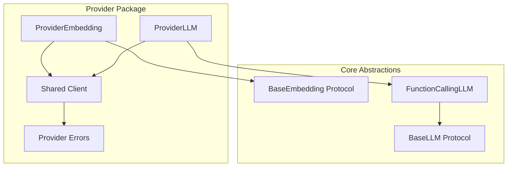

# Provider Integrations

This page provides an overview of all available provider integrations in the Serapeum framework. Providers implement the core abstractions to work with different LLM backends and services.

## Overview

Serapeum uses a **provider-based organization** where each provider package contains all features that provider offers (LLM, embeddings, and any provider-specific capabilities). This keeps related code together and makes it easy to install only the providers you need.

### Available Providers

- **[Ollama](providers/ollama.md)** - Local LLM inference with Ollama server
- **OpenAI** - OpenAI API integration (coming soon)
- **Azure OpenAI** - Azure OpenAI Service integration (in development)

---

## Provider Architecture

All providers follow the same architectural pattern:



**Key Components:**

1. **LLM Implementation**: Inherits from `FunctionCallingLLM` to provide chat, completion, tool calling, and structured outputs
2. **Embedding Implementation**: Implements `BaseEmbedding` protocol for text and query embeddings
3. **Shared Client**: HTTP client and configuration shared across LLM and embedding classes
4. **Provider Errors**: Custom exceptions for provider-specific error handling

---

## Provider Comparison

| Provider | Status | LLM | Embeddings | Tool Calling | Streaming | Async |
|----------|--------|-----|------------|--------------|-----------|-------|
| **[Ollama](providers/ollama.md)** | ✅ Available | ✅ | ✅ | ✅ | ✅ | ✅ |
| **OpenAI** | 🚧 In Development | 🚧 | 🚧 | 🚧 | 🚧 | 🚧 |
| **Azure OpenAI** | 🚧 In Development | 🚧 | 🚧 | 🚧 | 🚧 | 🚧 |

---

## Installation

Each provider is distributed as a separate package. Install only the providers you need:

```bash
# Ollama provider
pip install serapeum-ollama

# OpenAI provider (when available)
pip install serapeum-openai

# Azure OpenAI provider (when available)
pip install serapeum-azure-openai

# Install multiple providers
pip install serapeum-ollama serapeum-openai
```

All provider packages depend on `serapeum-core`, which will be installed automatically.

---

## Quick Comparison

### Ollama

<div class="grid cards" markdown>

-   :material-server: **Local Inference**

    ---

    Run models locally on your machine without external API dependencies

-   :material-lock: **Privacy First**

    ---

    All data stays on your machine. No internet required after model download

-   :material-scale-balance: **Free & Open Source**

    ---

    No API costs. Use any Ollama-compatible model

-   :material-flash: **Full Features**

    ---

    Complete support for chat, streaming, tools, structured outputs, and embeddings

</div>

[**Read Ollama Documentation →**](providers/ollama.md)

### OpenAI (Coming Soon)

<div class="grid cards" markdown>

-   :material-cloud: **Cloud-Based**

    ---

    Access powerful models via OpenAI's API

-   :material-robot: **State-of-the-Art**

    ---

    GPT-4, GPT-3.5, and latest OpenAI models

-   :material-scale: **Scalable**

    ---

    Pay-as-you-go pricing with global infrastructure

-   :material-lightning-bolt: **Fast & Reliable**

    ---

    Optimized inference with high availability

</div>

### Azure OpenAI (Coming Soon)

<div class="grid cards" markdown>

-   :material-microsoft-azure: **Enterprise Ready**

    ---

    OpenAI models on Microsoft Azure infrastructure

-   :material-shield-check: **Compliance**

    ---

    Enterprise-grade security and compliance certifications

-   :material-network: **Private Network**

    ---

    Deploy within your Azure virtual network

-   :material-key: **Azure Integration**

    ---

    Seamless integration with Azure services and authentication

</div>

---

## Adding New Providers

Want to integrate a new LLM provider (OpenAI, Anthropic, Cohere, etc.) into Serapeum?

We've created a comprehensive guide that walks you through every step of implementing a new provider integration, from directory structure to testing and documentation.

**[📖 Read the Complete Provider Implementation Guide →](providers/adding-new-providers.md)**

### What You'll Learn

- **Directory Structure**: How to organize your provider package
- **LLM Implementation**: Step-by-step guide to implementing the LLM class
- **Embeddings**: How to add embedding support (if applicable)
- **Testing**: Writing comprehensive tests with proper markers
- **Documentation**: Creating user-facing documentation
- **Best Practices**: Common pitfalls and how to avoid them

### Quick Overview

All providers follow the same pattern:

1. **Inherit from Core Classes**: `FunctionCallingLLM` for LLMs, `BaseEmbedding` for embeddings
2. **Implement Required Methods**: Chat, completion, streaming (sync & async)
3. **Add to Workspace**: Configure in `pyproject.toml`
4. **Write Tests**: Unit tests and e2e tests with markers
5. **Document**: README, usage examples, and docs page

### Reference Implementation

The **[Ollama provider](https://github.com/Serapieum-of-alex/Serapeum/tree/main/libs/providers/ollama)** serves as a complete reference showing:

- Full LLM implementation with streaming and async support
- Embedding implementation with batching
- Shared client and error handling
- Comprehensive test suite
- Complete documentation

### Development Checklist

Use this checklist when implementing a new provider:

- [ ] Inherits from `FunctionCallingLLM` for LLM
- [ ] Implements `BaseEmbedding` for embeddings (if applicable)
- [ ] Supports sync, async, and streaming operations
- [ ] Includes comprehensive unit tests (≥95% coverage)
- [ ] Includes e2e tests with appropriate markers
- [ ] Has README with examples and configuration
- [ ] Has documentation page in `docs/overview/providers/`
- [ ] Exports public API in `__init__.py`
- [ ] Added to workspace in root `pyproject.toml`
- [ ] Added to provider comparison table above
- [ ] Follows code style and type annotations

**[Get Started: Read the Full Implementation Guide →](providers/adding-new-providers.md)**

---

## Support

For provider-specific issues:

- **Ollama**: [Ollama GitHub](https://github.com/ollama/ollama)
- **Serapeum Integration**: [Serapeum Issues](https://github.com/Serapieum-of-alex/Serapeum/issues)

For general framework questions, see the [Contributing Guide](../contributing.md).

---

## Next Steps

<div class="grid cards" markdown>

-   :material-book-open-variant: **[Ollama Provider](providers/ollama.md)**

    ---

    Complete guide to using the Ollama provider for local LLM inference

-   :material-file-document: **[API Reference](../reference/core/llms/llm-classes-comparison.md)**

    ---

    Detailed API documentation for core abstractions

-   :material-map: **[Codebase Map](core-package.md)**

    ---

    Understand the project structure and architecture

</div>

---
## Adding New Providers

To add a new provider integration, see the [Provider Integrations Guide](providers.md#adding-new-providers) for detailed instructions and the provider architecture pattern.

---
