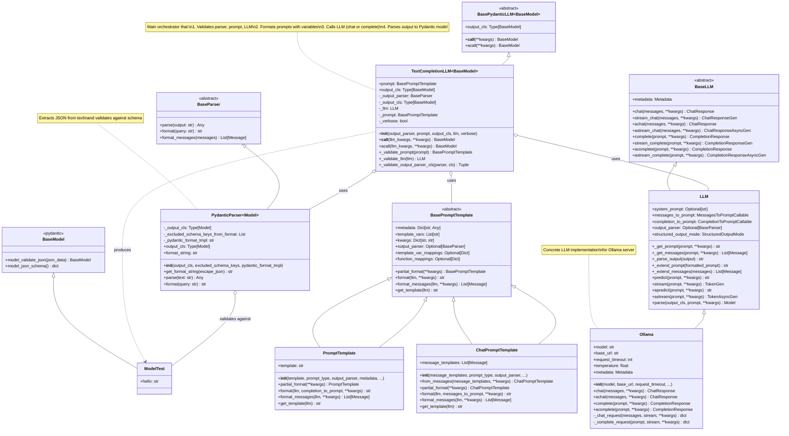

# Architecture and Class Relationships

This diagram shows the class relationships and structure for `TextCompletionLLM`.

## Class Responsibilities

### TextCompletionLLM
- **Orchestrates** the complete workflow from prompt to structured output
- **Validates** all components during initialization
- **Routes** to chat or completion based on LLM metadata
- **Ensures** type safety of output

### PydanticParser
- **Extracts** JSON from raw LLM output
- **Validates** JSON against Pydantic schema
- **Formats** prompts with schema hints

### Ollama (LLM)
- **Executes** requests to Ollama server
- **Supports** both chat and completion modes
- **Handles** streaming and async operations

### PromptTemplate/ChatPromptTemplate
- **Formats** prompts with variables
- **Supports** both string and message-based templates
- **Manages** template variables and mappings
