# Architecture and Class Relationships

This diagram shows the class relationships and structure for `ToolOrchestratingLLM`.

```mermaid
classDiagram
    class BasePydanticLLM~BaseModel~ {
        <<abstract>>
        +output_cls: Type[BaseModel]
        +__call__(**kwargs) BaseModel
        +acall(**kwargs) BaseModel
    }

    class ToolOrchestratingLLM~Model~ {
        +__init__(output_cls, prompt, llm, tool_choice, allow_parallel, verbose)
        +output_cls: Type[Model]
        +prompt: BasePromptTemplate
        +__call__(llm_kwargs, **kwargs) Union[Model, List[Model]]
        +acall(llm_kwargs, **kwargs) Union[Model, List[Model]]
        +stream_call(llm_kwargs, **kwargs) Generator[Model, None, None]
        +astream_call(llm_kwargs, **kwargs) AsyncGenerator[Model, None]
        -_output_cls: Type[Model]
        -_llm: FunctionCallingLLM
        -_prompt: BasePromptTemplate
        -_verbose: bool
        -_allow_parallel_tool_calls: bool
        -_tool_choice: Optional[Union[str, Dict]]
        +_validate_prompt(prompt) BasePromptTemplate
        +_validate_llm(llm) LLM
    }

    class BasePydanticLLM~BaseModel~ {
        <<abstract>>
        +output_cls: Type[BaseModel]
    }

    class BaseTool {
        <<abstract>>
        +metadata: ToolMetadata
        +call(**kwargs) ToolOutput
        +acall(**kwargs) ToolOutput
    }

    class CallableTool {
        +__init__(fn, metadata)
        +from_function(fn) CallableTool
        +from_model(model_cls) CallableTool
        +call(**kwargs) ToolOutput
        +acall(**kwargs) ToolOutput
        -_fn: Callable
        -_async_fn: Optional[Callable]
        -_metadata: ToolMetadata
    }

    class BasePromptTemplate {
        <<abstract>>
        +metadata: Dict[str, Any]
        +template_vars: List[str]
        +kwargs: Dict[str, str]
        +output_parser: Optional[BaseParser]
        +template_var_mappings: Optional[Dict]
        +function_mappings: Optional[Dict]
        +partial_format(**kwargs) BasePromptTemplate
        +format(llm, **kwargs) str
        +format_messages(llm, **kwargs) List[Message]
        +get_template(llm) str
    }

    class PromptTemplate {
        +template: str
        +__init__(template, prompt_type, output_parser, metadata, ...)
        +partial_format(**kwargs) PromptTemplate
        +format(llm, completion_to_prompt, **kwargs) str
        +format_messages(llm, **kwargs) List[Message]
        +get_template(llm) str
    }

    class ChatPromptTemplate {
        +message_templates: List[Message]
        +__init__(message_templates, prompt_type, output_parser, ...)
        +from_messages(message_templates, **kwargs) ChatPromptTemplate
        +partial_format(**kwargs) ChatPromptTemplate
        +format(llm, messages_to_prompt, **kwargs) str
        +format_messages(llm, **kwargs) List[Message]
        +get_template(llm) str
    }

    class BaseLLM {
        <<abstract>>
        +metadata: Metadata
        +chat(messages, **kwargs) ChatResponse
        +stream_chat(messages, **kwargs) ChatResponseGen
        +achat(messages, **kwargs) ChatResponse
        +astream_chat(messages, **kwargs) ChatResponseAsyncGen
        +complete(prompt, **kwargs) CompletionResponse
        +stream_complete(prompt, **kwargs) CompletionResponseGen
        +acomplete(prompt, **kwargs) CompletionResponse
        +astream_complete(prompt, **kwargs) CompletionResponseAsyncGen
    }

    class LLM {
        +system_prompt: Optional[str]
        +messages_to_prompt: MessagesToPromptCallable
        +completion_to_prompt: CompletionToPromptCallable
        +output_parser: Optional[BaseParser]
        +structured_output_mode: StructuredOutputMode
        +_get_prompt(prompt, **kwargs) str
        +_get_messages(prompt, **kwargs) List[Message]
        +_parse_output(output) str
        +_extend_prompt(formatted_prompt) str
        +_extend_messages(messages) List[Message]
        +predict(prompt, **kwargs) str
        +stream(prompt, **kwargs) TokenGen
        +apredict(prompt, **kwargs) str
        +astream(prompt, **kwargs) TokenAsyncGen
        +parse(output_cls, prompt, **kwargs) Model
    }

    class FunctionCallingLLM {
        <<abstract>>
        +predict_and_call(tools, chat_history, ...) AgentChatResponse
        +apredict_and_call(tools, chat_history, ...) AgentChatResponse
        +stream_chat_with_tools(tools, chat_history, ...) Generator
        +astream_chat_with_tools(tools, chat_history, ...) AsyncGenerator
        +chat_with_tools(tools, chat_history, ...) AgentChatResponse
        +achat_with_tools(tools, chat_history, ...) AgentChatResponse
        -_prepare_chat_with_tools(tools, chat_history, ...) Tuple
        -_validate_chat_with_tools_response(...) AgentChatResponse
    }

    class Ollama {
        +model: str
        +base_url: str
        +request_timeout: int
        +temperature: float
        +metadata: Metadata
        +__init__(model, base_url, request_timeout, ...)
        +chat(messages, **kwargs) ChatResponse
        +achat(messages, **kwargs) ChatResponse
        +complete(prompt, **kwargs) CompletionResponse
        +acomplete(prompt, **kwargs) CompletionResponse
        +predict_and_call(tools, ...) AgentChatResponse
        +apredict_and_call(tools, ...) AgentChatResponse
        +stream_chat_with_tools(tools, ...) Generator
        +astream_chat_with_tools(tools, ...) AsyncGenerator
        -_chat_request(messages, stream, **kwargs) dict
        -_complete_request(prompt, stream, **kwargs) dict
        -_prepare_tools_schema(tools) List[Dict]
    }

    class AgentChatResponse {
        +response: str
        +sources: List[ToolOutput]
        +is_dummy_stream: bool
        +metadata: Optional[Dict]
        +__str__() str
        +response_gen: Generator[str, None, None]
        +async_response_gen: AsyncGenerator[str, None]
        +parse_tool_outputs(allow_parallel) Union[Any, List[Any]]
    }

    class ToolOutput {
        +content: str
        +tool_name: str
        +raw_input: Dict[str, Any]
        +raw_output: Any
        +is_error: bool
    }

    class StreamingObjectProcessor {
        +__init__(output_cls, flexible_mode, allow_parallel, llm)
        +process(partial_resp, cur_objects) Union[Model, List[Model]]
        -_output_cls: Type[Model]
        -_flexible_mode: bool
        -_allow_parallel_tool_calls: bool
        -_llm: FunctionCallingLLM
    }

    class BaseModel {
        <<pydantic>>
        +model_validate(data) BaseModel
        +model_validate_json(json_data) BaseModel
        +model_json_schema() dict
    }

    class MockAlbum {
        +title: str
        +artist: str
        +songs: List[MockSong]
    }

    class MockSong {
        +title: str
    }

    BasePydanticLLM <|-- ToolOrchestratingLLM
    BaseLLM <|-- LLM
    LLM <|-- FunctionCallingLLM
    FunctionCallingLLM <|-- Ollama
    BaseTool <|-- CallableTool
    BasePromptTemplate <|-- PromptTemplate
    BasePromptTemplate <|-- ChatPromptTemplate
    BaseModel <|-- MockAlbum
    BaseModel <|-- MockSong

    ToolOrchestratingLLM o-- FunctionCallingLLM : uses
    ToolOrchestratingLLM o-- BasePromptTemplate : uses
    ToolOrchestratingLLM ..> CallableTool : creates from model
    ToolOrchestratingLLM ..> AgentChatResponse : receives
    ToolOrchestratingLLM ..> MockAlbum : produces
    ToolOrchestratingLLM ..> StreamingObjectProcessor : uses for streaming
    CallableTool ..> MockAlbum : validates against schema
    CallableTool ..> ToolOutput : produces
    AgentChatResponse o-- ToolOutput : contains list
    ToolOutput o-- MockAlbum : contains as raw_output
    MockAlbum o-- MockSong : contains list

    note for ToolOrchestratingLLM "Main orchestrator that:\n1. Converts Pydantic model to tool\n2. Formats prompts with variables\n3. Calls LLM with function calling\n4. Parses tool outputs to models\n5. Supports sync/async/streaming"
    note for CallableTool "Converts Pydantic models\nto callable tools with\nJSON schema validation"
    note for AgentChatResponse "Container for LLM response\nand tool execution results"
    note for Ollama "Concrete implementation\nfor Ollama with\nfunction calling support"
```

## Class Responsibilities

### ToolOrchestratingLLM
- **Orchestrates** the complete function-calling workflow
- **Validates** LLM supports function calling during initialization
- **Converts** Pydantic models to callable tools
- **Routes** execution through predict_and_call
- **Supports** single or parallel tool calls
- **Handles** sync, async, and streaming modes

### CallableTool
- **Converts** Pydantic models to function schemas
- **Validates** tool arguments against JSON schema
- **Executes** tool functions (sync/async)
- **Wraps** results in ToolOutput

### FunctionCallingLLM (Abstract)
- **Defines** interface for function-calling LLMs
- **Provides** predict_and_call abstraction
- **Handles** tool schema preparation
- **Manages** tool execution orchestration

### Ollama
- **Implements** FunctionCallingLLM for Ollama server
- **Formats** requests with tool schemas
- **Parses** tool_calls from responses
- **Executes** tools and aggregates results

### AgentChatResponse
- **Contains** LLM response text and tool outputs
- **Parses** tool outputs to extract structured models
- **Supports** single or list of outputs
- **Provides** streaming helpers

### StreamingObjectProcessor
- **Processes** partial streaming responses
- **Maintains** state across chunks
- **Yields** progressively updated models
- **Handles** flexible/strict parsing modes

## Key Design Patterns

1. **Protocol-Based Interfaces**: Uses abstract base classes for extensibility
2. **Pydantic Integration**: First-class support for structured outputs
3. **Async-First**: All operations support sync/async/streaming
4. **Tool Abstraction**: Pydantic models become callable tools automatically
5. **Response Aggregation**: AgentChatResponse unifies text and structured outputs
