# Component Boundaries and Interactions

This diagram shows how components interact during the complete lifecycle.

```mermaid
graph TB
    subgraph User Space
        UC[User Code]
        MA[MockAlbum Schema]
        MS[MockSong Schema]
    end

    subgraph ToolOrchestratingLLM Components
        TOL[ToolOrchestratingLLM]

        subgraph Validators
            VL[validate_llm]
            VP[validate_prompt]
        end

        subgraph Stored State
            SL["_llm: FunctionCallingLLM"]
            SP["_prompt: BasePromptTemplate"]
            SO["_output_cls: Type[MockAlbum]"]
            SV["_verbose: bool"]
            SAP["_allow_parallel_tool_calls: bool"]
            STC["_tool_choice: Optional"]
        end

        subgraph Execution Methods
            CALL["__call__"]
            ACALL["acall"]
            STREAM["stream_call"]
            ASTREAM["astream_call"]
        end
    end

    subgraph Tool Layer
        CT[CallableTool]

        subgraph Tool Operations
            FM[from_model]
            ES[extract_schema]
            TC[tool.call]
        end
    end

    subgraph Prompt Layer
        PT[PromptTemplate]
        CPT[ChatPromptTemplate]

        subgraph Prompt Operations
            FMS[format_messages]
            AV[Apply Variables]
            GT[get_template]
        end
    end

    subgraph LLM Layer - FunctionCallingLLM
        OL[Ollama]

        subgraph Orchestration Methods
            PAC[predict_and_call]
            APAC[apredict_and_call]
            SCT[stream_chat_with_tools]
            ASCT[astream_chat_with_tools]
        end

        subgraph Message Processing
            EM[_extend_messages]
            PM[_prepare_chat_with_tools]
        end

        subgraph Tool Schema
            PTS[_prepare_tools_schema]
        end

        MD[metadata]
    end

    subgraph External Service
        OS[Ollama Server]

        subgraph Endpoints
            EC["/api/chat"]
            EG["/api/generate"]
        end
    end

    subgraph Response Models
        ACR[AgentChatResponse]

        subgraph Response Components
            RES[response: str]
            SRC["sources: List[ToolOutput]"]
        end

        subgraph Parsing Methods
            PTO[parse_tool_outputs]
        end
    end

    subgraph Tool Output
        TOUT[ToolOutput]

        subgraph Output Fields
            TCONT[content]
            TNAME[tool_name]
            TINPUT[raw_input]
            TOUTPUT[raw_output: MockAlbum]
        end
    end

    subgraph Streaming Support
        SOP[StreamingObjectProcessor]

        subgraph Processor Methods
            PROC[process]
            PS[Parse partial JSON]
            US[Update state]
        end
    end

    %% Initialization Flow
    UC -->|1. Create instance| TOL
    TOL -->|Validate| VL
    VL -->|Check metadata| MD
    MD -->|is_function_calling_model| VL
    VL -->|Store| SL

    TOL -->|Validate/Convert| VP
    VP -->|Create if string| PT
    VP -->|Store| SP

    TOL -->|Store| SO
    TOL -->|Store| SV
    TOL -->|Store| SAP
    TOL -->|Store| STC

    MA -->|Defines schema| SO

    %% Execution Flow - Standard Call
    UC -->|2. Call with kwargs| CALL
    CALL -->|Create tool| FM
    FM -->|Extract schema from| MA
    FM -->|Returns| CT

    CALL -->|Format with kwargs| FMS
    FMS -->|Uses template| PT
    FMS -->|Apply variables| AV
    AV -->|Returns| Messages

    CALL -->|Extend| EM
    EM -->|Add system prompts| Messages

    CALL -->|Invoke| PAC
    PAC -->|Prepare| PM
    PM -->|Add tools| PTS
    PTS -->|From| CT

    PAC -->|HTTP POST| EC
    EC -->|In| OS
    OS -->|Returns| Response

    PAC -->|Parse tool_calls| Response
    PAC -->|Execute| TC
    TC -->|Validate against| MA
    TC -->|Create instance| MA
    TC -->|Wrap in| TOUT

    PAC -->|Create| ACR
    ACR -->|Contains| TOUT
    ACR -->|In| SRC

    CALL -->|Parse| PTO
    PTO -->|Extract from| SRC
    PTO -->|Get| TOUTPUT
    TOUTPUT -->|Returns| MA

    MA -->|Instance to| UC

    %% Async Flow
    UC -->|3. Async call| ACALL
    ACALL -->|Invoke| APAC
    APAC -->|Similar flow| PAC

    %% Streaming Flow
    UC -->|4. Stream call| STREAM
    STREAM -->|Invoke| SCT
    SCT -->|Yields chunks| Response

    STREAM -->|Process| PROC
    PROC -->|Uses| SOP
    SOP -->|Parse| PS
    PS -->|Update| US
    US -->|Yields partial| MA

    %% Async Streaming Flow
    UC -->|5. Async stream| ASTREAM
    ASTREAM -->|Invoke| ASCT
    ASCT -->|Similar flow| SCT

    %% Parallel Tool Calls
    SAP -->|If True| PTO
    PTO -->|Returns List| MA

    %% Styling
    classDef userClass fill:#e1f5ff,stroke:#01579b
    classDef validatorClass fill:#fff9c4,stroke:#f57f17
    classDef stateClass fill:#f3e5f5,stroke:#4a148c
    classDef toolClass fill:#e8f5e9,stroke:#1b5e20
    classDef promptClass fill:#fce4ec,stroke:#880e4f
    classDef llmClass fill:#e0f2f1,stroke:#004d40
    classDef responseClass fill:#fff3e0,stroke:#e65100
    classDef externalClass fill:#efebe9,stroke:#3e2723
    classDef streamClass fill:#e3f2fd,stroke:#0d47a1

    class UC,MA,MS userClass
    class VL,VP validatorClass
    class SL,SP,SO,SV,SAP,STC stateClass
    class CT,FM,ES,TC toolClass
    class PT,CPT,FMS,AV,GT promptClass
    class OL,PAC,APAC,SCT,ASCT,EM,PM,PTS,MD llmClass
    class ACR,RES,SRC,PTO responseClass
    class TOUT,TCONT,TNAME,TINPUT,TOUTPUT responseClass
    class OS,EC,EG externalClass
    class SOP,PROC,PS,US streamClass
```



## Component Responsibilities Matrix

| Component | Initialization | Execution | Parsing | Streaming |
|-----------|---------------|-----------|---------|-----------|
| **ToolOrchestratingLLM** | Validates & stores components | Routes to predict_and_call | Extracts from AgentChatResponse | Processes with StreamingObjectProcessor |
| **CallableTool** | - | Created from Pydantic model | Validates tool arguments | - |
| **PromptTemplate** | Created/validated | Formats with variables | - | - |
| **Ollama** | Validated for function calling | Executes predict_and_call | - | Streams chat_with_tools |
| **AgentChatResponse** | - | Created by LLM | Contains ToolOutputs | - |
| **ToolOutput** | - | Created by tool execution | Contains raw_output (Pydantic) | - |
| **MockAlbum** | Defines schema | - | Validates parsed data | Progressively built |
| **StreamingObjectProcessor** | - | - | - | Parses partial responses |

## Interaction Patterns

### 1. Initialization Pattern (Constructor)
```
User → ToolOrchestratingLLM.__init__
  ├─→ validate_llm
  │   ├─→ Use provided or fallback to Configs.llm
  │   └─→ Check metadata.is_function_calling_model == True
  ├─→ validate_prompt
  │   └─→ Convert string to PromptTemplate if needed
  └─→ Store all components:
      ├─→ _output_cls (MockAlbum)
      ├─→ _llm (Ollama)
      ├─→ _prompt (PromptTemplate)
      ├─→ _verbose
      ├─→ _allow_parallel_tool_calls
      └─→ _tool_choice
```

### 2. Standard Execution Pattern (Sync)
```
User → ToolOrchestratingLLM.__call__(topic="songs")
  ├─→ CallableTool.from_model(MockAlbum)
  │   ├─→ Extract JSON schema from MockAlbum
  │   └─→ Create callable tool with validation
  ├─→ PromptTemplate.format_messages(topic="songs")
  │   ├─→ Apply template variables
  │   └─→ Return List[Message]
  ├─→ Ollama._extend_messages(messages)
  │   └─→ Add system prompts if configured
  ├─→ Ollama.predict_and_call([tool], messages, ...)
  │   ├─→ Prepare chat request with tool schemas
  │   ├─→ HTTP POST to /api/chat
  │   ├─→ Parse tool_calls from response
  │   ├─→ Execute tool.call(args)
  │   │   ├─→ Validate args against MockAlbum schema
  │   │   ├─→ Create MockAlbum instance
  │   │   └─→ Wrap in ToolOutput
  │   └─→ Create AgentChatResponse with sources
  └─→ AgentChatResponse.parse_tool_outputs(allow_parallel=False)
      ├─→ Extract sources[0].raw_output
      └─→ Return MockAlbum instance
```

### 3. Parallel Execution Pattern
```
User → ToolOrchestratingLLM.__call__(..., allow_parallel_tool_calls=True)
  ├─→ [Same tool creation and message formatting]
  ├─→ Ollama.predict_and_call([tool], ..., allow_parallel=True)
  │   ├─→ LLM generates multiple tool_calls
  │   ├─→ Execute each tool.call(args)
  │   │   ├─→ ToolOutput 1: MockAlbum(title="hello", ...)
  │   │   └─→ ToolOutput 2: MockAlbum(title="hello2", ...)
  │   └─→ Create AgentChatResponse with multiple sources
  └─→ AgentChatResponse.parse_tool_outputs(allow_parallel=True)
      ├─→ Extract all sources[i].raw_output
      └─→ Return List[MockAlbum]
```

### 4. Async Execution Pattern
```
User → await ToolOrchestratingLLM.acall(...)
  ├─→ [Same tool creation and message formatting]
  ├─→ await Ollama.apredict_and_call([tool], messages, ...)
  │   ├─→ Async HTTP request
  │   ├─→ Async tool execution
  │   └─→ Return AgentChatResponse
  └─→ AgentChatResponse.parse_tool_outputs(...)
      └─→ Return MockAlbum or List[MockAlbum]
```

### 5. Streaming Execution Pattern (Sync)
```
User → for obj in ToolOrchestratingLLM.stream_call(...):
  ├─→ [Same tool creation and message formatting]
  ├─→ Ollama.stream_chat_with_tools([tool], messages, ...)
  │   └─→ Yields partial ChatResponse chunks
  └─→ For each chunk:
      ├─→ StreamingObjectProcessor.process(chunk, cur_objects)
      │   ├─→ Parse partial tool_calls JSON
      │   ├─→ Validate against MockAlbum schema (flexible mode)
      │   ├─→ Update cur_objects state
      │   └─→ Return progressively updated MockAlbum
      └─→ Yield MockAlbum (partial or complete)
```

### 6. Async Streaming Pattern
```
User → async for obj in await ToolOrchestratingLLM.astream_call(...):
  ├─→ [Same tool creation and message formatting]
  ├─→ await Ollama.astream_chat_with_tools([tool], messages, ...)
  │   └─→ Async yields partial ChatResponse chunks
  └─→ For each chunk:
      ├─→ StreamingObjectProcessor.process(chunk, cur_objects)
      └─→ Yield MockAlbum (partial or complete)
```

## State Management

### Immutable State (Post-Initialization)
- `_output_cls`: Type[MockAlbum] - Schema for structured output
- `_llm`: FunctionCallingLLM - Language model instance
- `_verbose`: bool - Logging control
- `_allow_parallel_tool_calls`: bool - Single vs. multiple outputs
- `_tool_choice`: Optional - Tool selection strategy

### Mutable State
- `_prompt`: BasePromptTemplate - Can be updated via setter

### Transient State (Per Call)
- `llm_kwargs`: Forwarded to LLM methods (temperature, max_tokens, etc.)
- `**kwargs`: Template variables for prompt formatting
- `tool`: CallableTool instance created from output_cls
- `messages`: Formatted and extended message list
- `agent_response`: AgentChatResponse from LLM
- `parsed_output`: Final MockAlbum or List[MockAlbum]

### Streaming State (Per Stream)
- `cur_objects`: List of partial/complete objects maintained across chunks
- `partial_resp`: Current chunk being processed
- `objects`: Progressively updated Pydantic instances

## Data Flow Between Components

```
User Input (kwargs)
  ↓
ToolOrchestratingLLM
  ↓
CallableTool (from MockAlbum schema)
  ↓
PromptTemplate (formatted with kwargs)
  ↓
Messages (List[Message])
  ↓
Ollama (extended with system prompts)
  ↓
HTTP Request (with tool schemas)
  ↓
Ollama Server
  ↓
HTTP Response (with tool_calls)
  ↓
Ollama (parse and execute tools)
  ↓
ToolOutput (with raw_output=MockAlbum)
  ↓
AgentChatResponse (with sources=[ToolOutput])
  ↓
parse_tool_outputs (extract raw_output)
  ↓
MockAlbum instance or List[MockAlbum]
  ↓
User Output
```

## Error Boundaries

1. **Initialization**: validate_llm, validate_prompt
2. **Tool Creation**: CallableTool.from_model - schema extraction
3. **Prompt Formatting**: format_messages - template variable errors
4. **LLM Execution**: predict_and_call - network errors, timeout
5. **Tool Parsing**: Parse tool_calls - missing/malformed data
6. **Tool Execution**: Validate args - Pydantic ValidationError
7. **Output Extraction**: parse_tool_outputs - missing raw_output
