# Data Transformations and Validation

This diagram shows how data flows through the `ToolOrchestratingLLM` system.

```mermaid
flowchart TD
    Start([User Code]) --> Init{Initialize ToolOrchestratingLLM}

    Init --> ValidateLLM[Validate LLM]
    ValidateLLM --> CheckLLM{LLM Provided?}
    CheckLLM -->|Yes| CheckFunctionCalling{is_function_calling_model?}
    CheckLLM -->|No| CheckConfigs{Configs.llm Set?}
    CheckConfigs -->|Yes| CheckFunctionCalling
    CheckConfigs -->|No| Error1[Raise AssertionError]
    CheckFunctionCalling -->|True| ValidatePrompt
    CheckFunctionCalling -->|False| Error2[Raise ValueError:<br/>Model does not support function calling]

    ValidatePrompt --> CheckPrompt{Prompt Type?}
    CheckPrompt -->|BasePromptTemplate| StoreComponents
    CheckPrompt -->|String| ConvertPrompt[Convert to PromptTemplate]
    CheckPrompt -->|Other| Error3[Raise ValueError]

    ConvertPrompt --> StoreComponents[Store All Components]
    StoreComponents --> Ready([ToolOrchestratingLLM Ready])

    Ready --> Call{User Calls tools_llm}
    Call -->|With kwargs| CreateTool[CallableTool.from_model]

    CreateTool --> ExtractSchema[Extract Pydantic schema]
    ExtractSchema --> BuildToolSchema[Build tool JSON schema]
    BuildToolSchema --> FormatMessages[Format Messages]

    FormatMessages --> ApplyVars[Apply template variables]
    ApplyVars --> CreateMessages[Create Message list]
    CreateMessages --> ExtendMessages[Extend with system prompts]

    ExtendMessages --> PredictAndCall[Call invoke_callable]
    PredictAndCall --> PrepareRequest[Prepare chat request with tools]

    PrepareRequest --> AddToolSchemas[Add tool schemas to request]
    AddToolSchemas --> SendRequest[HTTP POST to Ollama server]
    SendRequest --> ReceiveResponse[Receive response with tool_calls]

    ReceiveResponse --> ParseToolCalls{tool_calls present?}
    ParseToolCalls -->|No| Error4[No tool calls generated]
    ParseToolCalls -->|Yes| ExtractArgs[Extract tool arguments]

    ExtractArgs --> CheckParallel{allow_parallel_tool_calls?}
    CheckParallel -->|False| ExecuteSingle[Execute single tool call]
    CheckParallel -->|True| ExecuteMultiple[Execute multiple tool calls]

    ExecuteSingle --> ValidateArgs1[Validate args against schema]
    ValidateArgs1 --> CreateModel1[Create Pydantic instance]
    CreateModel1 --> WrapOutput1[Wrap in ToolOutput]
    WrapOutput1 --> CreateResponse1[Create AgentChatResponse]
    CreateResponse1 --> ParseSingle

    ExecuteMultiple --> ValidateArgsN[Validate each args against schema]
    ValidateArgsN --> CreateModelN[Create multiple Pydantic instances]
    CreateModelN --> WrapOutputN[Wrap each in ToolOutput]
    WrapOutputN --> CreateResponseN[Create AgentChatResponse]
    CreateResponseN --> ParseMultiple

    ParseSingle[parse_tool_outputs<br/>allow_parallel=False]
    ParseSingle --> ExtractFirst[Extract first source.raw_output]
    ExtractFirst --> ReturnSingle([Return MockAlbum instance])

    ParseMultiple[parse_tool_outputs<br/>allow_parallel=True]
    ParseMultiple --> ExtractAll[Extract all sources.raw_output]
    ExtractAll --> ReturnList([Return List of MockAlbum])

    style Start fill:#e1f5ff
    style Ready fill:#e1f5ff
    style ReturnSingle fill:#c8e6c9
    style ReturnList fill:#c8e6c9
    style Error1 fill:#ffcdd2
    style Error2 fill:#ffcdd2
    style Error3 fill:#ffcdd2
    style Error4 fill:#ffcdd2
    style SendRequest fill:#fff9c4
    style ReceiveResponse fill:#fff9c4
```



## Data Transformations

### Initialization Phase
```
Input:
  - output_cls: MockAlbum (Pydantic model class)
  - prompt: "This is a test album with {topic}"
  - llm: Ollama(model="llama3.1")

Validations:
  1. Check llm.metadata.is_function_calling_model == True
  2. Convert prompt string to PromptTemplate if needed
  3. Store all validated components

Output:
  - ToolOrchestratingLLM instance ready for execution
```

### Execution Phase - Single Output
```
Input:
  tools_llm(topic="songs")

Transformations:
  1. kwargs: {topic: "songs"}

  2. CallableTool.from_model(MockAlbum)
     → tool with JSON schema:
     {
       "type": "function",
       "function": {
         "name": "MockAlbum",
         "parameters": {
           "type": "object",
           "properties": {
             "title": {"type": "string"},
             "artist": {"type": "string"},
             "songs": {"type": "array", "items": {...}}
           }
         }
       }
     }

  3. format_messages(topic="songs")
     → [Message(role=USER, content="This is a test album with songs")]

  4. _extend_messages(messages)
     → [Message(role=SYSTEM, ...), Message(role=USER, ...)]

  5. invoke_callable([tool], messages, ...)
     → HTTP request:
     {
       "model": "llama3.1",
       "messages": [...],
       "tools": [{"type": "function", "function": {...}}]
     }

  6. LLM response:
     {
       "message": {
         "role": "assistant",
         "tool_calls": [{
           "id": "call_123",
           "type": "function",
           "function": {
             "name": "MockAlbum",
             "arguments": '{"title":"hello","artist":"world","songs":[...]}'
           }
         }]
       }
     }

  7. Parse arguments → Pydantic validation
     → MockAlbum(title="hello", artist="world", songs=[...])

  8. Wrap in ToolOutput
     → ToolOutput(
         content="...",
         tool_name="MockAlbum",
         raw_output=MockAlbum(...)
       )

  9. Create AgentChatResponse
     → AgentChatResponse(response="...", sources=[ToolOutput(...)])

  10. parse_tool_outputs(allow_parallel=False)
      → Extract sources[0].raw_output
      → MockAlbum(title="hello", artist="world", songs=[...])

Output:
  MockAlbum(title="hello", artist="world", songs=[...])
```

### Execution Phase - Parallel Outputs
```
Input:
  tools_llm(topic="songs")  # with allow_parallel_tool_calls=True

Transformations:
  1-6. [Same as single output]

  7. LLM response with multiple tool_calls:
     {
       "message": {
         "tool_calls": [
           {"function": {"arguments": '{"title":"hello","artist":"world",...}'}},
           {"function": {"arguments": '{"title":"hello2","artist":"world2",...}'}}
         ]
       }
     }

  8. Parse each → Multiple Pydantic instances
     → [MockAlbum(...), MockAlbum(...)]

  9. Wrap each in ToolOutput
     → [ToolOutput(raw_output=MockAlbum(...)), ToolOutput(raw_output=MockAlbum(...))]

  10. Create AgentChatResponse
      → AgentChatResponse(sources=[ToolOutput(...), ToolOutput(...)])

  11. parse_tool_outputs(allow_parallel=True)
      → Extract all sources[i].raw_output
      → [MockAlbum(...), MockAlbum(...)]

Output:
  [MockAlbum(title="hello", ...), MockAlbum(title="hello2", ...)]
```

## Error Handling Points

1. **LLM validation**:
   - Ensures LLM instance is provided or available in Configs
   - Validates `is_function_calling_model == True`

2. **Prompt validation**:
   - Ensures prompt is BasePromptTemplate or string

3. **Tool schema generation**:
   - Extracts JSON schema from Pydantic model
   - Handles complex nested models

4. **Tool call parsing**:
   - Validates LLM generated tool_calls
   - Handles missing or malformed tool calls

5. **Argument validation**:
   - Validates tool arguments against Pydantic schema
   - Catches ValidationError and reports issues

6. **Output extraction**:
   - Ensures raw_output exists in ToolOutput
   - Handles single vs. list outputs based on allow_parallel_tool_calls

## Streaming Data Flow

```mermaid
flowchart TD
    StreamStart(["__call__(stream=True) called"]) --> CreateTool[Create CallableTool]
    CreateTool --> FormatMsgs[Format messages]
    FormatMsgs --> StreamChat[generate_tool_calls(stream=True)]

    StreamChat --> ReceiveChunk{Receive chunk}
    ReceiveChunk --> ProcessChunk[StreamingObjectProcessor.process]

    ProcessChunk --> ParsePartial[Parse partial tool_calls]
    ParsePartial --> UpdateState[Update cur_objects state]
    UpdateState --> YieldPartial[Yield partial/complete model]

    YieldPartial --> MoreChunks{More chunks?}
    MoreChunks -->|Yes| ReceiveChunk
    MoreChunks -->|No| StreamEnd([End streaming])

    style StreamStart fill:#e1f5ff
    style YieldPartial fill:#c8e6c9
    style StreamEnd fill:#c8e6c9
```

In streaming mode:
1. Each chunk may contain partial JSON for tool arguments
2. `StreamingObjectProcessor` maintains state across chunks
3. Yields progressively updated Pydantic instances
4. Handles flexible parsing for incomplete JSON
