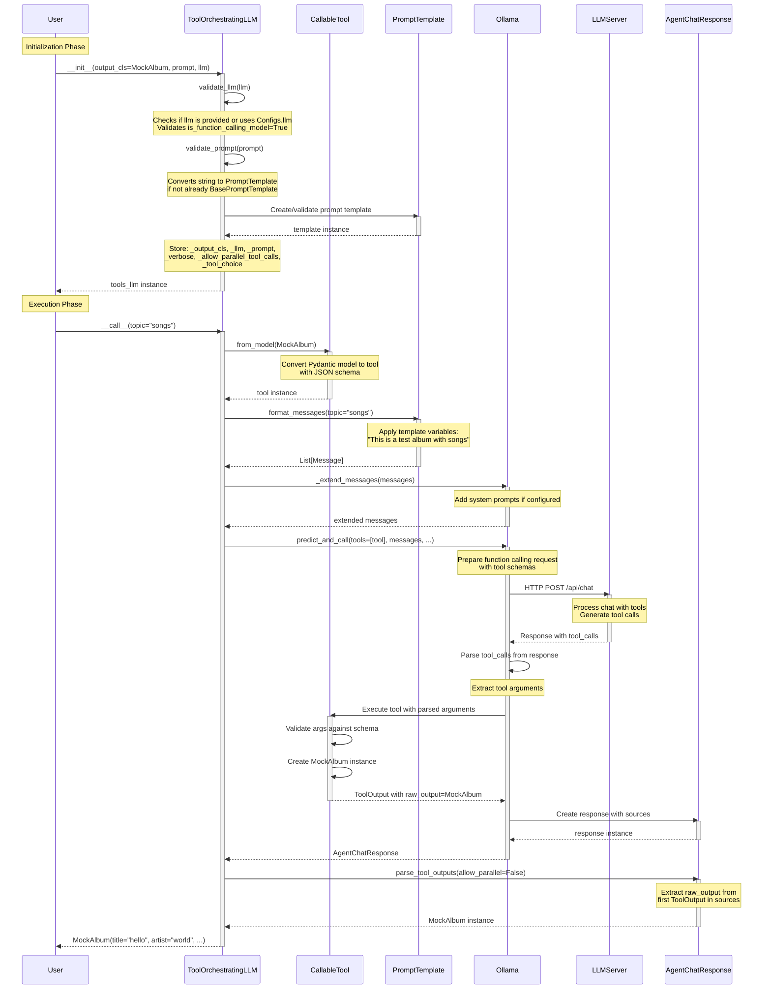
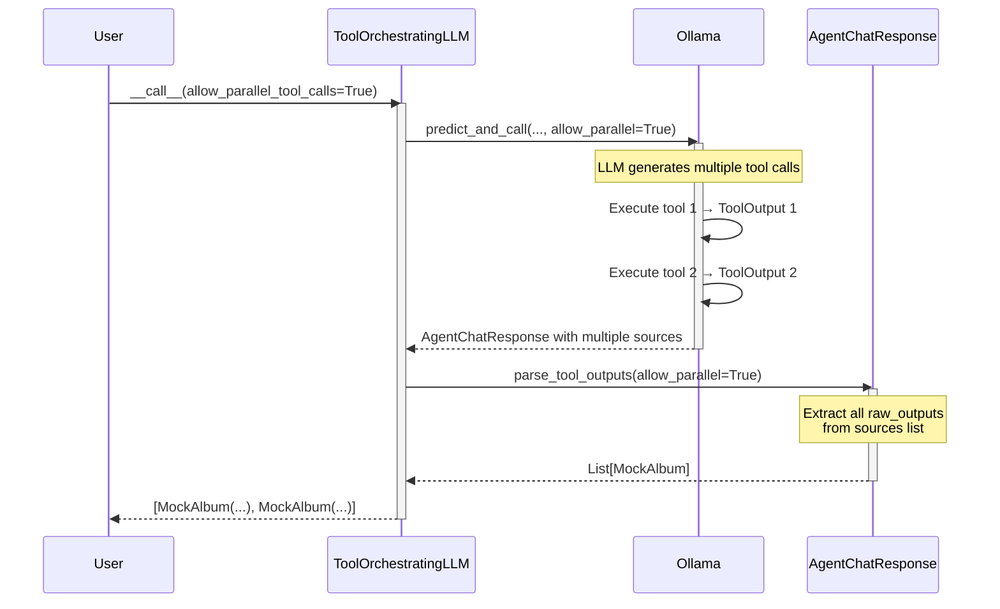

# Execution Flow and Method Calls

This diagram shows the complete workflow from initialization to execution of `ToolOrchestratingLLM`.

## Key Points

1. **Initialization validates all components** before storing them - LLM must support function calling
2. **Tool creation** converts Pydantic model to CallableTool with JSON schema
3. **Prompt formatting** applies template variables to create messages
4. **predict_and_call** orchestrates the function calling flow with the LLM
5. **Tool execution** happens automatically after LLM generates tool calls
6. **Response parsing** extracts structured Pydantic instances from ToolOutput

## Parallel Tool Calls

When `allow_parallel_tool_calls=True`:

## Async Execution Flow

The async flow (`acall`) follows the same pattern but uses:
- `apredict_and_call` instead of `predict_and_call`
- Async tool execution
- All operations are awaited

## Streaming Execution Flow

For `__call__(stream=True)`:
1. Uses `stream_chat_with_tools` instead of `predict_and_call`
2. Yields partial responses as `StreamingObjectProcessor` parses incremental tool calls
3. Maintains `cur_objects` state across chunks
4. Each yield contains progressively updated Pydantic instances
