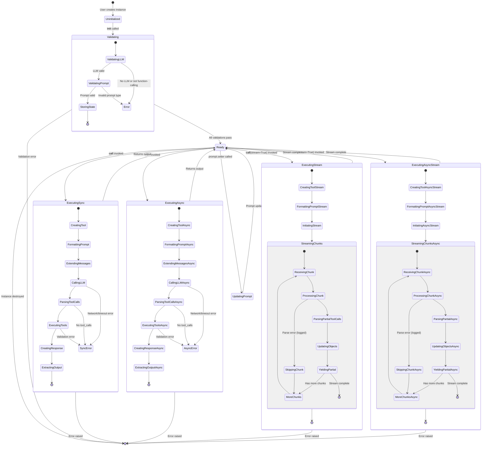
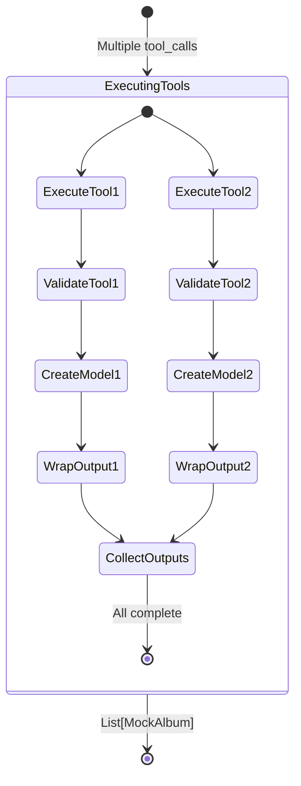

# State Transitions and Lifecycle

This diagram shows the state transitions and lifecycle of `ToolOrchestratingLLM`.



## State Descriptions

### Uninitialized
- **Entry**: Instance creation started
- **Actions**: None
- **Exit**: When `__init__` is called
- **Data**: Constructor arguments available

### Validating
- **Entry**: `__init__` method executing
- **Substates**:
  - `ValidatingLLM`: Check LLM exists and supports function calling
  - `ValidatingPrompt`: Convert/validate prompt template
  - `StoringState`: Store all validated components
- **Exit**: All validations pass or error raised
- **Data**: Validated components stored in instance attributes

### Ready
- **Entry**: Instance fully initialized
- **Actions**: Waiting for execution call
- **Transitions**:
  - `__call__` → ExecutingSync
  - `acall` → ExecutingAsync
  - `__call__(stream=True)` → ExecutingStream
  - `acall(stream=True)` → ExecutingAsyncStream
  - `prompt.setter` → UpdatingPrompt
- **Data**: All instance state available and immutable (except prompt)

### ExecutingSync (Synchronous Execution)
- **Entry**: `__call__` invoked
- **Substates**:
  1. `CreatingTool`: CallableTool.from_model(output_cls)
  2. `FormattingPrompt`: format_messages(**kwargs)
  3. `ExtendingMessages`: _extend_messages(messages)
  4. `CallingLLM`: predict_and_call(tools, messages, ...)
  5. `ParsingToolCalls`: Extract tool_calls from response
  6. `ExecutingTools`: Validate args and create Pydantic instances
  7. `CreatingResponse`: Build AgentChatResponse
  8. `ExtractingOutput`: parse_tool_outputs(allow_parallel)
- **Exit**: Returns Pydantic instance(s) or raises error
- **Data**: Transient execution state (tool, messages, response)

### ExecutingAsync (Asynchronous Execution)
- **Entry**: `acall` invoked
- **Substates**: Same as ExecutingSync but async
- **Exit**: Returns Pydantic instance(s) or raises error
- **Data**: Same as ExecutingSync

### ExecutingStream (Synchronous Streaming)
- **Entry**: `__call__(stream=True)` invoked
- **Substates**:
  1. `CreatingToolStream`: Create CallableTool
  2. `FormattingPromptStream`: Format messages
  3. `InitiatingStream`: Start chat_with_tools(stream=True)
  4. `StreamingChunks`: Process chunks loop
     - `ReceivingChunk`: Get next chunk from generator
     - `ProcessingChunk`: Initialize StreamingObjectProcessor
     - `ParsingPartialToolCalls`: Parse partial JSON
     - `UpdatingObjects`: Update cur_objects state
     - `YieldingPartial`: Yield partial/complete model
     - `MoreChunks`: Check if more chunks available
     - `SkippingChunk`: Handle parse errors gracefully
- **Exit**: Generator exhausted or error raised
- **Data**: Streaming state (cur_objects, partial_resp)

### ExecutingAsyncStream (Asynchronous Streaming)
- **Entry**: `acall(stream=True)` invoked
- **Substates**: Same as ExecutingStream but async
- **Exit**: Async generator exhausted or error raised
- **Data**: Same as ExecutingStream

### UpdatingPrompt
- **Entry**: `prompt.setter` called
- **Actions**: Update `_prompt` attribute
- **Exit**: Immediately returns to Ready
- **Data**: New prompt template stored

## State Data by Phase

### Initialization Phase
```python
# Uninitialized → Validating → Ready
{
    "_output_cls": Type[MockAlbum],
    "_llm": Ollama,
    "_prompt": PromptTemplate,
    "_verbose": False,
    "_allow_parallel_tool_calls": False,
    "_tool_choice": None
}
```

### Execution Phase (Sync)
```python
# Ready → ExecutingSync → Ready
{
    # Instance state (immutable during execution)
    "_output_cls": Type[MockAlbum],
    "_llm": Ollama,
    "_prompt": PromptTemplate,

    # Transient state (created during execution)
    "kwargs": {"topic": "songs"},
    "tool": CallableTool,
    "messages": List[Message],
    "agent_response": AgentChatResponse,
    "output": MockAlbum
}
```

### Streaming Phase
```python
# Ready → ExecutingStream → Ready
{
    # Instance state
    "_output_cls": Type[MockAlbum],
    "_llm": Ollama,
    "_prompt": PromptTemplate,

    # Streaming state (maintained across chunks)
    "tool": CallableTool,
    "messages": List[Message],
    "chat_response_gen": Generator,
    "cur_objects": List[MockAlbum],  # Progressive state
    "partial_resp": StreamingChatResponse
}
```

## Transition Triggers

### User-Triggered Transitions
1. `__init__` → Starts validation
2. `__call__` → Starts sync execution
3. `acall` → Starts async execution
4. `__call__(stream=True)` → Starts streaming
5. `acall(stream=True)` → Starts async streaming
6. `prompt.setter` → Updates prompt

### System-Triggered Transitions
1. Validation success → Ready state
2. Validation failure → Error state
3. Execution complete → Return to Ready
4. Execution error → Error state
5. Stream chunk received → Process and yield
6. Stream exhausted → Return to Ready

## Error States

### Validation Errors (Initialization)
- `AssertionError`: No LLM provided and Configs.llm not set
- `ValueError`: LLM does not support function calling
- `ValueError`: Invalid prompt type

### Execution Errors (Runtime)
- `ValueError`: LLM errors (network, timeout, invalid args)
- `ValidationError`: Tool argument validation fails
- `AttributeError`: Missing raw_output in ToolOutput

### Streaming Errors (Runtime)
- Parse errors are logged as warnings and skipped
- Critical errors raised and propagated

## State Persistence

### Persistent Across Calls
- `_output_cls`: Never changes
- `_llm`: Never changes
- `_prompt`: Can be updated via setter
- `_verbose`: Never changes
- `_allow_parallel_tool_calls`: Never changes
- `_tool_choice`: Never changes

### Transient Per Call
- Tool instance
- Formatted messages
- LLM response
- Parsed output

### Transient Per Stream
- `cur_objects`: Maintains progressive parsing state
- Each new streaming call creates fresh state

## Parallel Execution States

When `allow_parallel_tool_calls=True`:



## Lifecycle Summary

1. **Birth**: Instance created → Validation → Ready
2. **Active**: Ready → Execute → Ready (repeatable)
3. **Mutable**: Prompt can be updated at any time when Ready
4. **Death**: Instance destroyed when no longer referenced

Each execution is independent and returns the instance to Ready state, allowing multiple calls with different arguments.
