# Data Transformations and Validation

This diagram shows how data flows through the `TextCompletionLLM` system.

```mermaid
flowchart TD
    Start([User Code]) --> Init{Initialize TextCompletionLLM}

    Init --> ValidateParser[Validate Output Parser]
    ValidateParser --> CheckParser{Parser Type?}
    CheckParser -->|PydanticParser| ExtractClass[Extract output_cls]
    CheckParser -->|None + output_cls| CreateParser[Create PydanticParser]
    CheckParser -->|Other| Error1[Raise ValueError]

    ExtractClass --> ValidateLLM[Validate LLM]
    CreateParser --> ValidateLLM

    ValidateLLM --> CheckLLM{LLM Provided?}
    CheckLLM -->|Yes| ValidatePrompt[Validate Prompt]
    CheckLLM -->|No| CheckConfigs{Configs.llm Set?}
    CheckConfigs -->|Yes| ValidatePrompt
    CheckConfigs -->|No| Error2[Raise AssertionError]

    ValidatePrompt --> CheckPrompt{Prompt Type?}
    CheckPrompt -->|BasePromptTemplate| StoreComponents[Store All Components]
    CheckPrompt -->|String| ConvertPrompt[Convert to PromptTemplate]
    CheckPrompt -->|Other| Error3[Raise ValueError]

    ConvertPrompt --> StoreComponents
    StoreComponents --> Ready([TextCompletionLLM Ready])

    Ready --> Call{User Calls text_llm}
    Call -->|With kwargs| MergeKwargs[Merge kwargs with defaults]

    MergeKwargs --> CheckModel{LLM.metadata.is_chat_model?}

    CheckModel -->|True - Chat Model| FormatMessages[Format Messages]
    CheckModel -->|False - Completion Model| FormatPrompt[Format Prompt String]

    FormatMessages --> ApplyVars1[Apply template variables]
    ApplyVars1 --> AddSchema1[Add JSON schema to messages]
    AddSchema1 --> ExtendMessages[Extend with system prompts]
    ExtendMessages --> ChatCall[Call LLM.chat]
    ChatCall --> ChatRequest[HTTP POST to /api/chat]
    ChatRequest --> ChatResponse[ChatResponse with message]
    ChatResponse --> ExtractContent1[Extract message.content]
    ExtractContent1 --> ParseOutput

    FormatPrompt --> ApplyVars2[Apply template variables]
    ApplyVars2 --> AddSchema2[Add JSON schema to prompt]
    AddSchema2 --> ExtendPrompt[Extend with system prompts]
    ExtendPrompt --> CompleteCall[Call LLM.complete]
    CompleteCall --> CompleteRequest[HTTP POST to /api/generate]
    CompleteRequest --> CompleteResponse[CompletionResponse with text]
    CompleteResponse --> ExtractContent2[Extract response.text]
    ExtractContent2 --> ParseOutput[Parse Output]

    ParseOutput --> ExtractJSON[Extract JSON string]
    ExtractJSON --> ValidateJSON{Valid JSON?}
    ValidateJSON -->|No| Error4[Raise ValueError]
    ValidateJSON -->|Yes| ValidateSchema[Validate against Pydantic schema]

    ValidateSchema --> CheckSchema{Schema Valid?}
    CheckSchema -->|No| Error5[Raise ValidationError]
    CheckSchema -->|Yes| CreateModel[Create Pydantic instance]

    CreateModel --> TypeCheck{isinstance check}
    TypeCheck -->|Pass| Return([Return ModelTest instance])
    TypeCheck -->|Fail| Error6[Raise ValueError]

    style Start fill:#e1f5ff
    style Ready fill:#e1f5ff
    style Return fill:#c8e6c9
    style Error1 fill:#ffcdd2
    style Error2 fill:#ffcdd2
    style Error3 fill:#ffcdd2
    style Error4 fill:#ffcdd2
    style Error5 fill:#ffcdd2
    style Error6 fill:#ffcdd2
    style ChatRequest fill:#fff9c4
    style CompleteRequest fill:#fff9c4
```



## Data Transformations

### Initialization Phase
```
Input:
  - output_parser: PydanticParser(output_cls=ModelTest)
  - prompt: "This is a test prompt with a {test_input}."
  - llm: Ollama(model="llama3.1")

Output:
  - TextCompletionLLM instance with validated components
```

### Execution Phase (Chat Model)
```
Input:
  text_llm(test_input="hello")

Transformations:
  1. kwargs: {test_input: "hello"}
  2. Formatted messages: [Message(role=USER, content="This is a test...")]
  3. Extended messages: [Message(role=SYSTEM, ...), Message(role=USER, ...)]
  4. LLM request: {"model": "llama3.1", "messages": [...]}
  5. Raw response: '{"hello": "world"}'
  6. Extracted JSON: {"hello": "world"}
  7. Validated model: ModelTest(hello="world")

Output:
  ModelTest(hello="world")
```

### Execution Phase (Completion Model)
```
Input:
  text_llm(test_input="hello")

Transformations:
  1. kwargs: {test_input: "hello"}
  2. Formatted prompt: "This is a test prompt with a hello."
  3. Extended prompt: "System: ...\n\nThis is a test prompt with a hello."
  4. LLM request: {"model": "llama3.1", "prompt": "..."}
  5. Raw response: '{"hello": "world"}'
  6. Extracted JSON: {"hello": "world"}
  7. Validated model: ModelTest(hello="world")

Output:
  ModelTest(hello="world")
```

## Error Handling Points

1. **Parser validation**: Ensures PydanticParser is used
2. **LLM validation**: Ensures LLM instance is available
3. **Prompt validation**: Ensures prompt is convertible to template
4. **JSON extraction**: Handles malformed JSON responses
5. **Schema validation**: Catches Pydantic validation errors
6. **Type checking**: Ensures output matches expected type
