# Execution Flow and Method Calls

This diagram shows the complete workflow from initialization to execution of the `Ollama` class.

```mermaid
sequenceDiagram
    participant User
    participant Ollama
    participant Client/AsyncClient
    participant OllamaServer
    participant TextCompletionLLM
    participant ToolOrchestratingLLM
    participant PydanticParser

    Note over User: Initialization Phase
    User->>Ollama: __init__(model, base_url, request_timeout, ...)
    activate Ollama

    Ollama->>Ollama: Set model configuration
    Note over Ollama: Store: model, base_url, temperature,<br/>request_timeout, json_mode, etc.

    Ollama->>Ollama: Initialize metadata
    Note over Ollama: Set is_chat_model=True<br/>is_function_calling_model=True<br/>context_window, num_output

    alt client not provided
        Ollama->>Client/AsyncClient: Create lazy client
        Note over Client/AsyncClient: Client created on first use<br/>with base_url and timeout
    else client provided
        Ollama->>Ollama: Store provided client
    end

    Ollama-->>User: Ollama instance
    deactivate Ollama

    Note over User: Direct Usage - Chat Method
    User->>Ollama: chat(messages, **kwargs)
    activate Ollama

    Ollama->>Ollama: _prepare_chat_with_tools(messages, tools)
    Note over Ollama: Convert tools to Ollama format<br/>if tools provided

    Ollama->>Ollama: _chat(messages, stream=False, **kwargs)
    Ollama->>Client/AsyncClient: Ensure client initialized
    activate Client/AsyncClient
    Client/AsyncClient-->>Ollama: client instance
    deactivate Client/AsyncClient

    Ollama->>Ollama: Build request payload
    Note over Ollama: Combine: model, messages,<br/>options (temp, etc.), format, tools

    Ollama->>Client/AsyncClient: client.chat(**request)
    activate Client/AsyncClient
    Client/AsyncClient->>OllamaServer: HTTP POST /api/chat
    activate OllamaServer
    OllamaServer-->>Client/AsyncClient: JSON response
    deactivate OllamaServer
    Client/AsyncClient-->>Ollama: raw response dict
    deactivate Client/AsyncClient

    Ollama->>Ollama: _chat_from_response(response)
    Note over Ollama: Parse message, tool_calls,<br/>additional_kwargs

    Ollama-->>User: ChatResponse
    deactivate Ollama

    Note over User: Direct Usage - Complete Method
    User->>Ollama: complete(prompt, **kwargs)
    activate Ollama

    Ollama->>Ollama: @chat_to_completion_decorator
    Note over Ollama: Converts prompt to Message<br/>and delegates to chat()

    Ollama->>Ollama: chat([Message(USER, prompt)], **kwargs)
    Note over Ollama: Follows chat flow above

    Ollama->>Ollama: Extract text from ChatResponse
    Ollama-->>User: CompletionResponse
    deactivate Ollama

    Note over User: Usage with TextCompletionLLM
    User->>PydanticParser: Create with output_cls
    activate PydanticParser
    PydanticParser-->>User: parser
    deactivate PydanticParser

    User->>TextCompletionLLM: __init__(parser, prompt, llm=Ollama)
    activate TextCompletionLLM
    TextCompletionLLM->>TextCompletionLLM: Validate components
    TextCompletionLLM-->>User: text_llm instance
    deactivate TextCompletionLLM

    User->>TextCompletionLLM: __call__(value="input")
    activate TextCompletionLLM

    TextCompletionLLM->>Ollama: Check metadata.is_chat_model
    activate Ollama
    Ollama-->>TextCompletionLLM: True
    deactivate Ollama

    TextCompletionLLM->>TextCompletionLLM: Format prompt with variables
    TextCompletionLLM->>Ollama: chat(formatted_messages)
    activate Ollama
    Ollama->>OllamaServer: HTTP POST /api/chat
    activate OllamaServer
    OllamaServer-->>Ollama: JSON response
    deactivate OllamaServer
    Ollama-->>TextCompletionLLM: ChatResponse
    deactivate Ollama

    TextCompletionLLM->>PydanticParser: parse(response.message.content)
    activate PydanticParser
    PydanticParser-->>TextCompletionLLM: Parsed model instance
    deactivate PydanticParser

    TextCompletionLLM-->>User: DummyModel instance
    deactivate TextCompletionLLM

    Note over User: Usage with ToolOrchestratingLLM
    User->>ToolOrchestratingLLM: __init__(output_cls=Album, prompt, llm=Ollama)
    activate ToolOrchestratingLLM
    ToolOrchestratingLLM->>ToolOrchestratingLLM: Create tool from output_cls
    Note over ToolOrchestratingLLM: Convert Album Pydantic model<br/>to CallableTool
    ToolOrchestratingLLM-->>User: tools_llm instance
    deactivate ToolOrchestratingLLM

    User->>ToolOrchestratingLLM: __call__(topic="rock")
    activate ToolOrchestratingLLM

    ToolOrchestratingLLM->>ToolOrchestratingLLM: Format prompt with topic
    ToolOrchestratingLLM->>Ollama: chat(messages, tools=[Album tool])
    activate Ollama

    Ollama->>Ollama: _prepare_chat_with_tools(messages, tools)
    Note over Ollama: Convert CallableTool to<br/>Ollama tool format with schema

    Ollama->>OllamaServer: HTTP POST /api/chat with tools
    activate OllamaServer
    OllamaServer-->>Ollama: Response with tool_calls
    deactivate OllamaServer

    Ollama-->>ToolOrchestratingLLM: ChatResponse(tool_calls=[...])
    deactivate Ollama

    ToolOrchestratingLLM->>ToolOrchestratingLLM: Extract tool calls
    ToolOrchestratingLLM->>ToolOrchestratingLLM: Execute tool with arguments
    Note over ToolOrchestratingLLM: Create Album instance<br/>from tool arguments

    ToolOrchestratingLLM-->>User: Album instance
    deactivate ToolOrchestratingLLM

    Note over User: Streaming Usage
    User->>Ollama: stream_chat(messages)
    activate Ollama

    Ollama->>Ollama: _chat(messages, stream=True)
    Ollama->>Client/AsyncClient: client.chat(stream=True)
    activate Client/AsyncClient
    Client/AsyncClient->>OllamaServer: HTTP POST /api/chat (streaming)
    activate OllamaServer

    loop For each chunk
        OllamaServer-->>Client/AsyncClient: Stream chunk
        Client/AsyncClient-->>Ollama: Raw chunk dict
        Ollama->>Ollama: _chat_stream_from_response(chunk)
        Note over Ollama: Parse incremental message,<br/>accumulate tool_calls
        Ollama-->>User: Yield ChatResponse
    end

    deactivate OllamaServer
    deactivate Client/AsyncClient
    deactivate Ollama

    Note over User: Async Usage
    User->>Ollama: await achat(messages)
    activate Ollama

    Ollama->>Ollama: _achat(messages, stream=False)
    Ollama->>Client/AsyncClient: await async_client.chat()
    activate Client/AsyncClient
    Client/AsyncClient->>OllamaServer: HTTP POST /api/chat (async)
    activate OllamaServer
    OllamaServer-->>Client/AsyncClient: JSON response
    deactivate OllamaServer
    Client/AsyncClient-->>Ollama: raw response dict
    deactivate Client/AsyncClient

    Ollama->>Ollama: _chat_from_response(response)
    Ollama-->>User: ChatResponse
    deactivate Ollama
```



## Key Execution Paths

### 1. Direct Chat Call
```
User → Ollama.chat
  ├─→ _prepare_chat_with_tools (if tools provided)
  ├─→ _chat (build request)
  ├─→ Client.chat → HTTP POST /api/chat
  ├─→ _chat_from_response (parse response)
  └─→ Return ChatResponse
```

### 2. Complete Call (via Decorator)
```
User → Ollama.complete
  ├─→ @chat_to_completion_decorator
  ├─→ Convert prompt to Message
  ├─→ Delegate to chat()
  └─→ Return CompletionResponse
```

### 3. With TextCompletionLLM
```
User → TextCompletionLLM(llm=Ollama)
  ├─→ Format prompt with variables
  ├─→ Ollama.chat (get raw response)
  ├─→ PydanticParser.parse
  └─→ Return validated model instance
```

### 4. With ToolOrchestratingLLM
```
User → ToolOrchestratingLLM(llm=Ollama)
  ├─→ Convert output_cls to CallableTool
  ├─→ Format prompt with variables
  ├─→ Ollama.chat with tools parameter
  ├─→ Ollama converts tools to schema
  ├─→ Server returns tool_calls
  ├─→ Execute tool to create instance
  └─→ Return model instance
```

### 5. Streaming
```
User → Ollama.stream_chat
  ├─→ _chat(stream=True)
  ├─→ Client.chat(stream=True)
  └─→ For each chunk:
      ├─→ _chat_stream_from_response
      └─→ Yield ChatResponse
```

## Important Implementation Details

1. **Client Lazy Initialization**: The Ollama client is created lazily on first use, not during `__init__`
2. **Tool Conversion**: When tools are provided, they're converted from `BaseTool` to Ollama's tool schema format
3. **Decorator Pattern**: The `complete` method uses decorators to wrap the `chat` method for consistency
4. **Streaming Accumulation**: In streaming mode, tool calls are accumulated across chunks
5. **Metadata Handling**: Response metadata includes model info, timing, and token counts
6. **Error Handling**: Network errors, timeout errors, and parsing errors are handled at each stage
