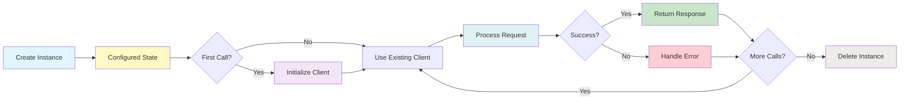

# Lifecycle and State Management

This diagram shows the complete lifecycle and state transitions of the Ollama LLM.

```mermaid
stateDiagram-v2
    [*] --> Uninitialized
    
    Uninitialized --> Configured: __init__(model, base_url, ...)
    
    state Configured {
        [*] --> ClientNotCreated
        
        note right of ClientNotCreated
            State: Configuration stored
            - model: str
            - base_url: str
            - request_timeout: float
            - temperature: float
            - json_mode: bool
            - _client: None
            - _async_client: None
        end note
        
        ClientNotCreated --> ClientInitialized: First chat/complete call
        
        state ClientInitialized {
            [*] --> Idle
            
            note right of Idle
                State: Ready for requests
                - _client: Client instance
                - _async_client: None or AsyncClient
            end note
            
            Idle --> ProcessingChat: chat(messages)
            Idle --> ProcessingComplete: complete(prompt)
            Idle --> ProcessingStream: stream_chat(messages)
            Idle --> ProcessingAsync: achat(messages)
            Idle --> ProcessingTools: chat_with_tools(messages, tools)
            
            state ProcessingChat {
                [*] --> BuildingRequest
                BuildingRequest --> ConvertingMessages: Convert Message objects
                ConvertingMessages --> AddingOptions: Add temperature, etc.
                AddingOptions --> AddingFormat: Add json format if enabled
                AddingFormat --> SendingRequest: HTTP POST to server
                SendingRequest --> WaitingResponse: Awaiting response
                WaitingResponse --> ParsingResponse: Parse raw dict
                ParsingResponse --> CreatingChatResponse: Create ChatResponse
                CreatingChatResponse --> [*]
            }
            
            state ProcessingComplete {
                [*] --> DecoratorWrap
                DecoratorWrap --> ConvertToMessage: Wrap prompt as Message
                ConvertToMessage --> DelegateToChat: Call chat([message])
                DelegateToChat --> ProcessingChat
                ProcessingChat --> DecoratorUnwrap: Extract text
                DecoratorUnwrap --> CreateCompletionResponse: Create CompletionResponse
                CreateCompletionResponse --> [*]
            }
            
            state ProcessingStream {
                [*] --> BuildingStreamRequest
                BuildingStreamRequest --> SendingStreamRequest: stream=True
                SendingStreamRequest --> StreamLoop
                
                state StreamLoop {
                    [*] --> WaitingChunk
                    WaitingChunk --> ReceivingChunk: Chunk arrives
                    ReceivingChunk --> ParsingChunk: Parse chunk dict
                    ParsingChunk --> AccumulatingContent: Accumulate content
                    AccumulatingContent --> AccumulatingTools: Accumulate tool_calls
                    AccumulatingTools --> YieldingResponse: Yield ChatResponse
                    YieldingResponse --> CheckDone: Check done flag
                    CheckDone --> WaitingChunk: done=False
                    CheckDone --> [*]: done=True
                }
                
                StreamLoop --> [*]
            }
            
            state ProcessingAsync {
                [*] --> EnsureAsyncClient
                EnsureAsyncClient --> BuildingAsyncRequest: Create AsyncClient if needed
                BuildingAsyncRequest --> SendingAsyncRequest: await async_client.chat()
                SendingAsyncRequest --> WaitingAsyncResponse: Awaiting
                WaitingAsyncResponse --> ParsingAsyncResponse: Parse response
                ParsingAsyncResponse --> CreatingAsyncChatResponse: Create ChatResponse
                CreatingAsyncChatResponse --> [*]
            }
            
            state ProcessingTools {
                [*] --> PreparingTools
                PreparingTools --> ConvertingTools: Convert to Ollama format
                ConvertingTools --> ExtractingSchemas: Extract fn_schema from metadata
                ExtractingSchemas --> BuildingToolDicts: Build tool dicts
                BuildingToolDicts --> MergingKwargs: Add tools to kwargs
                MergingKwargs --> CallingChat: Call chat(messages, tools=...)
                CallingChat --> ProcessingChat
                ProcessingChat --> ValidatingToolResponse: Check tool_calls present
                ValidatingToolResponse --> CheckParallel: Check allow_parallel_tool_calls
                CheckParallel --> ForcingSingle: False - trim to 1
                CheckParallel --> ReturningMultiple: True - keep all
                ForcingSingle --> [*]
                ReturningMultiple --> [*]
            }
            
            ProcessingChat --> Idle: Return ChatResponse
            ProcessingComplete --> Idle: Return CompletionResponse
            ProcessingStream --> Idle: Stream complete
            ProcessingAsync --> Idle: Return ChatResponse
            ProcessingTools --> Idle: Return ChatResponse with tools
            
            Idle --> Error: Exception occurs
            ProcessingChat --> Error: Network/Parse error
            ProcessingComplete --> Error: Network/Parse error
            ProcessingStream --> Error: Network/Parse error
            ProcessingAsync --> Error: Network/Parse error
            ProcessingTools --> Error: Tool validation error
            
            state Error {
                [*] --> LoggingError
                LoggingError --> RaisingException: Raise appropriate exception
                RaisingException --> [*]
            }
            
            Error --> Idle: Error handled by caller
        }
    }
    
    Configured --> [*]: Delete instance
    
    note left of Configured
        Lifecycle Phases:
        1. Uninitialized: Before __init__
        2. Configured: After __init__, clients lazy
        3. ClientInitialized: After first use
        4. Idle: Ready for requests
        5. Processing*: Handling request
        6. Error: Exception state
    end note
```



## State Transitions

### 1. Initialization → Configured
```python
llm = Ollama(
    model="llama3.1",
    base_url="http://localhost:11434",
    request_timeout=180
)

# State: Configured
# - Configuration fields populated
# - Metadata created (is_chat_model=True, is_function_calling_model=True)
# - _client = None (not yet created)
# - _async_client = None (not yet created)
```

### 2. Configured → ClientInitialized (Lazy)
```python
# First call triggers client creation
response = llm.chat([Message(role=MessageRole.USER, content="Hello")])

# Transition:
# - Access self.client property
# - Check if self._client is None → True
# - Create Client(host=self.base_url, timeout=self.request_timeout)
# - Store in self._client

# State: ClientInitialized → Idle
# - _client = Client instance
# - Ready to process requests
```

### 3. Idle → ProcessingChat → Idle
```python
# Idle state: Ready for requests
response = llm.chat(messages)

# Transition to ProcessingChat:
# 1. BuildingRequest: Create request dict
# 2. ConvertingMessages: Message objects to dicts
# 3. AddingOptions: Merge temperature, etc.
# 4. AddingFormat: Add json format if enabled
# 5. SendingRequest: client.chat(**request)
# 6. WaitingResponse: Block until response
# 7. ParsingResponse: _chat_from_response(raw)
# 8. CreatingChatResponse: Build ChatResponse object

# Transition back to Idle:
# - Return ChatResponse to caller
```

### 4. Idle → ProcessingComplete → Idle
```python
# Complete uses decorator pattern
response = llm.complete(prompt)

# Transition to ProcessingComplete:
# 1. DecoratorWrap: @chat_to_completion_decorator intercepts
# 2. ConvertToMessage: prompt → Message(role=USER, content=prompt)
# 3. DelegateToChat: Call self.chat([message])
#    [Enters ProcessingChat state]
# 4. DecoratorUnwrap: Extract message.content
# 5. CreateCompletionResponse: Wrap in CompletionResponse

# Transition back to Idle:
# - Return CompletionResponse to caller
```

### 5. Idle → ProcessingStream → Idle
```python
# Streaming maintains state across multiple yields
for chunk in llm.stream_chat(messages):
    print(chunk.message.content)

# Transition to ProcessingStream:
# 1. BuildingStreamRequest: Create request with stream=True
# 2. SendingStreamRequest: client.chat(stream=True)
# 3. StreamLoop - for each chunk:
#    a. WaitingChunk: Block for next chunk
#    b. ReceivingChunk: Chunk dict arrives
#    c. ParsingChunk: _chat_stream_from_response(chunk)
#    d. AccumulatingContent: Append to content buffer
#    e. AccumulatingTools: Append to tool_calls buffer
#    f. YieldingResponse: Create and yield ChatResponse with delta
#    g. CheckDone: If done=True, exit loop
# 4. StreamLoop exits when done=True

# Transition back to Idle:
# - Generator exhausted
```

### 6. Idle → ProcessingAsync → Idle
```python
# Async uses separate client and event loop
response = await llm.achat(messages)

# Transition to ProcessingAsync:
# 1. EnsureAsyncClient: Check self._async_client
#    - If None, create AsyncClient(host=base_url, timeout=timeout)
# 2. BuildingAsyncRequest: Create request dict
# 3. SendingAsyncRequest: await async_client.chat(**request)
# 4. WaitingAsyncResponse: Coroutine awaits response
# 5. ParsingAsyncResponse: _chat_from_response(raw)
# 6. CreatingAsyncChatResponse: Build ChatResponse

# Transition back to Idle:
# - Return ChatResponse to caller
```

### 7. Idle → ProcessingTools → Idle
```python
# Tool calling adds preparation and validation steps
response = llm.chat_with_tools(messages, tools)

# Transition to ProcessingTools:
# 1. PreparingTools: _prepare_chat_with_tools(messages, tools)
# 2. ConvertingTools: For each tool:
#    a. ExtractingSchemas: Get tool.metadata.fn_schema
#    b. BuildingToolDicts: Create Ollama tool dict format
# 3. MergingKwargs: Add tools to kwargs
# 4. CallingChat: Delegate to chat(messages, **kwargs)
#    [Enters ProcessingChat state]
# 5. ValidatingToolResponse: _validate_chat_with_tools_response
# 6. CheckParallel: Check allow_parallel_tool_calls flag
#    - If False: ForcingSingle → trim to first tool call
#    - If True: ReturningMultiple → keep all tool calls

# Transition back to Idle:
# - Return ChatResponse with tool_calls
```

### 8. Any State → Error → Idle
```python
try:
    response = llm.chat(messages)
except Exception as e:
    # Handle error

# Error transition can occur from:
# - ProcessingChat: Network timeout, invalid response
# - ProcessingComplete: Any chat error propagates
# - ProcessingStream: Chunk parsing error
# - ProcessingAsync: Async operation failure
# - ProcessingTools: Tool schema validation error

# Error state:
# 1. LoggingError: Log exception details
# 2. RaisingException: Raise appropriate exception type
#    - TimeoutError: request_timeout exceeded
#    - ConnectionError: Cannot reach server
#    - ValueError: Invalid response format
#    - KeyError: Missing required field in response

# Transition back to Idle:
# - Exception handled by caller
# - Instance still usable for next call
```

## State Variables

### Configuration State (Immutable after init)
```python
# Set during __init__, never change
self.model: str = "llama3.1"
self.base_url: str = "http://localhost:11434"
self.request_timeout: float = 180.0
self.temperature: float = 0.75
self.context_window: int = 3900
self.prompt_key: str = "prompt"
self.json_mode: bool = False
self.additional_kwargs: dict[str, Any] = {}
self.keep_alive: Optional[str] = None
self._is_function_calling_model: bool = True
```

### Client State (Mutable, lazy-initialized)
```python
# None until first use
self._client: Optional[Client] = None
self._async_client: Optional[AsyncClient] = None

# After first sync call
self._client: Client = Client(host=self.base_url, timeout=self.request_timeout)

# After first async call
self._async_client: AsyncClient = AsyncClient(host=self.base_url, timeout=self.request_timeout)
```

### Request State (Per-call, transient)
```python
# Created fresh for each call, not stored
request_dict = {
    "model": self.model,
    "messages": [...],
    "options": {"temperature": self.temperature, ...},
    "stream": False,
    "format": "json" if self.json_mode else None,
    "tools": [...] if tools else None,
    "keep_alive": self.keep_alive
}
```

### Streaming State (Per-stream, transient)
```python
# Maintained during stream, not stored on instance
accumulated_content: str = ""
accumulated_tool_calls: list[dict] = []
current_chunk: dict = {}
done: bool = False
```

### Response State (Per-call, returned)
```python
# Created and returned, not stored
chat_response = ChatResponse(
    message=Message(
        role=MessageRole.ASSISTANT,
        content="...",
        additional_kwargs={"tool_calls": [...]}
    ),
    raw={...},
    additional_kwargs={...}
)
```

## Lifecycle Diagram



## Concurrency Considerations

### Thread Safety
```
Ollama instance is NOT thread-safe by default:
  - _client and _async_client are shared state
  - Lazy initialization is not synchronized
  
Recommendation:
  - Use separate Ollama instance per thread
  - Or use locks around lazy initialization
```

### Async Safety
```
Ollama async methods are event-loop safe:
  - Uses separate _async_client per event loop
  - No shared mutable state in async methods
  
Safe to use:
  - Multiple concurrent achat() calls in same loop
  - Multiple event loops with same instance (separate clients)
```

### Streaming State
```
Each stream maintains its own state:
  - Generator/async generator has local variables
  - No shared state between streams
  
Safe to have:
  - Multiple concurrent streams from same instance
```

## State Management Best Practices

### 1. Initialization
```python
# ✓ Good: Initialize once, reuse
llm = Ollama(model="llama3.1", request_timeout=180)

# ✗ Bad: Create new instance per call
def get_response(prompt):
    llm = Ollama(model="llama3.1")  # Inefficient
    return llm.complete(prompt)
```

### 2. Client Reuse
```python
# ✓ Good: Client automatically reused
llm = Ollama(model="llama3.1")
response1 = llm.chat(messages1)  # Creates client
response2 = llm.chat(messages2)  # Reuses client

# ✗ Bad: Don't access _client directly
llm._client = None  # Don't do this
```

### 3. Configuration
```python
# ✓ Good: Set configuration at init
llm = Ollama(model="llama3.1", temperature=0.8, json_mode=True)

# ✗ Bad: Don't modify config after init
llm.temperature = 0.5  # Config is immutable
```

### 4. Error Handling
```python
# ✓ Good: Instance remains usable after error
llm = Ollama(model="llama3.1")
try:
    response = llm.chat(messages)
except TimeoutError:
    # Can still use llm for next call
    response = llm.chat(messages, temperature=0.2)

# ✓ Good: Instance is reusable
```

### 5. Streaming
```python
# ✓ Good: Complete stream before next call
for chunk in llm.stream_chat(messages1):
    process(chunk)
response = llm.chat(messages2)  # Safe

# ⚠ Warning: Interleaving streams
stream1 = llm.stream_chat(messages1)
stream2 = llm.stream_chat(messages2)  # Both use same client
```
