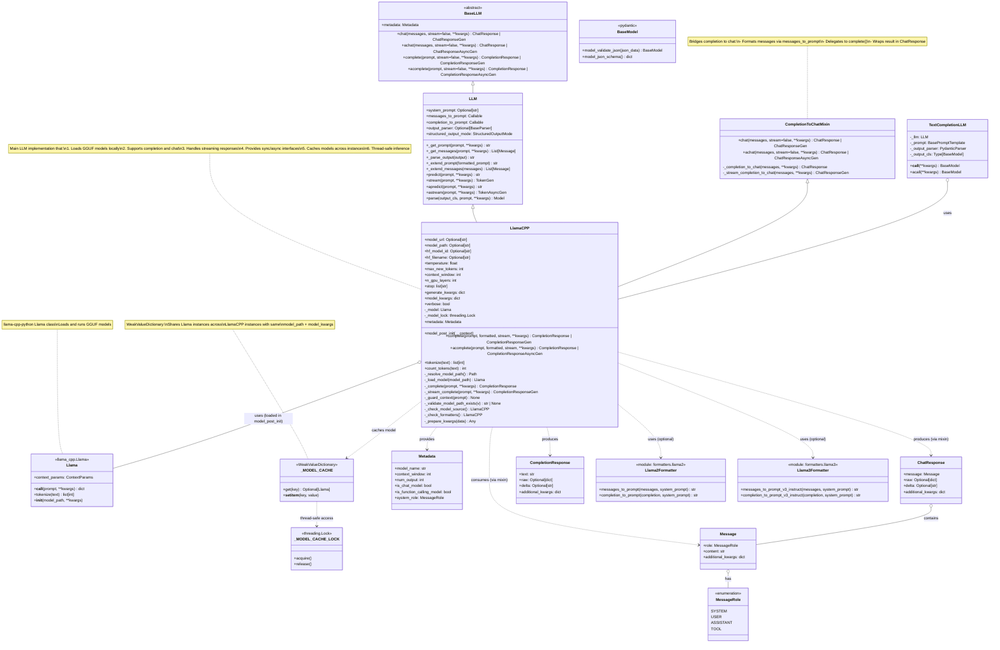

# Architecture and Class Relationships

This diagram shows the class relationships and inheritance hierarchy for the `LlamaCPP` LLM implementation.



## Class Hierarchy

### Inheritance Chain
```
BaseLLM (abstract)
  └─→ LLM (adds prompting and structured outputs)
      └─→ CompletionToChatMixin (adds chat from completion)
          └─→ LlamaCPP (concrete implementation)
```

**Key difference from Ollama**: LlamaCPP does **not** inherit from `FunctionCallingLLM` — it does not support tool/function calling. Chat is provided through `CompletionToChatMixin` (completion → chat), whereas Ollama provides chat natively and derives completion from it.

## Component Responsibilities

### LlamaCPP
**Core LLM Implementation**
- **Model Management**: Downloads, caches, and loads GGUF model files
- **Completion**: Builds and executes text completion requests
- **Streaming**: Handles incremental response chunks
- **Context Guard**: Validates prompt length before inference
- **Tokenization**: Exposes model tokenizer for token counting
- **Thread Safety**: Serializes calls to the C backend with a lock
- **Configuration**: Manages model settings, temperature, max_tokens, etc.

### CompletionToChatMixin (Parent Mixin)
**Completion-to-Chat Bridge**
- **Chat Interface**: Provides `chat()` and `achat()` by delegating to `complete()`
- **Message Formatting**: Uses `messages_to_prompt` to format messages as a string
- **Response Wrapping**: Converts `CompletionResponse` to `ChatResponse`
- **Streaming Bridge**: Bridges streaming completion to streaming chat

### LLM (Grandparent Class)
**High-Level Orchestration**
- **Prompt Management**: Extends prompts with system messages
- **Message Formatting**: Converts between formats
- **Structured Outputs**: Forces Pydantic model outputs via `parse`
- **Parser Integration**: Applies output parsers to responses

### BaseLLM (Root Class)
**Core Interface**
- **Standard Methods**: Defines chat, complete, and their variants
- **Sync/Async**: Requires both synchronous and asynchronous implementations
- **Streaming**: Requires streaming variants of all methods
- **Metadata**: Requires metadata property for capabilities

### Llama (llama-cpp-python)
**Model Runtime**
- **Model Loading**: Loads GGUF files into memory
- **Inference**: Runs token generation on CPU/GPU
- **Tokenization**: Provides vocabulary-based tokenization
- **Streaming**: Supports streaming generation via iterator

### Model Cache
**Shared Memory**
- **WeakValueDictionary**: Models are shared across LlamaCPP instances
- **Automatic Cleanup**: Entries are removed when all references are garbage-collected
- **Thread-Safe**: Protected by a module-level lock

### Formatter Modules
**Prompt Templates**
- **Llama 2 / Mistral**: `[INST]...[/INST]` format
- **Llama 3 Instruct**: `<|start_header_id|>...<|eot_id|>` format
- **Pluggable**: Users can provide custom formatters

### Message/ChatResponse/CompletionResponse
**Data Models**
- **Message**: Represents a single chat message with role and content
- **ChatResponse**: Wraps assistant response with metadata
- **CompletionResponse**: Wraps text completion with metadata

## Design Patterns

### 1. Eager Initialization (vs. Ollama's Lazy Init)
```python notest
def model_post_init(self, __context):
    model_path = self._resolve_model_path()
    self._model = self._load_model(model_path)
```

### 2. Flyweight Pattern (Model Cache)
```python notest
_MODEL_CACHE: WeakValueDictionary[tuple[str, str], Llama] = WeakValueDictionary()

def _load_model(self, model_path: Path) -> Llama:
    cache_key = (str(model_path), json.dumps(self.model_kwargs, sort_keys=True))
    # Check cache → load if missing → store in cache
    ...
```

### 3. CompletionToChatMixin (Adapter Pattern)
```python notest
# Chat is derived from completion:
# 1. messages_to_prompt(messages) → formatted string
# 2. complete(formatted_string) → CompletionResponse
# 3. Wrap in ChatResponse
```

### 4. Thread Safety (Monitor Pattern)
```python notest
with self._model_lock:
    response = self._model(prompt=prompt, **call_kwargs)
```

## Integration Points

### With TextCompletionLLM
```
TextCompletionLLM uses LlamaCPP for:
  - Checking is_chat_model via metadata
  - Calling chat() or complete()
  - Getting raw text responses for parsing
```

### With External Packages
```
LlamaCPP depends on:
  - llama-cpp-python (Llama model runtime)
  - pydantic (for configuration and validation)
  - serapeum.core (for base classes and types)
  - requests (for URL model downloads)
  - huggingface-hub (optional, for HF downloads)
```
