# Data Transformations and Validation

This diagram shows how data flows and transforms through the LlamaCPP LLM system.

```mermaid
flowchart TD
    Start([User Code]) --> Init{Initialize LlamaCPP}

    Init --> Validators[Run Validators]
    Validators --> V1[_validate_model_path_exists]
    V1 --> V2[_check_model_source]
    V2 --> V3[_check_formatters]
    V3 --> V4[_prepare_kwargs]

    V4 --> SetConfig[Set Configuration]
    SetConfig --> StoreModelSource[Store model_path / model_url / hf_model_id]
    StoreModelSource --> StoreGenParams[Store temperature, max_new_tokens, context_window]
    StoreGenParams --> StoreKwargs[Store generate_kwargs, model_kwargs]
    StoreKwargs --> CreateMetadata[Create Metadata]
    CreateMetadata --> SetChatFlag[Set is_chat_model=True]
    SetChatFlag --> SetFnCallFlag[Set is_function_calling_model=False]

    SetFnCallFlag --> PostInit[model_post_init]
    PostInit --> ResolvePath[_resolve_model_path]

    ResolvePath --> SourceType{Model Source?}
    SourceType -->|model_path| UsePath[Use local Path directly]
    SourceType -->|hf_model_id| DownloadHF[_fetch_model_file_hf]
    SourceType -->|model_url| DownloadURL[_fetch_model_file]
    SourceType -->|default| DownloadDefault[_fetch_model_file with default URL]

    DownloadHF --> HFLib[hf_hub_download]
    HFLib --> HFPath[Return cached Path]
    DownloadURL --> HTTPGet[requests.get with streaming]
    HTTPGet --> ValidateSize{Content-Length >= 1 MB?}
    ValidateSize -->|No| SizeError[Raise ValueError]
    ValidateSize -->|Yes| WriteChunks[Write chunks with progress bar]
    WriteChunks --> URLPath[Return local Path]
    DownloadDefault --> HTTPGet

    UsePath --> LoadModel[_load_model]
    HFPath --> LoadModel
    URLPath --> LoadModel

    LoadModel --> CacheKey[Compute cache_key: path + model_kwargs]
    CacheKey --> CheckCache{In _MODEL_CACHE?}
    CheckCache -->|Yes| ReturnCached[Return cached Llama]
    CheckCache -->|No| CreateLlama[Llama model_path, **model_kwargs]
    CreateLlama --> StoreCache[Store in _MODEL_CACHE]
    StoreCache --> ReturnCached

    ReturnCached --> Ready([LlamaCPP Instance Ready])

    Ready --> CallType{Call Type?}

    CallType -->|complete| CompletePath[Complete Path]
    CallType -->|chat| ChatPath[Chat Path]
    CallType -->|complete stream=True| StreamPath[Stream Path]
    CallType -->|acomplete| AsyncPath[Async Path]

    %% Complete Path
    CompletePath --> CheckFormatted{formatted?}
    CheckFormatted -->|No| ApplyFormatter[completion_to_prompt prompt]
    CheckFormatted -->|Yes| SkipFormat[Use prompt as-is]
    ApplyFormatter --> GuardContext
    SkipFormat --> GuardContext[_guard_context]

    GuardContext --> CountTokens[tokenize prompt → count]
    CountTokens --> CheckLength{count > context_window?}
    CheckLength -->|Yes| ContextError[Raise ValueError]
    CheckLength -->|No| BuildKwargs[Build call_kwargs]

    BuildKwargs --> MergeGenKwargs[Merge generate_kwargs]
    MergeGenKwargs --> AddTemp[Add temperature]
    AddTemp --> AddMaxTokens[Add max_tokens]
    AddMaxTokens --> AddStop[Add stop tokens]
    AddStop --> AddOverrides[Add **kwargs overrides]

    AddOverrides --> AcquireLock[Acquire _model_lock]
    AcquireLock --> CallModel[self._model prompt, **call_kwargs]
    CallModel --> ReleaseLock[Release _model_lock]
    ReleaseLock --> ParseResponse[Parse response dict]
    ParseResponse --> ExtractText[Extract choices 0 text]
    ExtractText --> CreateCompResp[Create CompletionResponse]
    CreateCompResp --> ReturnComplete([Return CompletionResponse])

    %% Chat Path via mixin
    ChatPath --> FormatMessages[messages_to_prompt messages]
    FormatMessages --> FormattedString[Formatted prompt string]
    FormattedString --> DelegateComplete[complete formatted, formatted=True]
    DelegateComplete --> GuardContext
    ReturnComplete --> WrapChat{Called from chat?}
    WrapChat -->|Yes| CreateChatResp[Create ChatResponse]
    WrapChat -->|No| ReturnDirect([Return to caller])
    CreateChatResp --> ExtractContent[text → Message role=ASSISTANT]
    ExtractContent --> ReturnChat([Return ChatResponse])

    %% Stream Path
    StreamPath --> CheckFormatted2{formatted?}
    CheckFormatted2 -->|No| ApplyFormatter2[completion_to_prompt]
    CheckFormatted2 -->|Yes| SkipFormat2[Use as-is]
    ApplyFormatter2 --> GuardContextS[_guard_context]
    SkipFormat2 --> GuardContextS
    GuardContextS --> BuildKwargsS[Build call_kwargs with stream=True]
    BuildKwargsS --> AcquireLockS[Acquire _model_lock]
    AcquireLockS --> StreamLoop{For each chunk}

    StreamLoop --> ReceiveChunk[Receive chunk dict]
    ReceiveChunk --> ExtractDelta[Extract choices 0 text as delta]
    ExtractDelta --> AccumText[Accumulate text += delta]
    AccumText --> CreateChunkResp[Create CompletionResponse with delta]
    CreateChunkResp --> YieldChunk[Yield CompletionResponse]
    YieldChunk --> CheckDone{More chunks?}
    CheckDone -->|Yes| StreamLoop
    CheckDone -->|No| ReleaseLockS[Release _model_lock]
    ReleaseLockS --> EndStream([Stream Complete])

    %% Async Path
    AsyncPath --> CheckStream{stream?}
    CheckStream -->|No| ToThread[asyncio.to_thread self.complete]
    CheckStream -->|Yes| ToThreadStream[asyncio.to_thread list complete stream=True]
    ToThread --> ReturnAsync([Return CompletionResponse])
    ToThreadStream --> ReYield[Async generator re-yields chunks]
    ReYield --> ReturnAsyncStream([Return async generator])

    %% Error paths
    SizeError --> ErrorEnd([Raise Exception])
    ContextError --> ErrorEnd

    %% Styling
    style Start fill:#e1f5ff
    style Ready fill:#e1f5ff
    style ReturnComplete fill:#c8e6c9
    style ReturnChat fill:#c8e6c9
    style ReturnDirect fill:#c8e6c9
    style ReturnAsync fill:#c8e6c9
    style ReturnAsyncStream fill:#c8e6c9
    style EndStream fill:#c8e6c9
    style SizeError fill:#ffcdd2
    style ContextError fill:#ffcdd2
    style ErrorEnd fill:#ffcdd2
    style CallModel fill:#fff9c4
    style StreamLoop fill:#fff9c4
    style ToThread fill:#fff9c4
    style ToThreadStream fill:#fff9c4
```



## Data Transformation Examples

### 1. Initialization
```python notest
Input:
  LlamaCPP(
      model_path="/models/llama-3-8b.Q4_0.gguf",
      temperature=0.1,
      max_new_tokens=256,
      context_window=8192,
      messages_to_prompt=messages_to_prompt_v3_instruct,
      completion_to_prompt=completion_to_prompt_v3_instruct,
  )

Transformations:
  1. Validators:
     - _validate_model_path_exists: Path exists ✓
     - _check_model_source: model_path is set ✓
     - _check_formatters: both formatters provided ✓
     - _prepare_kwargs: merge n_ctx=8192, verbose=False into model_kwargs

  2. Store configuration:
     - model_path = "/models/llama-3-8b.Q4_0.gguf"
     - temperature = 0.1
     - max_new_tokens = 256
     - context_window = 8192

  3. Create metadata:
     - model_name = "/models/llama-3-8b.Q4_0.gguf"
     - is_chat_model = True
     - is_function_calling_model = False
     - context_window = 8192
     - num_output = 256

  4. model_post_init:
     - _resolve_model_path → Path("/models/llama-3-8b.Q4_0.gguf")
     - _load_model → Llama instance (cached)

Output:
  LlamaCPP instance with loaded model
```

### 2. Completion Request
```python notest
Input:
  prompt = "Say hello."
  formatted = False
  stream = False

Transformations:
  1. Apply formatter:
     completion_to_prompt("Say hello.")
     →  "<|start_header_id|>system<|end_header_id|>\n\n"
        "You are a helpful...<|eot_id|>\n"
        "<|start_header_id|>user<|end_header_id|>\n\n"
        "Say hello.<|eot_id|>\n"
        "<|start_header_id|>assistant<|end_header_id|>\n\n"

  2. Guard context:
     tokenize(formatted_prompt) → [token_ids...]
     count = 47  (< 8192 ✓)

  3. Build call_kwargs:
     {
       "temperature": 0.1,
       "max_tokens": 256,
       "stream": False,
       "stop": None
     }

  4. Call model (with lock):
     self._model(prompt=formatted_prompt, **call_kwargs)

  5. Raw response:
     {
       "id": "cmpl-...",
       "choices": [
         {"text": "Hello! How can I help you today?", "index": 0, ...}
       ],
       "usage": {"prompt_tokens": 47, "completion_tokens": 9, "total_tokens": 56}
     }

  6. Create CompletionResponse:
     CompletionResponse(
       text="Hello! How can I help you today?",
       raw={...}
     )

Output:
  CompletionResponse with generated text
```

### 3. Chat Request (via Mixin)
```python notest
Input:
  messages = [
    Message(role=MessageRole.SYSTEM, content="You are a math tutor."),
    Message(role=MessageRole.USER, content="What is 2+2?"),
  ]
  stream = False

Transformations:
  1. CompletionToChatMixin calls messages_to_prompt:
     messages_to_prompt_v3_instruct(messages)
     → "<|start_header_id|>system<|end_header_id|>\n\n"
       "You are a math tutor.<|eot_id|>\n"
       "<|start_header_id|>user<|end_header_id|>\n\n"
       "What is 2+2?<|eot_id|>\n"
       "<|start_header_id|>assistant<|end_header_id|>\n\n"

  2. Delegate to complete(formatted_string, formatted=True)
     [Follows Completion Request flow above]

  3. CompletionResponse returned:
     CompletionResponse(text="4", raw={...})

  4. Wrap in ChatResponse:
     ChatResponse(
       message=Message(
         role=MessageRole.ASSISTANT,
         content="4"
       ),
       raw={...}
     )

Output:
  ChatResponse with assistant message
```

### 4. Streaming Completion
```python notest
Input:
  prompt = "Count to 3"
  stream = True

Transformations:
  1. Apply formatter → formatted prompt

  2. Guard context → OK

  3. Build call_kwargs with stream=True

  4. Acquire _model_lock

  5. For each chunk from self._model(stream=True):
     Chunk 1: {"choices": [{"text": "1"}]}
       → CompletionResponse(delta="1", text="1")
       → Yield

     Chunk 2: {"choices": [{"text": ", "}]}
       → CompletionResponse(delta=", ", text="1, ")
       → Yield

     Chunk 3: {"choices": [{"text": "2"}]}
       → CompletionResponse(delta="2", text="1, 2")
       → Yield

     Chunk 4: {"choices": [{"text": ", "}]}
       → CompletionResponse(delta=", ", text="1, 2, ")
       → Yield

     Chunk 5: {"choices": [{"text": "3"}]}
       → CompletionResponse(delta="3", text="1, 2, 3")
       → Yield

  6. Release _model_lock

Output:
  Generator yielding CompletionResponse objects
```

### 5. Async Completion
```python notest
Input:
  prompt = "Say hello."
  stream = False

Transformations:
  1. acomplete(prompt, stream=False)
  2. await asyncio.to_thread(self.complete, prompt, formatted=False, stream=False)
     [Runs sync complete() in thread pool]
  3. Return CompletionResponse

For streaming:
  1. acomplete(prompt, stream=True)
  2. chunks = await asyncio.to_thread(lambda: list(self.complete(..., stream=True)))
     [Collects all chunks in thread pool]
  3. Return async generator that re-yields chunks

Output:
  CompletionResponse or async generator
```

## Validation Points

### 1. Configuration Validation (Pydantic Validators)
- **model_path**: If provided, must point to existing file
- **model source**: At least one of model_path, model_url, hf_model_id required
- **hf_filename**: Required when hf_model_id is set
- **formatters**: Both messages_to_prompt and completion_to_prompt required
- **temperature**: Must be in [0.0, 1.0] (Field constraint)
- **max_new_tokens**: Must be > 0 (Field constraint)
- **context_window**: Must be > 0 (Field constraint)

### 2. Model Download Validation
- **Content-Length**: Must be >= 1 MB (URL downloads)
- **HTTP status**: Must be 200
- **File existence**: Verified after download

### 3. Runtime Validation
- **Context guard**: Prompt token count must not exceed context_window
- **Lock acquisition**: Model calls serialized per instance

## Error Handling

### Download Errors
```
URL download → Content-Length < 1 MB → Raise ValueError
URL download → HTTP error → Raise requests.HTTPError
URL download → Connection error → Raise requests.ConnectionError
URL download → Partial file → Cleanup and re-raise
HF download → huggingface-hub missing → Raise ImportError
```

### Inference Errors
```
Prompt too long → _guard_context → Raise ValueError
Backend error → Llama.__call__ → Raise RuntimeError
```

### Configuration Errors
```
No model source → _check_model_source → Raise ValueError
Missing formatters → _check_formatters → Raise ValueError
Invalid model_path → _validate_model_path_exists → Raise ValueError
```

## Data Flow Summary

```
User Input
  ↓
Configuration / Pydantic Validation
  ↓
Model Resolution (download if needed)
  ↓
Model Loading (with cache)
  ↓
Prompt Formatting (completion_to_prompt or messages_to_prompt)
  ↓
Context Guard (token count check)
  ↓
Call kwargs Building
  ↓
Thread-safe Model Inference (with _model_lock)
  ↓
Raw Response (dict from llama-cpp-python)
  ↓
Response Wrapping (CompletionResponse or ChatResponse)
  ↓
User Output
```
