# Execution Flow and Method Calls

This diagram shows the complete workflow from initialization to execution of the `LlamaCPP` class.

```mermaid
sequenceDiagram
    participant User
    participant LlamaCPP
    participant Formatter
    participant Llama as Llama (llama-cpp-python)
    participant Cache as _MODEL_CACHE
    participant ModelSource as Model Source (File/URL/HF)
    participant TextCompletionLLM
    participant PydanticParser

    Note over User: Initialization Phase
    User->>LlamaCPP: __init__(model_path, temperature, formatters, ...)
    activate LlamaCPP

    LlamaCPP->>LlamaCPP: Run Pydantic validators
    Note over LlamaCPP: _validate_model_path_exists<br/>_check_model_source<br/>_check_formatters<br/>_prepare_kwargs

    LlamaCPP->>LlamaCPP: Store configuration
    Note over LlamaCPP: Store: model_path, temperature,<br/>max_new_tokens, context_window, etc.

    LlamaCPP->>LlamaCPP: Create metadata
    Note over LlamaCPP: is_chat_model=True<br/>is_function_calling_model=False

    LlamaCPP->>LlamaCPP: model_post_init

    LlamaCPP->>LlamaCPP: _resolve_model_path()
    alt model_path provided
        LlamaCPP->>LlamaCPP: Use local Path
    else model_url provided
        LlamaCPP->>ModelSource: _fetch_model_file(url, path)
        activate ModelSource
        ModelSource-->>LlamaCPP: Downloaded file path
        deactivate ModelSource
    else hf_model_id provided
        LlamaCPP->>ModelSource: _fetch_model_file_hf(repo_id, filename, cache_dir)
        activate ModelSource
        ModelSource-->>LlamaCPP: Cached file path
        deactivate ModelSource
    end

    LlamaCPP->>Cache: Check _MODEL_CACHE for (path, kwargs)
    activate Cache
    Cache-->>LlamaCPP: Cache miss
    deactivate Cache

    LlamaCPP->>Llama: Llama(model_path, **model_kwargs)
    activate Llama
    Llama-->>LlamaCPP: Llama instance
    deactivate Llama

    LlamaCPP->>Cache: Store in _MODEL_CACHE
    activate Cache
    Cache-->>LlamaCPP: Stored
    deactivate Cache

    LlamaCPP-->>User: LlamaCPP instance (model loaded)
    deactivate LlamaCPP

    Note over User: Direct Usage - Complete Method
    User->>LlamaCPP: complete(prompt, **kwargs)
    activate LlamaCPP

    LlamaCPP->>Formatter: completion_to_prompt(prompt)
    activate Formatter
    Formatter-->>LlamaCPP: formatted prompt
    deactivate Formatter

    LlamaCPP->>LlamaCPP: _guard_context(formatted_prompt)
    Note over LlamaCPP: tokenize → count tokens<br/>raise ValueError if > context_window

    LlamaCPP->>LlamaCPP: Build call_kwargs
    Note over LlamaCPP: Merge: generate_kwargs,<br/>temperature, max_tokens, stop

    LlamaCPP->>LlamaCPP: Acquire _model_lock

    LlamaCPP->>Llama: __call__(prompt, **call_kwargs)
    activate Llama
    Llama-->>LlamaCPP: response dict
    deactivate Llama

    LlamaCPP->>LlamaCPP: Release _model_lock

    LlamaCPP->>LlamaCPP: Extract choices[0]["text"]
    LlamaCPP-->>User: CompletionResponse
    deactivate LlamaCPP

    Note over User: Direct Usage - Chat Method (via Mixin)
    User->>LlamaCPP: chat(messages, **kwargs)
    activate LlamaCPP

    LlamaCPP->>LlamaCPP: CompletionToChatMixin.chat()
    LlamaCPP->>Formatter: messages_to_prompt(messages)
    activate Formatter
    Formatter-->>LlamaCPP: formatted prompt string
    deactivate Formatter

    LlamaCPP->>LlamaCPP: complete(formatted, formatted=True)
    Note over LlamaCPP: Follows complete() flow above

    LlamaCPP->>LlamaCPP: Wrap CompletionResponse in ChatResponse
    Note over LlamaCPP: Create Message(role=ASSISTANT,<br/>content=text)

    LlamaCPP-->>User: ChatResponse
    deactivate LlamaCPP

    Note over User: Usage with TextCompletionLLM
    User->>PydanticParser: Create with output_cls
    activate PydanticParser
    PydanticParser-->>User: parser
    deactivate PydanticParser

    User->>TextCompletionLLM: __init__(parser, prompt, llm=LlamaCPP)
    activate TextCompletionLLM
    TextCompletionLLM->>TextCompletionLLM: Validate components
    TextCompletionLLM-->>User: text_llm instance
    deactivate TextCompletionLLM

    User->>TextCompletionLLM: __call__(value="input")
    activate TextCompletionLLM

    TextCompletionLLM->>LlamaCPP: Check metadata.is_chat_model
    activate LlamaCPP
    LlamaCPP-->>TextCompletionLLM: True
    deactivate LlamaCPP

    TextCompletionLLM->>TextCompletionLLM: Format prompt with variables
    TextCompletionLLM->>LlamaCPP: chat(formatted_messages)
    activate LlamaCPP
    LlamaCPP->>Formatter: messages_to_prompt(messages)
    activate Formatter
    Formatter-->>LlamaCPP: formatted prompt
    deactivate Formatter
    LlamaCPP->>Llama: __call__(prompt, **kwargs)
    activate Llama
    Llama-->>LlamaCPP: response dict
    deactivate Llama
    LlamaCPP-->>TextCompletionLLM: ChatResponse
    deactivate LlamaCPP

    TextCompletionLLM->>PydanticParser: parse(response.message.content)
    activate PydanticParser
    PydanticParser-->>TextCompletionLLM: Parsed model instance
    deactivate PydanticParser

    TextCompletionLLM-->>User: Model instance
    deactivate TextCompletionLLM

    Note over User: Streaming Usage
    User->>LlamaCPP: complete(prompt, stream=True)
    activate LlamaCPP

    LlamaCPP->>Formatter: completion_to_prompt(prompt)
    activate Formatter
    Formatter-->>LlamaCPP: formatted prompt
    deactivate Formatter

    LlamaCPP->>LlamaCPP: _guard_context(formatted_prompt)
    LlamaCPP->>LlamaCPP: Build call_kwargs with stream=True
    LlamaCPP->>LlamaCPP: Acquire _model_lock

    LlamaCPP->>Llama: __call__(prompt, stream=True)
    activate Llama

    loop For each chunk
        Llama-->>LlamaCPP: chunk dict
        LlamaCPP->>LlamaCPP: Extract delta = choices[0]["text"]
        LlamaCPP->>LlamaCPP: Accumulate text += delta
        LlamaCPP-->>User: Yield CompletionResponse(delta, text)
    end

    deactivate Llama
    LlamaCPP->>LlamaCPP: Release _model_lock
    deactivate LlamaCPP

    Note over User: Async Usage
    User->>LlamaCPP: await acomplete(prompt)
    activate LlamaCPP

    LlamaCPP->>LlamaCPP: asyncio.to_thread(self.complete, prompt)
    Note over LlamaCPP: Offload CPU-bound inference<br/>to thread pool

    LlamaCPP->>Llama: [In thread] __call__(prompt, **kwargs)
    activate Llama
    Llama-->>LlamaCPP: response dict
    deactivate Llama

    LlamaCPP-->>User: CompletionResponse
    deactivate LlamaCPP
```



## Key Execution Paths

### 1. Direct Complete Call
```
User → LlamaCPP.complete
  ├─→ completion_to_prompt(prompt) (if not formatted)
  ├─→ _guard_context(formatted_prompt)
  ├─→ Build call_kwargs
  ├─→ Acquire _model_lock
  ├─→ self._model(prompt, **kwargs) → response dict
  ├─→ Release _model_lock
  ├─→ Extract choices[0]["text"]
  └─→ Return CompletionResponse
```

### 2. Chat Call (via CompletionToChatMixin)
```
User → LlamaCPP.chat
  ├─→ CompletionToChatMixin.chat()
  ├─→ messages_to_prompt(messages) → formatted string
  ├─→ Delegate to complete(formatted, formatted=True)
  ├─→ Receive CompletionResponse
  ├─→ Wrap in ChatResponse(message=Message(ASSISTANT, text))
  └─→ Return ChatResponse
```

### 3. With TextCompletionLLM
```
User → TextCompletionLLM(llm=LlamaCPP)
  ├─→ Format prompt with variables
  ├─→ LlamaCPP.chat (get response)
  ├─→ PydanticParser.parse
  └─→ Return validated model instance
```

### 4. Streaming
```
User → LlamaCPP.complete(stream=True)
  ├─→ completion_to_prompt(prompt)
  ├─→ _guard_context(formatted_prompt)
  ├─→ Acquire _model_lock
  └─→ For each chunk from model:
      ├─→ Extract delta from choices[0]["text"]
      ├─→ Accumulate text
      └─→ Yield CompletionResponse(delta, text)
  └─→ Release _model_lock
```

### 5. Async
```
User → LlamaCPP.acomplete(prompt)
  └─→ asyncio.to_thread(self.complete, prompt, ...)
      └─→ [In thread pool] Runs sync complete flow
  └─→ Return CompletionResponse
```

## Important Implementation Details

1. **Eager Initialization**: The model is loaded during `model_post_init`, not lazily on first use
2. **Model Cache**: `WeakValueDictionary` shares Llama instances across LlamaCPP instances with the same path + kwargs
3. **Thread Safety**: `_model_lock` serializes all calls to the Llama C backend per LlamaCPP instance
4. **CompletionToChatMixin**: Chat is derived from completion (the inverse of Ollama's approach)
5. **Async via Thread Pool**: `asyncio.to_thread` offloads CPU-bound inference to avoid blocking the event loop
6. **Formatter Requirement**: Prompt formatters are mandatory — the wrong formatter produces garbage output
7. **Context Guard**: Prompt length is validated against `context_window` before every inference call
