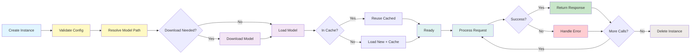

# Lifecycle and State Management

This diagram shows the complete lifecycle and state transitions of the LlamaCPP LLM.

```mermaid
stateDiagram-v2
    [*] --> Uninitialized

    Uninitialized --> Validating: __init__(model_path, formatters, ...)

    state Validating {
        [*] --> FieldValidation
        FieldValidation --> CrossFieldValidation: _validate_model_path_exists
        CrossFieldValidation --> FormatterValidation: _check_model_source
        FormatterValidation --> KwargsPrepare: _check_formatters
        KwargsPrepare --> [*]: _prepare_kwargs

        note right of FieldValidation
            Pydantic validators run:
            - field_validator: model_path exists
            - model_validator: source is valid
            - model_validator: formatters provided
            - model_validator(before): merge kwargs
        end note
    }

    Validating --> ModelLoading: model_post_init

    state ModelLoading {
        [*] --> ResolvingPath

        state ResolvingPath {
            [*] --> CheckSource
            CheckSource --> UseLocalPath: model_path set
            CheckSource --> DownloadFromURL: model_url set
            CheckSource --> DownloadFromHF: hf_model_id set
            CheckSource --> DownloadDefault: fallback URL

            DownloadFromURL --> DownloadProgress: requests.get(stream=True)
            DownloadFromHF --> HFDownload: hf_hub_download
            DownloadDefault --> DownloadProgress

            DownloadProgress --> ValidateDownload: Check file exists
            HFDownload --> ValidateDownload

            UseLocalPath --> [*]
            ValidateDownload --> [*]
        }

        ResolvingPath --> LoadingModel

        state LoadingModel {
            [*] --> CheckCache
            CheckCache --> CacheHit: Key found in _MODEL_CACHE
            CheckCache --> CacheMiss: Key not found

            CacheMiss --> CreateLlama: Llama(model_path, **model_kwargs)
            CreateLlama --> StoreInCache: _MODEL_CACHE[key] = llama

            CacheHit --> [*]
            StoreInCache --> [*]

            note right of CheckCache
                Cache key = (model_path, json(model_kwargs))
                Double-checked locking for thread safety
            end note
        }

        LoadingModel --> [*]
    }

    ModelLoading --> Ready: Model loaded successfully
    ModelLoading --> InitError: Download or load failed

    state Ready {
        [*] --> Idle

        note right of Idle
            State: Ready for requests
            - _model: Llama instance (loaded)
            - _model_lock: threading.Lock (unlocked)
            - Configuration immutable
        end note

        Idle --> ProcessingComplete: complete(prompt)
        Idle --> ProcessingChat: chat(messages)
        Idle --> ProcessingStream: complete(prompt, stream=True)
        Idle --> ProcessingAsync: acomplete(prompt)

        state ProcessingComplete {
            [*] --> FormatPrompt
            FormatPrompt --> GuardContext: completion_to_prompt(prompt)
            GuardContext --> CountTokens: tokenize(prompt)
            CountTokens --> CheckLength: count vs context_window
            CheckLength --> BuildCallKwargs: count <= context_window
            BuildCallKwargs --> AcquireLock: Merge generate_kwargs + defaults
            AcquireLock --> CallModel: _model_lock acquired
            CallModel --> ReleaseLock: self._model(prompt, **kwargs)
            ReleaseLock --> ExtractText: _model_lock released
            ExtractText --> CreateResponse: choices[0]["text"]
            CreateResponse --> [*]: CompletionResponse
        }

        state ProcessingChat {
            [*] --> FormatMessages
            FormatMessages --> DelegateComplete: messages_to_prompt(messages)
            DelegateComplete --> ProcessingComplete: complete(formatted, formatted=True)
            ProcessingComplete --> WrapChatResponse: CompletionResponse received
            WrapChatResponse --> [*]: ChatResponse
        }

        state ProcessingStream {
            [*] --> FormatPromptS
            FormatPromptS --> GuardContextS: completion_to_prompt
            GuardContextS --> BuildKwargsS: Token count OK
            BuildKwargsS --> AcquireLockS: stream=True

            state StreamLoop {
                [*] --> WaitingChunk
                WaitingChunk --> ReceiveChunk: Chunk arrives
                ReceiveChunk --> ExtractDelta: choices[0]["text"]
                ExtractDelta --> AccumulateText: text += delta
                AccumulateText --> YieldResponse: CompletionResponse(delta, text)
                YieldResponse --> CheckMore: Yield to caller
                CheckMore --> WaitingChunk: More chunks
                CheckMore --> [*]: Generation done
            }

            AcquireLockS --> StreamLoop: _model_lock acquired
            StreamLoop --> ReleaseLockS: Stream complete
            ReleaseLockS --> [*]: _model_lock released
        }

        state ProcessingAsync {
            [*] --> CheckAsyncStream
            CheckAsyncStream --> ToThreadSync: stream=False
            CheckAsyncStream --> ToThreadStream: stream=True

            ToThreadSync --> RunInPool: asyncio.to_thread(self.complete)
            RunInPool --> ReturnAsyncResult: CompletionResponse

            ToThreadStream --> CollectInPool: asyncio.to_thread(list(complete(stream=True)))
            CollectInPool --> ReYieldAsync: Async generator re-yields

            ReturnAsyncResult --> [*]
            ReYieldAsync --> [*]
        }

        ProcessingComplete --> Idle: Return CompletionResponse
        ProcessingChat --> Idle: Return ChatResponse
        ProcessingStream --> Idle: Stream complete
        ProcessingAsync --> Idle: Return result

        Idle --> Error: Exception occurs
        ProcessingComplete --> Error: Context/inference error
        ProcessingChat --> Error: Context/inference error
        ProcessingStream --> Error: Context/inference error
        ProcessingAsync --> Error: Thread pool error

        state Error {
            [*] --> IdentifyError
            IdentifyError --> RaiseException: Raise appropriate exception
            RaiseException --> [*]
        }

        Error --> Idle: Error handled by caller
    }

    Ready --> [*]: Delete instance

    InitError --> [*]: Initialization failed

    note left of Ready
        Lifecycle Phases:
        1. Uninitialized: Before __init__
        2. Validating: Pydantic validators
        3. ModelLoading: Download + load
        4. Ready/Idle: Ready for requests
        5. Processing*: Handling request
        6. Error: Exception state
    end note
```



## State Transitions

### 1. Initialization → Validating → ModelLoading → Ready
```python notest
from serapeum.llama_cpp import LlamaCPP
from serapeum.llama_cpp.formatters.llama3 import (
    messages_to_prompt_v3_instruct,
    completion_to_prompt_v3_instruct,
)

llm = LlamaCPP(
    model_path="/models/llama-3-8b.Q4_0.gguf",
    temperature=0.1,
    max_new_tokens=256,
    context_window=8192,
    messages_to_prompt=messages_to_prompt_v3_instruct,
    completion_to_prompt=completion_to_prompt_v3_instruct,
)

# State transitions during __init__:
# 1. Uninitialized
# 2. Validating:
#    - _validate_model_path_exists → OK
#    - _check_model_source → OK (model_path set)
#    - _check_formatters → OK (both provided)
#    - _prepare_kwargs → merge n_ctx into model_kwargs
# 3. ModelLoading:
#    - _resolve_model_path → Path("/models/llama-3-8b.Q4_0.gguf")
#    - _load_model → Check cache → miss → Llama() → store
# 4. Ready/Idle:
#    - _model = Llama instance
#    - _model_lock = unlocked
```

### 2. Ready → ProcessingComplete → Ready
```python notest
# Idle state: Ready for requests
response = llm.complete("Say hello.")

# Transition to ProcessingComplete:
# 1. FormatPrompt: completion_to_prompt("Say hello.")
# 2. GuardContext: tokenize → count tokens
# 3. CheckLength: count <= context_window ✓
# 4. BuildCallKwargs: merge generate_kwargs + temperature + max_tokens
# 5. AcquireLock: _model_lock.acquire()
# 6. CallModel: self._model(prompt, **call_kwargs)
# 7. ReleaseLock: _model_lock.release()
# 8. ExtractText: choices[0]["text"]
# 9. CreateResponse: CompletionResponse(text=..., raw=...)

# Transition back to Idle:
# - Return CompletionResponse to caller
```

### 3. Ready → ProcessingChat → Ready
```python notest
from serapeum.core.llms import Message, MessageRole

messages = [Message(role=MessageRole.USER, content="Hello!")]
response = llm.chat(messages)

# Transition to ProcessingChat:
# 1. FormatMessages: messages_to_prompt_v3_instruct(messages) → formatted string
# 2. DelegateComplete: complete(formatted, formatted=True)
#    [Enters ProcessingComplete state]
# 3. WrapChatResponse: CompletionResponse → ChatResponse

# Transition back to Idle:
# - Return ChatResponse to caller
```

### 4. Ready → ProcessingStream → Ready
```python notest
for chunk in llm.complete("Count to 3", stream=True):
    print(chunk.delta, end="")

# Transition to ProcessingStream:
# 1. FormatPromptS: completion_to_prompt(prompt)
# 2. GuardContextS: token count check
# 3. BuildKwargsS: stream=True
# 4. AcquireLockS: _model_lock.acquire()
# 5. StreamLoop:
#    a. WaitingChunk → ReceiveChunk (from model)
#    b. ExtractDelta → choices[0]["text"]
#    c. AccumulateText → text += delta
#    d. YieldResponse → CompletionResponse(delta, text)
#    e. CheckMore → repeat or exit
# 6. ReleaseLockS: _model_lock.release()

# Transition back to Idle:
# - Generator exhausted
```

### 5. Ready → ProcessingAsync → Ready
```python notest
response = await llm.acomplete("Say hello.")

# Transition to ProcessingAsync:
# 1. CheckAsyncStream: stream=False
# 2. ToThreadSync: asyncio.to_thread(self.complete, prompt, ...)
#    [In thread pool: runs sync complete flow]
# 3. ReturnAsyncResult: CompletionResponse

# Transition back to Idle:
# - Return CompletionResponse to caller
```

### 6. Any State → Error → Idle
```python notest
try:
    huge_prompt = "word " * 10000
    response = llm.complete(huge_prompt)
except ValueError as e:
    print(f"Context exceeded: {e}")
    # Instance still usable for next call

# Error transition can occur from:
# - ProcessingComplete: context guard, backend error
# - ProcessingChat: any complete error propagates
# - ProcessingStream: context guard, chunk error
# - ProcessingAsync: thread pool exception

# Error state:
# - IdentifyError: Determine exception type
# - RaiseException:
#   - ValueError: prompt > context_window
#   - RuntimeError: llama-cpp-python backend error

# Transition back to Idle:
# - Exception handled by caller
# - Instance still usable for next call
```

## State Variables

### Configuration State (Immutable after init)
```python notest
# Set during __init__, never change
self.model_path: str | None = "/models/llama-3-8b.Q4_0.gguf"
self.model_url: str | None = None
self.hf_model_id: str | None = None
self.hf_filename: str | None = None
self.temperature: float = 0.1
self.max_new_tokens: int = 256
self.context_window: int = 8192
self.n_gpu_layers: int = 0
self.stop: list[str] = []
self.generate_kwargs: dict = {}
self.model_kwargs: dict = {"n_ctx": 8192, "verbose": False, "n_gpu_layers": 0}
self.verbose: bool = False
```

### Model State (Set once during model_post_init)
```python notest
# Loaded during initialization, never changes
self._model: Llama = Llama(model_path=..., **model_kwargs)
self._model_lock: threading.Lock = threading.Lock()
```

### Module-level Cache State
```python notest
# Shared across all LlamaCPP instances
_MODEL_CACHE: WeakValueDictionary[tuple[str, str], Llama]
_MODEL_CACHE_LOCK: threading.Lock

# Key format: (model_path_str, json_sorted_model_kwargs)
# Values: Weak references to Llama instances
# Auto-cleaned when all LlamaCPP refs are GC'd
```

### Request State (Per-call, transient)
```python notest
# Created fresh for each call, not stored
call_kwargs = {
    **self.generate_kwargs,
    "temperature": self.temperature,
    "max_tokens": self.max_new_tokens,
    "stream": False,  # or True
    "stop": self.stop or None,
    **kwargs,  # caller overrides
}
```

### Streaming State (Per-stream, transient)
```python notest
# Maintained during stream, not stored on instance
text: str = ""        # Accumulated text
delta: str = ""       # Current chunk's text
response: dict = {}   # Current chunk from Llama
```

### Response State (Per-call, returned)
```python notest
# Created and returned, not stored
completion_response = CompletionResponse(
    text="Hello! How can I help you today?",
    raw={"id": "cmpl-...", "choices": [...], "usage": {...}},
    delta=None,  # None for non-streaming; set for streaming chunks
)
```

## Lifecycle Diagram



## Concurrency Considerations

### Thread Safety
```
LlamaCPP is thread-safe for inference:
  - _model_lock serializes all calls to the Llama C backend
  - Prevents races in llama-cpp-python (which releases the GIL)
  - One lock per LlamaCPP instance

Module-level cache is thread-safe:
  - _MODEL_CACHE_LOCK protects read/write
  - Double-checked locking prevents duplicate loads
```

### Async Safety
```
LlamaCPP async methods are event-loop safe:
  - asyncio.to_thread offloads blocking inference to thread pool
  - Does not block the running event loop
  - Multiple concurrent acomplete() calls are safe

Construction is blocking:
  - Model loading happens in __init__ / model_post_init
  - Wrap in asyncio.to_thread for async contexts:
    llm = await asyncio.to_thread(LlamaCPP, model_path="...", ...)
```

### Streaming State
```
Each stream maintains its own state:
  - Generator has local text accumulator
  - _model_lock held for entire stream duration
  - Only one stream can be active per instance at a time

Consequence:
  - Do not interleave multiple streams on the same instance
  - Complete one stream before starting another
```

## State Management Best Practices

### 1. Initialization
```python notest
from serapeum.llama_cpp import LlamaCPP
from serapeum.llama_cpp.formatters.llama3 import (
    messages_to_prompt_v3_instruct,
    completion_to_prompt_v3_instruct,
)

# Good: Initialize once, reuse
llm = LlamaCPP(
    model_path="/models/llama-3-8b.Q4_0.gguf",
    messages_to_prompt=messages_to_prompt_v3_instruct,
    completion_to_prompt=completion_to_prompt_v3_instruct,
)

# Bad: Create new instance per call (reloads model!)
def get_response(prompt):
    llm = LlamaCPP(model_path="...", ...)  # Very expensive!
    return llm.complete(prompt)
```

### 2. Model Sharing
```python notest
from serapeum.llama_cpp import LlamaCPP
from serapeum.llama_cpp.formatters.llama3 import (
    messages_to_prompt_v3_instruct,
    completion_to_prompt_v3_instruct,
)

# Good: Two instances share the same Llama via cache
llm1 = LlamaCPP(
    model_path="/models/llama-3-8b.Q4_0.gguf",
    messages_to_prompt=messages_to_prompt_v3_instruct,
    completion_to_prompt=completion_to_prompt_v3_instruct,
)
llm2 = LlamaCPP(
    model_path="/models/llama-3-8b.Q4_0.gguf",
    temperature=0.5,  # Different config, but same model
    messages_to_prompt=messages_to_prompt_v3_instruct,
    completion_to_prompt=completion_to_prompt_v3_instruct,
)
# llm1._model is llm2._model (same Llama instance from cache)
```

### 3. Streaming
```python notest
# Good: Complete stream before next call
for chunk in llm.complete("Hello", stream=True):
    process(chunk)
response = llm.complete("Next call")  # Safe

# Bad: Interleaving streams (lock is held during stream)
stream1 = llm.complete("Hello", stream=True)
# stream2 = llm.complete("World", stream=True)  # Would deadlock!
```

### 4. Error Recovery
```python notest
# Good: Instance remains usable after error
try:
    huge_prompt = "word " * 10000
    llm.complete(huge_prompt)
except ValueError:
    pass  # Context guard caught it

# Still works
response = llm.complete("Hello")  # OK
```

### 5. Async Construction
```python notest
import asyncio

# Good: Don't block the event loop during construction
async def setup():
    llm = await asyncio.to_thread(
        LlamaCPP,
        model_path="/models/llama-3-8b.Q4_0.gguf",
        messages_to_prompt=messages_to_prompt_v3_instruct,
        completion_to_prompt=completion_to_prompt_v3_instruct,
    )
    return llm

# Bad: Blocking construction in async context
async def bad_setup():
    llm = LlamaCPP(model_path="...", ...)  # Blocks event loop for 10-30s!
    return llm
```
