# Architecture and Class Relationships

This diagram shows the class relationships and inheritance hierarchy for the `Ollama` LLM implementation.

```mermaid
classDiagram
    class BaseLLM {
        <<abstract>>
        +metadata: Metadata
        +chat(messages, stream=false, **kwargs) ChatResponse | ChatResponseGen
        +achat(messages, stream=false, **kwargs) ChatResponse | ChatResponseAsyncGen
        +complete(prompt, stream=false, **kwargs) CompletionResponse | CompletionResponseGen
        +acomplete(prompt, stream=false, **kwargs) CompletionResponse | CompletionResponseAsyncGen
    }

    class LLM {
        +system_prompt: Optional[str]
        +messages_to_prompt: Callable
        +completion_to_prompt: Callable
        +output_parser: Optional[BaseParser]
        +structured_output_mode: StructuredOutputMode
        +_get_prompt(prompt, **kwargs) str
        +_get_messages(prompt, **kwargs) List[Message]
        +_parse_output(output) str
        +_extend_prompt(formatted_prompt) str
        +_extend_messages(messages) List[Message]
        +predict(prompt, **kwargs) str
        +stream(prompt, **kwargs) TokenGen
        +apredict(prompt, **kwargs) str
        +astream(prompt, **kwargs) TokenAsyncGen
        +parse(output_cls, prompt, **kwargs) Model
    }

    class FunctionCallingLLM {
        <<abstract>>
        +generate_tool_calls(messages, tools, stream=false, **kwargs) ChatResponse | ChatResponseGen
        +agenerate_tool_calls(messages, tools, stream=false, **kwargs) ChatResponse | ChatResponseAsyncGen
        +get_tool_calls_from_response(response, error_on_no_tool_call) List[ToolSelection]
        #_prepare_chat_with_tools(messages, tools, **kwargs) dict
        #_validate_chat_with_tools_response(response, tools, **kwargs) ChatResponse
    }

    class Ollama {
        +model: str
        +base_url: str
        +temperature: float
        +context_window: int
        +request_timeout: float
        +prompt_key: str
        +json_mode: bool
        +additional_kwargs: dict
        +keep_alive: Optional[str]
        -_client: Optional[Client]
        -_async_client: Optional[AsyncClient]
        -_is_function_calling_model: bool
        +__init__(model, base_url, temperature, ...)
        +metadata: Metadata
        +client: Client
        +async_client: AsyncClient
        +chat(messages, stream=false, **kwargs) ChatResponse | ChatResponseGen
        +achat(messages, stream=false, **kwargs) ChatResponse | ChatResponseAsyncGen
        +complete(prompt, stream=false, **kwargs) CompletionResponse | CompletionResponseGen
        +acomplete(prompt, stream=false, **kwargs) CompletionResponse | CompletionResponseAsyncGen
        +generate_tool_calls(messages, tools, stream=false, **kwargs) ChatResponse | ChatResponseGen
        +agenerate_tool_calls(messages, tools, stream=false, **kwargs) ChatResponse | ChatResponseAsyncGen
        -_chat(messages, stream, **kwargs) ChatResponse
        -_achat(messages, stream, **kwargs) ChatResponse
        -_prepare_chat_with_tools(messages, tools, **kwargs) dict
        -_validate_chat_with_tools_response(response, tools, **kwargs) ChatResponse
        -_chat_from_response(response) ChatResponse
        -_chat_stream_from_response(response) ChatResponse
        #_get_model_kwargs(**kwargs) dict
    }

    class Client {
        <<ollama.Client>>
        +chat(**kwargs) dict
        +generate(**kwargs) dict
        +__init__(host, timeout)
    }

    class AsyncClient {
        <<ollama.AsyncClient>>
        +chat(**kwargs) dict
        +generate(**kwargs) dict
        +__init__(host, timeout)
    }

    class Metadata {
        +model_name: str
        +context_window: int
        +num_output: int
        +is_chat_model: bool
        +is_function_calling_model: bool
        +system_role: MessageRole
    }

    class Message {
        +role: MessageRole
        +content: str
        +additional_kwargs: dict
        +images: Optional[List[Image]]
    }

    class MessageRole {
        <<enumeration>>
        SYSTEM
        USER
        ASSISTANT
        TOOL
    }

    class ChatResponse {
        +message: Message
        +raw: Optional[dict]
        +delta: Optional[str]
        +logprobs: Optional[List]
        +additional_kwargs: dict
    }

    class CompletionResponse {
        +text: str
        +raw: Optional[dict]
        +delta: Optional[str]
        +logprobs: Optional[List]
        +additional_kwargs: dict
    }

    class BaseTool {
        <<protocol>>
        +metadata: ToolMetadata
        +call(**kwargs) ToolOutput
        +acall(**kwargs) ToolOutput
    }

    class CallableTool {
        +metadata: ToolMetadata
        -_fn: Callable
        +__init__(fn, metadata)
        +call(**kwargs) ToolOutput
        +acall(**kwargs) ToolOutput
        +from_function(fn) CallableTool
        +from_model(model_cls) CallableTool
    }

    class ToolMetadata {
        +name: str
        +description: str
        +fn_schema: dict
    }

    class TextCompletionLLM {
        -_llm: LLM
        -_prompt: BasePromptTemplate
        -_output_parser: PydanticParser
        -_output_cls: Type[BaseModel]
        +__call__(**kwargs) BaseModel
        +acall(**kwargs) BaseModel
    }

    class ToolOrchestratingLLM {
        -_llm: FunctionCallingLLM
        -_prompt: BasePromptTemplate
        -_output_cls: Type[BaseModel]
        -_tools: List[BaseTool]
        -_allow_parallel_tool_calls: bool
        +__call__(**kwargs, stream=False) BaseModel | List[BaseModel] | Generator[BaseModel]
        +acall(**kwargs, stream=False) BaseModel | List[BaseModel] | AsyncGenerator[BaseModel]
    }

    class BaseModel {
        <<pydantic>>
        +model_validate_json(json_data) BaseModel
        +model_json_schema() dict
    }

    class DummyModel {
        +value: str
    }

    class Album {
        +title: str
        +artist: str
        +songs: List[str]
    }

    %% Inheritance relationships
    BaseLLM <|-- LLM
    LLM <|-- FunctionCallingLLM
    FunctionCallingLLM <|-- Ollama
    BaseTool <|.. CallableTool
    BaseModel <|-- DummyModel
    BaseModel <|-- Album

    %% Composition relationships
    Ollama o-- Client : uses (lazy init)
    Ollama o-- AsyncClient : uses (lazy init)
    Ollama ..> Metadata : provides
    Ollama ..> ChatResponse : produces
    Ollama ..> CompletionResponse : produces
    Ollama ..> Message : consumes/produces

    %% Message relationships
    Message o-- MessageRole : has
    ChatResponse o-- Message : contains
    Message ..> Image : may contain

    %% Tool relationships
    BaseTool o-- ToolMetadata : has
    CallableTool ..> ToolMetadata : creates
    BaseTool ..> BaseModel : may wrap

    %% Orchestrator relationships
    TextCompletionLLM o-- Ollama : uses
    TextCompletionLLM ..> DummyModel : produces
    ToolOrchestratingLLM o-- Ollama : uses
    ToolOrchestratingLLM o-- CallableTool : uses
    ToolOrchestratingLLM ..> Album : produces

    note for Ollama "Main LLM implementation that:\n1. Connects to Ollama server\n2. Supports chat and completion\n3. Handles tool/function calling\n4. Manages streaming responses\n5. Provides sync/async interfaces"
    note for FunctionCallingLLM "Abstract class providing:\n- Tool calling interface\n- Tool response validation\n- Tool preparation helpers"
    note for Client "Synchronous Ollama client\nfrom ollama package"
    note for AsyncClient "Asynchronous Ollama client\nfrom ollama package"
```



## Class Hierarchy

### Inheritance Chain
```
BaseLLM (abstract)
  └─→ LLM (adds prompting and structured outputs)
      └─→ FunctionCallingLLM (abstract, adds tool calling)
          └─→ Ollama (concrete implementation)
```

## Component Responsibilities

### Ollama
**Core LLM Implementation**
- **Connection Management**: Manages sync/async clients for Ollama server
- **Request Handling**: Builds and executes chat/completion requests
- **Response Parsing**: Converts raw responses to typed models
- **Tool Integration**: Prepares tools in Ollama format, validates responses
- **Streaming Support**: Handles incremental response chunks
- **Configuration**: Manages model settings, temperature, context window, etc.

### FunctionCallingLLM (Parent Class)
**Tool Calling Abstraction**
- **Tool Interface**: Defines standard methods for tool-calling interactions
- **Tool Preparation**: Abstract method for preparing tools in provider format
- **Response Validation**: Ensures tool calls are properly structured
- **Tool Extraction**: Gets tool calls from chat responses

### LLM (Grandparent Class)
**High-Level Orchestration**
- **Prompt Management**: Extends prompts with system messages
- **Message Formatting**: Converts between formats
- **Structured Outputs**: Forces Pydantic model outputs via `parse`
- **Parser Integration**: Applies output parsers to responses

### BaseLLM (Root Class)
**Core Interface**
- **Standard Methods**: Defines chat, complete, and their variants
- **Sync/Async**: Requires both synchronous and asynchronous implementations
- **Streaming**: Requires streaming variants of all methods
- **Metadata**: Requires metadata property for capabilities

### Client/AsyncClient
**HTTP Communication**
- **API Requests**: Handles HTTP communication with Ollama server
- **Streaming**: Supports streaming responses
- **Configuration**: Manages host, timeout, and connection settings

### Message/ChatResponse/CompletionResponse
**Data Models**
- **Message**: Represents a single chat message with role and content
- **ChatResponse**: Wraps assistant response with metadata
- **CompletionResponse**: Wraps text completion with metadata

### Tool Classes
**Function Calling**
- **BaseTool**: Protocol defining tool interface
- **CallableTool**: Concrete implementation wrapping Python functions or Pydantic models
- **ToolMetadata**: Describes tool name, description, and schema

### Orchestration Classes
**High-Level Patterns**
- **TextCompletionLLM**: Formats prompts → calls LLM → parses to Pydantic
- **ToolOrchestratingLLM**: Formats prompts → calls LLM with tools → executes tools → returns instances

## Design Patterns

### 1. Lazy Initialization
```python
@property
def client(self) -> Client:
    if self._client is None:
        self._client = Client(host=self.base_url, timeout=self.request_timeout)
    return self._client
```

### 2. Decorator Pattern (Completion via Chat)
```python
@chat_to_completion_decorator
def complete(self, prompt: str, **kwargs) -> CompletionResponse:
    # Decorator handles conversion
    pass
```

### 3. Template Method Pattern
```python
# FunctionCallingLLM defines workflow
def generate_tool_calls(self, messages, tools, **kwargs):
    prepared = self._prepare_chat_with_tools(messages, tools, **kwargs)  # Subclass implements
    response = self.chat(prepared)
    validated = self._validate_chat_with_tools_response(response, tools)  # Subclass implements
    return validated
```

### 4. Protocol-Based Tools
```python
# BaseTool is a protocol, not a base class
class BaseTool(Protocol):
    def call(self, **kwargs) -> ToolOutput: ...
```

## Integration Points

### With TextCompletionLLM
```
TextCompletionLLM uses Ollama for:
  - Checking is_chat_model via metadata
  - Calling chat() or complete()
  - Getting raw text responses for parsing
```

### With ToolOrchestratingLLM
```
ToolOrchestratingLLM uses Ollama for:
  - Tool-calling capabilities
  - generate_tool_calls() method
  - Tool call extraction from responses
```

### With External Packages
```
Ollama depends on:
  - ollama package (Client, AsyncClient)
  - pydantic (for configuration and models)
  - serapeum.core (for base classes and types)
```
