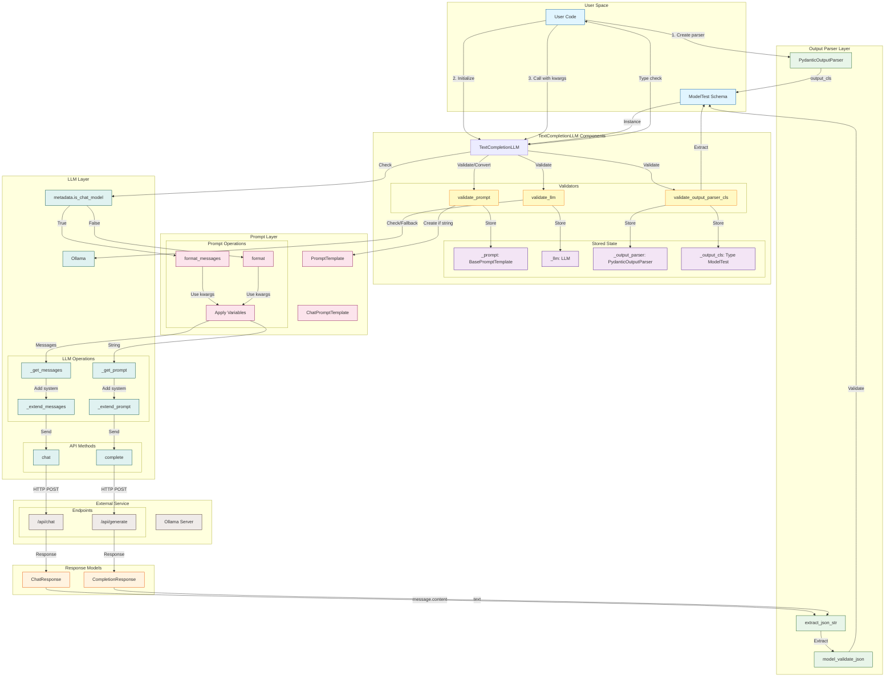

# Component Boundaries and Interactions

This diagram shows how components interact during the complete lifecycle.



## Component Responsibilities Matrix

| Component | Initialization | Execution | Parsing |
|-----------|---------------|-----------|---------|
| **TextCompletionLLM** | Validates & stores all components | Routes to chat/complete | Type checks output |
| **PydanticOutputParser** | Stores output_cls schema | - | Extracts JSON & validates |
| **PromptTemplate** | Created/validated | Formats with variables | - |
| **Ollama (LLM)** | Validated/stored | Executes requests | - |
| **ModelTest** | Defines schema | - | Validates parsed data |

## Interaction Patterns

### 1. Initialization Pattern (Constructor)
```
User → TextCompletionLLM.__init__
  ├─→ validate_output_parser_cls
  │   └─→ Extract/Create parser & output_cls
  ├─→ validate_llm
  │   └─→ Use provided or fallback to Configs.llm
  └─→ validate_prompt
      └─→ Convert string to PromptTemplate if needed
```

### 2. Chat Model Execution Pattern
```
User → TextCompletionLLM.__call__
  ├─→ Check metadata.is_chat_model == True
  ├─→ PromptTemplate.format_messages(kwargs)
  ├─→ LLM._extend_messages
  ├─→ Ollama.chat → HTTP → ChatResponse
  ├─→ Extract message.content
  └─→ PydanticOutputParser.parse → ModelTest
```

### 3. Completion Model Execution Pattern
```
User → TextCompletionLLM.__call__
  ├─→ Check metadata.is_chat_model == False
  ├─→ PromptTemplate.format(kwargs)
  ├─→ LLM._extend_prompt
  ├─→ Ollama.complete → HTTP → CompletionResponse
  ├─→ Extract response.text
  └─→ PydanticOutputParser.parse → ModelTest
```

## State Management

### Immutable State (Post-Initialization)
- `_output_parser`: PydanticOutputParser instance
- `_output_cls`: Type[ModelTest]
- `_llm`: Ollama instance

### Mutable State
- `_prompt`: Can be updated via setter
- `_verbose`: Controls logging output

### Transient State (Per Call)
- `llm_kwargs`: Forwarded to LLM methods
- `**kwargs`: Template variables for prompt formatting
- `raw_output`: Intermediate text from LLM
- `parsed_output`: Final validated Pydantic model
