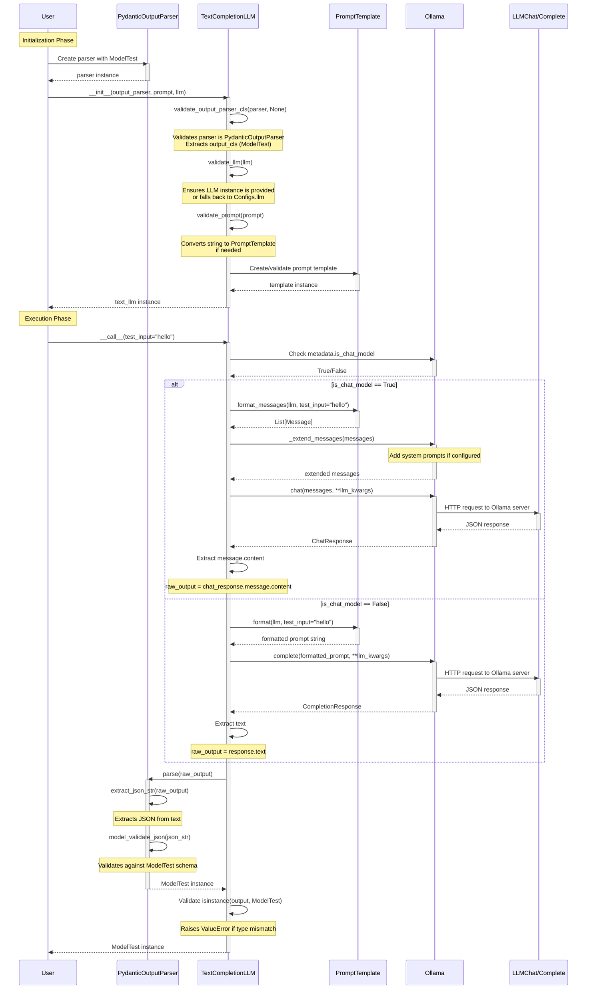

# TextCompletionLLM Sequence Diagram

This diagram shows the complete workflow from initialization to execution of `TextCompletionLLM`.

## Key Points

1. **Initialization validates all components** before storing them
2. **Prompt formatting** adapts based on whether the LLM is a chat model or completion model
3. **Output parsing** extracts JSON and validates against the Pydantic schema
4. **Type checking** ensures the parsed output matches the expected output class
