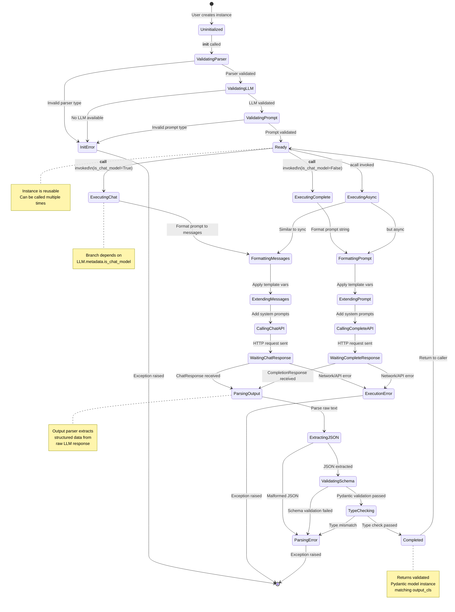

# TextCompletionLLM State Diagram

This diagram shows the lifecycle states of a `TextCompletionLLM` instance.



## State Descriptions

### Initialization States

| State | Description | Exit Conditions |
|-------|-------------|-----------------|
| **Uninitialized** | Object construction in progress | `__init__` called |
| **ValidatingParser** | Checking output_parser and output_cls compatibility | Valid: → ValidatingLLM<br>Invalid: → InitError |
| **ValidatingLLM** | Ensuring LLM instance is available | Valid: → ValidatingPrompt<br>Missing: → InitError |
| **ValidatingPrompt** | Converting/validating prompt template | Valid: → Ready<br>Invalid: → InitError |
| **Ready** | Instance fully initialized and ready for calls | User calls instance |

### Execution States (Chat Path)

| State | Description | Exit Conditions |
|-------|-------------|-----------------|
| **ExecutingChat** | Entry point for chat model execution | → FormattingMessages |
| **FormattingMessages** | Converting prompt to message list | → ExtendingMessages |
| **ExtendingMessages** | Applying template variables to messages | → CallingChatAPI |
| **CallingChatAPI** | Invoking Ollama.chat method | → WaitingChatResponse |
| **WaitingChatResponse** | HTTP request in flight | Success: → ParsingOutput<br>Error: → ExecutionError |

### Execution States (Completion Path)

| State | Description | Exit Conditions |
|-------|-------------|-----------------|
| **ExecutingComplete** | Entry point for completion model execution | → FormattingPrompt |
| **FormattingPrompt** | Converting prompt to string | → ExtendingPrompt |
| **ExtendingPrompt** | Applying template variables to prompt | → CallingCompleteAPI |
| **CallingCompleteAPI** | Invoking Ollama.complete method | → WaitingCompleteResponse |
| **WaitingCompleteResponse** | HTTP request in flight | Success: → ParsingOutput<br>Error: → ExecutionError |

### Parsing States

| State | Description | Exit Conditions |
|-------|-------------|-----------------|
| **ParsingOutput** | Starting output parsing process | → ExtractingJSON |
| **ExtractingJSON** | Extracting JSON from raw text | Valid JSON: → ValidatingSchema<br>Invalid: → ParsingError |
| **ValidatingSchema** | Validating against Pydantic schema | Valid: → TypeChecking<br>Invalid: → ParsingError |
| **TypeChecking** | Verifying output matches output_cls | Match: → Completed<br>Mismatch: → ParsingError |
| **Completed** | Successful execution with valid output | → Ready (return result) |

### Error States

| State | Description | Exceptions Raised |
|-------|-------------|-------------------|
| **InitError** | Initialization validation failed | ValueError, AssertionError |
| **ExecutionError** | LLM execution failed | ConnectionError, TimeoutError, HTTPError |
| **ParsingError** | Output parsing/validation failed | ValueError, ValidationError |

## State Transitions Example

### Successful Execution Flow
```
[*]
  → Uninitialized
  → ValidatingParser
  → ValidatingLLM
  → ValidatingPrompt
  → Ready
  → ExecutingChat (or ExecutingComplete)
  → FormattingMessages (or FormattingPrompt)
  → ExtendingMessages (or ExtendingPrompt)
  → CallingChatAPI (or CallingCompleteAPI)
  → WaitingChatResponse (or WaitingCompleteResponse)
  → ParsingOutput
  → ExtractingJSON
  → ValidatingSchema
  → TypeChecking
  → Completed
  → Ready (reusable for next call)
```

### Error During Initialization
```
[*]
  → Uninitialized
  → ValidatingParser
  → ValidatingLLM
  → InitError (no LLM provided and Configs.llm is None)
  → [*] (AssertionError raised)
```

### Error During Execution
```
Ready
  → ExecutingComplete
  → FormattingPrompt
  → ExtendingPrompt
  → CallingCompleteAPI
  → WaitingCompleteResponse
  → ExecutionError (Ollama server not reachable)
  → [*] (ConnectionError raised)
```

### Error During Parsing
```
WaitingChatResponse
  → ParsingOutput (raw_output: "This is not JSON")
  → ExtractingJSON
  → ParsingError (cannot find JSON in text)
  → [*] (ValueError raised)
```

## Concurrency Notes

- **Thread-safe**: The instance is reusable after reaching `Ready` state
- **Stateless execution**: Each `__call__` creates new transient state
- **Immutable config**: Parser, LLM, and output_cls don't change after initialization
- **Async support**: `acall` follows similar state transitions but with async operations
