# ToolOrchestratingLLM — Comprehensive Diagrams and Documentation

This page documents `serapeum.core.structured_tools.tools_llm.ToolOrchestratingLLM` with class, component, sequence, activity, data-flow, state, and architecture diagrams. Diagrams include full type annotations, generic parameters, relationships, and both sync/async variants.

- Primary class: `ToolOrchestratingLLM(BasePydanticLLM[pydantic.BaseModel])`
- Key collaborators: `FunctionCallingLLM`, `BasePromptTemplate`/`PromptTemplate`, `CallableTool`, `StreamingObjectProcessor`, `AgentChatResponse`, `Configs`

Sections provide Mermaid diagrams and PlantUML alternatives where applicable.

---

## Class Hierarchy (UML)

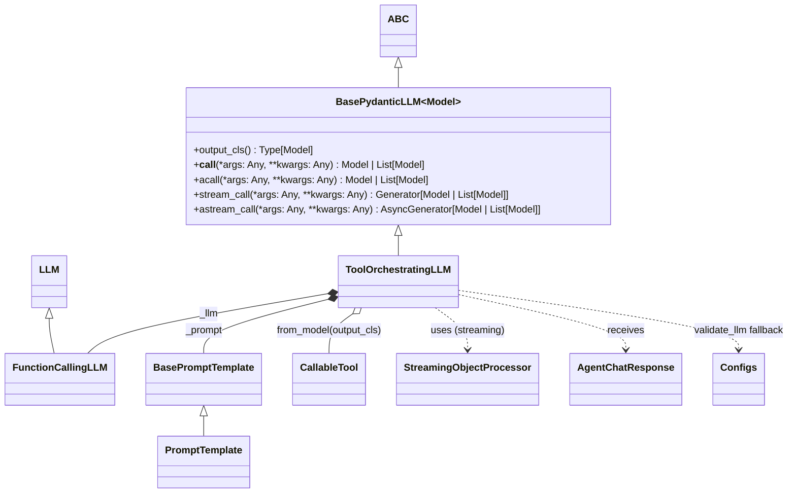

PlantUML alternative:

```plantuml
@startuml
set namespaceSeparator ::

abstract class ABC
class "pydantic.BaseModel" as BaseModel
class Model <<TypeVar: bound=BaseModel>>

abstract class BasePydanticLLM~Model~ {
  +{abstract} output_cls() : Type[Model]
  +{abstract} __call__(*args: Any, **kwargs: Any) : Model | List[Model]
  +acall(*args: Any, **kwargs: Any) : Model | List[Model]
  +stream_call(*args: Any, **kwargs: Any) : Generator[Model | List[Model]]
  +astream_call(*args: Any, **kwargs: Any) : AsyncGenerator[Model | List[Model]]
}

class ToolOrchestratingLLM
class LLM
class FunctionCallingLLM
LLM <|-- FunctionCallingLLM

ABC <|-- BasePydanticLLM~Model~
BasePydanticLLM~BaseModel~ <|-- ToolOrchestratingLLM

class BasePromptTemplate
class PromptTemplate
BasePromptTemplate <|-- PromptTemplate

class CallableTool
class StreamingObjectProcessor
class AgentChatResponse
class Configs

ToolOrchestratingLLM *-- BasePromptTemplate : _prompt
ToolOrchestratingLLM *-- FunctionCallingLLM : _llm
ToolOrchestratingLLM o-- CallableTool : from_model()
ToolOrchestratingLLM ..> StreamingObjectProcessor : uses
ToolOrchestratingLLM ..> AgentChatResponse : receives
ToolOrchestratingLLM ..> Configs : validate_llm()
@enduml
```

---

## Comprehensive Class Diagram (UML)

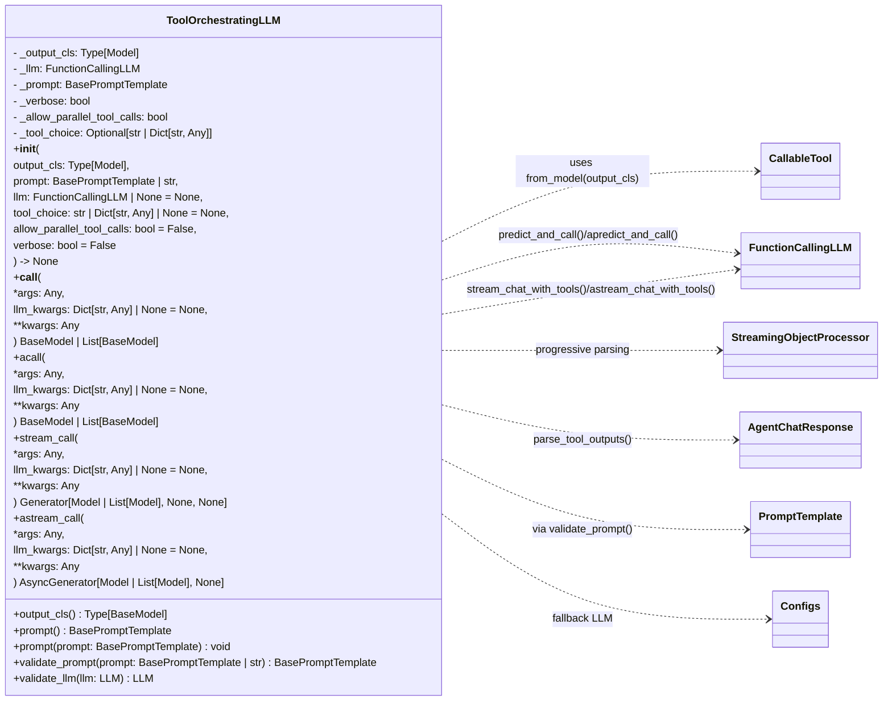

PlantUML alternative:

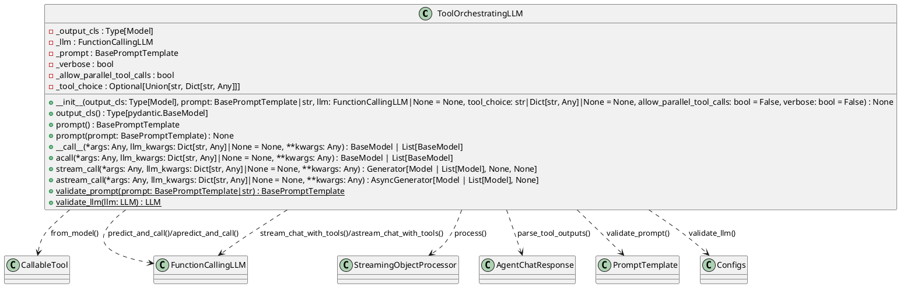

---

## Component Diagram (UML)

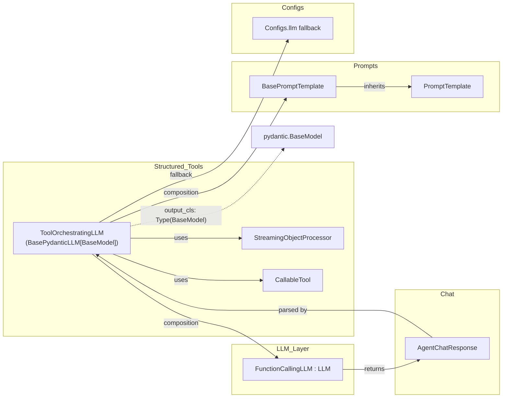

---

## Sequence Diagram — __call__

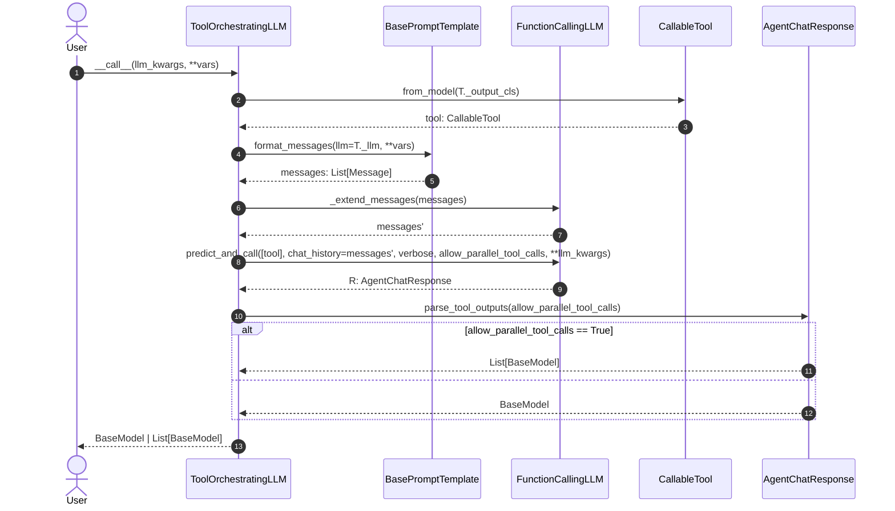

PlantUML alternative:

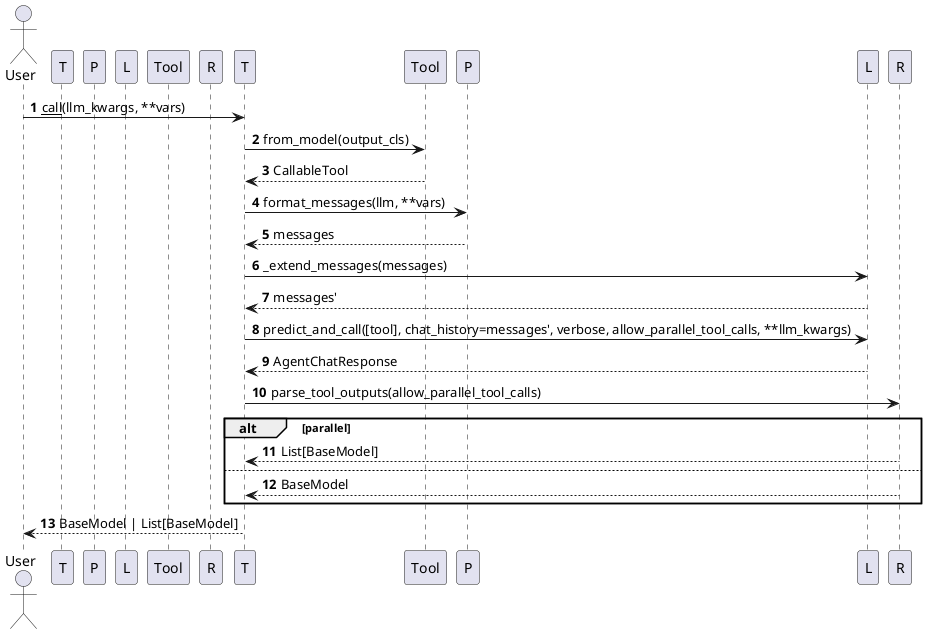

---

## Sequence Diagram — Streaming (`stream_call`)

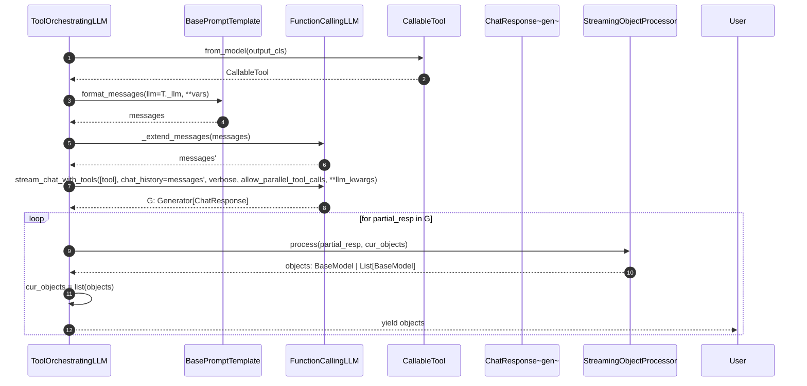

---

## Activity Diagram

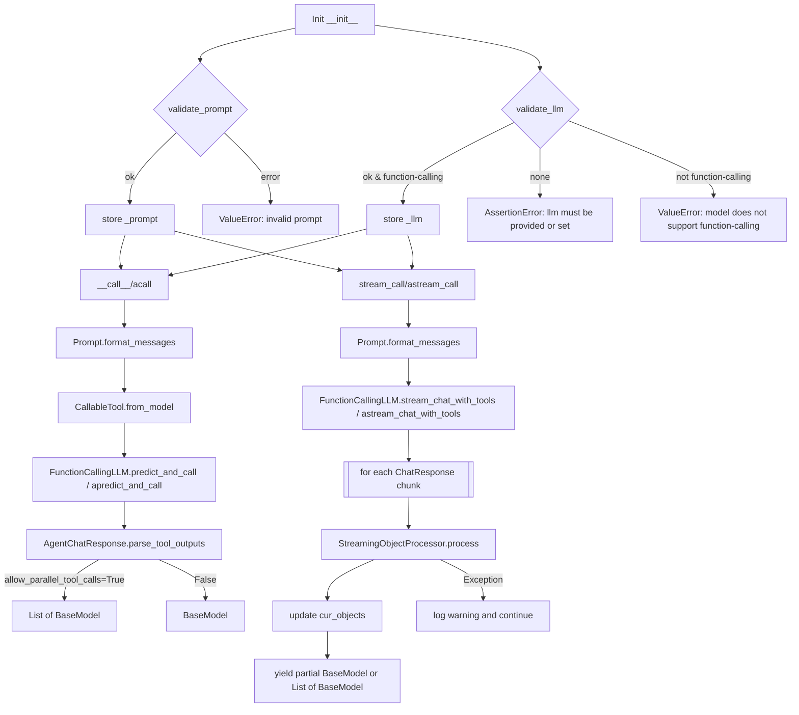

---

## Data Flow Diagram

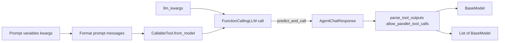

---

## State Machine Diagram (Streaming Lifecycle)

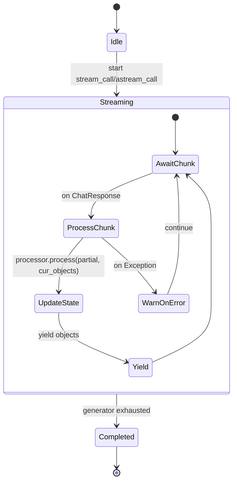

---

## Architecture Overview (Block Diagram)

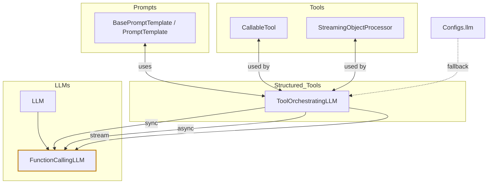

---

### Notes and Type Details

- Generics
  - `BasePydanticLLM[Model]` where `Model: TypeVar` bound to `pydantic.BaseModel`
  - `ToolOrchestratingLLM` is instantiated as `BasePydanticLLM[BaseModel]`

- Method return types
  - `__call__` / `acall`: `BaseModel | List[BaseModel]`
  - `stream_call`: `Generator[Model | List[Model], None, None]`
  - `astream_call`: `AsyncGenerator[Model | List[Model], None]`

- Key decisions and error paths
  - `validate_llm`: raises `AssertionError` if no LLM provided or configured; raises `ValueError` if not a function-calling model
  - `validate_prompt`: raises `ValueError` for invalid prompt types
  - `stream_call`/`astream_call`: raise `ValueError` if underlying LLM is not `FunctionCallingLLM`; warn and continue on streaming parse errors

- Parallel tool calls
  - `allow_parallel_tool_calls=True` may yield/return `List[BaseModel]` and affects parsing and selection in streaming

- Collaborators in method signatures
  - Parameters: `CallableTool`, `BasePromptTemplate`/`PromptTemplate`, `FunctionCallingLLM`, `StreamingObjectProcessor`
  - Return values: `BaseModel`, `List[BaseModel]`, `Generator`, `AsyncGenerator`; internally uses `AgentChatResponse`
