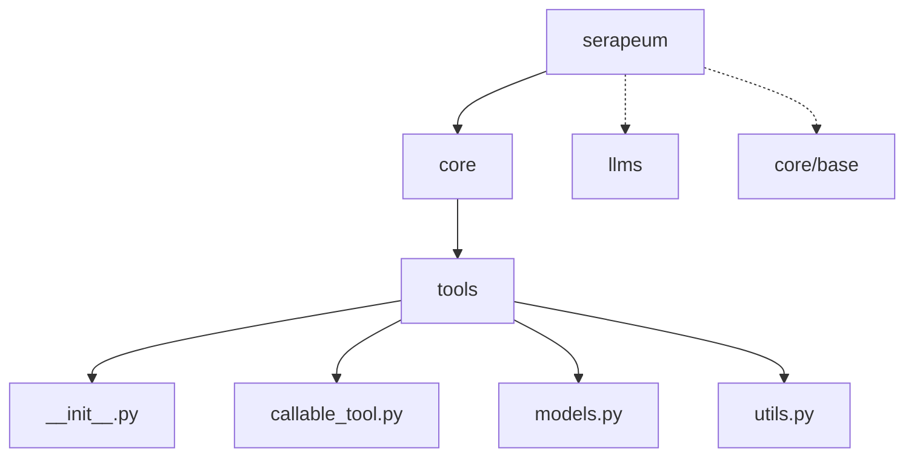
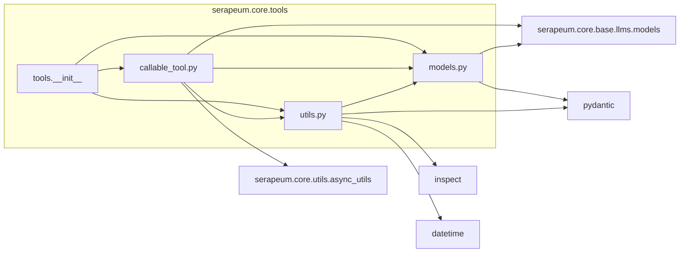
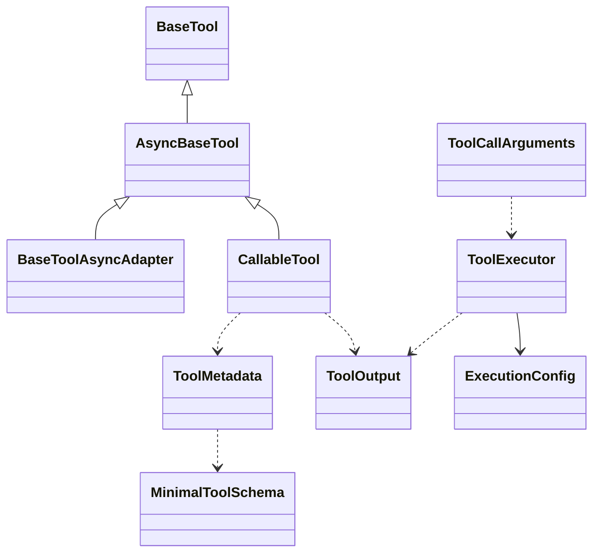
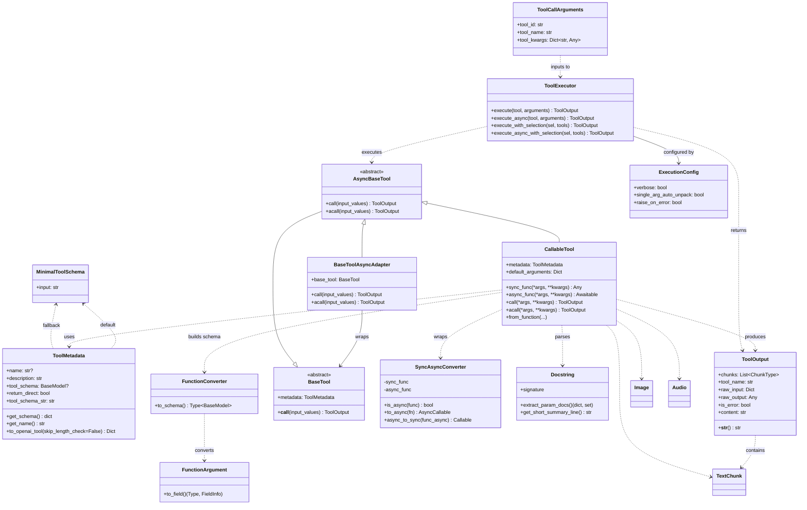

# serapeum.core.tools — Developer Documentation

This documentation provides a complete, visual, and navigable overview of the `serapeum.core.tools` submodule: purpose, structure, classes and functions, relationships, diagrams, and usage examples.


## High-level overview

The `tools` submodule turns ordinary Python callables into LLM-callable "tools" and provides a unified runtime to execute them synchronously or asynchronously. It standardizes:

- Tool metadata (name, description, input schema) for function-calling providers.
- Tool outputs (text and multimodal chunks) via a common `ToolOutput` container.
- A consistent calling surface for both sync and async functions/classes.
- A robust executor with optional single-argument auto-unpacking and standardized error handling.

Main capabilities:
- Derive Pydantic input schemas from Python function signatures and docstrings.
- Wrap a function into a `CallableTool` that returns `ToolOutput` and carries `ToolMetadata`.
- Execute tools with `ToolExecutor` (sync/async) or adapt a synchronous tool to async flows.


## Package hierarchy

See the package and file layout.




## Module dependency diagram

This shows how the modules in `serapeum.core.tools` depend on one another and on external packages inside the project.

- Draw.io:  diagrams/module-deps.drawio




## Module-by-module breakdown

- __init__.py
  - Re-exports key public types for convenience: `CallableTool`, `ToolOutput`, `ToolCallArguments`.

- models.py
  - MinimalToolSchema: Default args schema when no custom schema is provided (`{"input": str}`).
  - ToolMetadata: Name/description/schema of a tool; exports OpenAI-style function tool specs.
  - ToolOutput: Standard output holder containing text/image/audio chunks, raw input/output, errors.
  - BaseTool / AsyncBaseTool: Base interfaces for tools (sync/async contracting).
  - BaseToolAsyncAdapter / adapt_to_async_tool: Adapts sync tools to the async interface.
  - ToolCallArguments: Selected tool name/id and kwargs to pass at runtime.

- callable_tool.py
  - SyncAsyncConverter: Bridges sync<->async callables in both directions.
  - CallableTool: Wraps a Python callable (sync or async), infers metadata and schema when needed, and returns `ToolOutput`.

- utils.py
  - Docstring: Parses Google/Sphinx/Javadoc-style parameter descriptions from function docstrings.
  - FunctionArgument: Converts `inspect.Parameter` to `(type, FieldInfo)` with sensible defaults.
  - FunctionConverter: Builds a Pydantic model from a function signature (+Annotated, +datetime formats).
  - ExecutionConfig: Flags for executor behavior.
  - ToolExecutor: Safe execution harness (sync/async) with optional single-arg auto-unpack and error standardization.


## UML class diagram
Quick preview (key relationships only; see the full file for details):



- Detailed class diagram




## Call graph (key flows)

- Draw.io:  diagrams/call-graph.drawio

```mermaid
%% Mermaid Call Graphs for serapeum.core.tools
%% Save as docs/tools/diagrams/call-graph.mmd

flowchart TD
    %% CallableTool flow
    subgraph CallableTool
        CT_call["__call__(*args, **kwargs)"] --> CT_merge["merge default_arguments"]
        CT_merge --> CT_call2["call(*args, **kwargs)"]
        CT_call2 --> CT_sync["_sync_func(*args, **kwargs)"]
        CT_sync --> CT_parse["_parse_tool_output(raw)"]
        CT_parse --> CT_out["ToolOutput(... )<br/>(chunks, tool_name, raw_input, raw_output)"]

        CT_acall["acall(*args, **kwargs)"] --> CT_async["_async_func(*args, **kwargs)"]
        CT_async --> CT_parse
    end

    %% ToolExecutor flow
    subgraph ToolExecutor
        EX_exec["execute(tool, arguments)"] --> EX_logStart["_log_execution_start (optional)"]
        EX_logStart --> EX_invoke{"_should_unpack_single_arg?"}
        EX_invoke -- yes --> EX_try1["_try_single_arg_then_kwargs"]
        EX_invoke -- no  --> EX_direct["tool(**arguments)"]
        EX_try1 --> EX_result["ToolOutput"]
        EX_direct --> EX_result
        EX_exec -->|exception| EX_err["_create_error_output"]
        EX_result --> EX_logRes["_log_execution_result (optional)"]

        EX_async["execute_async(tool, arguments)"] --> EX_logStart2["_log_execution_start (optional)"]
        EX_logStart2 --> EX_adapt["adapt_to_async_tool(tool)"]
        EX_adapt --> EX_invokeA{"_should_unpack_single_arg?"}
        EX_invokeA -- yes --> EX_try1A["_try_single_arg_then_kwargs_async"]
        EX_invokeA -- no  --> EX_directA["async_tool.acall(**arguments)"]
        EX_try1A --> EX_resultA["ToolOutput"]
        EX_directA --> EX_resultA
        EX_async -->|exception| EX_errA["_create_error_output"]
        EX_resultA --> EX_logRes2["_log_execution_result (optional)"]
    end
```




## Summary of main classes and functions

| Name | Kind | Purpose | Key methods/properties |
|---|---|---|---|
| MinimalToolSchema | Pydantic model | Default function args schema `{input: str}` when no custom schema is provided | `input: str` |
| ToolMetadata | dataclass | Describes tool (name, description, schema, return_direct) and exports to provider formats | `get_schema()`, `tool_schema_str`, `get_name()`, `to_openai_tool()` |
| ToolOutput | Pydantic model | Standard tool response: chunks, `content` view, raw input/output, error flag | `content` property, `__str__` |
| BaseTool | abstract class | Sync tool interface | `metadata`, `__call__` |
| AsyncBaseTool | abstract class | Async-capable tool interface | `call()`, `acall()` |
| BaseToolAsyncAdapter | class | Wraps `BaseTool` to provide async interface | `metadata`, `call()`, `acall()` |
| adapt_to_async_tool | function | Returns `AsyncBaseTool` (adapts if needed) | — |
| ToolCallArguments | Pydantic model | Tool selection and kwargs with forgiving validation | validator: ignore non-dict `tool_kwargs` |
| SyncAsyncConverter | helper class | Converts sync->async and async->sync wrappers | `to_async()`, `async_to_sync()` |
| CallableTool | class | Turns a Python callable into a Tool with metadata/schema and standardized output | `from_function()`, `metadata`, `sync_func`, `async_func`, `call()`, `acall()` |
| Docstring | helper class | Extracts param docs and brief summary from docstrings | `extract_param_docs()`, `get_short_summary_line()` |
| FunctionArgument | helper class | Converts `inspect.Parameter` to `(type, FieldInfo)`, supports Annotated | `to_field()` |
| FunctionConverter | helper class | Creates Pydantic model from function signature (+extra fields) | `to_schema()` |
| ExecutionConfig | dataclass | Executor behavior flags | `verbose`, `single_arg_auto_unpack`, `raise_on_error` |
| ToolExecutor | class | Orchestrates tool execution with error handling | `execute()`, `execute_async()`, `execute_with_selection()`, `execute_async_with_selection()` |


## Usage examples

Wrap a synchronous function and call it

```python
from serapeum.core.tools.callable_tool import CallableTool
from serapeum.core.tools.models import ToolMetadata

def greet(name: str) -> str:
    """Greet a user by name."""
    return f"Hello, {name}!"

tool = CallableTool(func=greet, metadata=ToolMetadata(name="greet", description="Greets by name"))
result = tool("Ada")  # or tool.call("Ada")
print(result.content)  # "Hello, Ada!"
```

Wrap an async function and await it

```python
import asyncio
from serapeum.core.tools.callable_tool import CallableTool
from serapeum.core.tools.models import ToolMetadata

async def add(a: int, b: int) -> int:
    return a + b

tool = CallableTool(func=add, metadata=ToolMetadata(name="add", description="Add two ints"))
result = asyncio.run(tool.acall(2, 3))
print(result.content)  # "5"
```

Infer schema and metadata with from_function

```python
from serapeum.core.tools.callable_tool import CallableTool

# from_function inspects signature and docstring to infer schema and description
# (first docstring line + signature)

def power(base: int, exp: int = 2) -> int:
    """Exponentiation."""
    return base ** exp

tool = CallableTool.from_function(power)
print(tool.metadata.get_name())  # "power"
print(tool("3").content)       # "9" (exp defaults to 2 unless overridden)
```

Export as an OpenAI function tool

```python
from pydantic import BaseModel
from serapeum.core.tools.models import ToolMetadata

class SearchArgs(BaseModel):
    query: str
    limit: int | None = None

meta = ToolMetadata(name="search", description="Search items", tool_schema=SearchArgs)
print(meta.to_openai_tool())
```

Execute with ToolExecutor (selection-based)

```python
from serapeum.core.tools.models import ToolCallArguments
from serapeum.core.tools.utils import ToolExecutor
from serapeum.core.tools.callable_tool import CallableTool
from serapeum.core.tools.models import ToolMetadata

# Prepare two tools
say = CallableTool.from_function(lambda text: text, name="say")
inc = CallableTool(func=lambda x: x + 1, metadata=ToolMetadata(name="inc", description="Increment"))

# Simulate a selection coming from an LLM
selection = ToolCallArguments(tool_id="1", tool_name="say", tool_kwargs={"text": "hi"})

executor = ToolExecutor()
out = executor.execute_with_selection(selection, [say, inc])
print(out.content)  # "hi"
```

Single-argument auto-unpack

```python
from serapeum.core.tools.utils import ToolExecutor, ExecutionConfig
from serapeum.core.tools.models import ToolMetadata
from serapeum.core.tools.callable_tool import CallableTool

def echo_list(lst: list[int]):
    return ",".join(map(str, lst))

tool = CallableTool(func=echo_list, metadata=ToolMetadata(name="echo_list", description="Echo list"))
executor = ToolExecutor(ExecutionConfig(single_arg_auto_unpack=True))
print(executor.execute(tool, {"lst": [1, 2, 3]}).content)  # "1,2,3"
```

